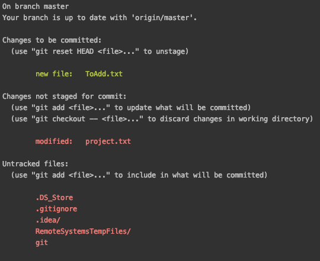

更多配置请参阅 [Git 配置](./../Git%20团队协作与管理（进阶篇）/定制%20Git/1.%20Git%20配置.md)

## 简单命令的认识

### 用户信息

使用以下命令来让 Git 记住你是谁，以后每次提交都会以此为签名让其他人知道是你做出了贡献

```shell
git config --global user.name "<你的名字>"
git config --global user.email <你的邮箱>
```

### init：创建本地仓库

假设我们将启动一个全新的项目，代码将存在于 `/home/gitee/firstProject`目录，那么以此目录为目标建立仓库

```shell
cd /home/gitee/firstProject
git init
```
如此便将仓库建立好了
### clone：获取远程仓库

假设我们要对一个已经存在于远程仓库的项目进行`https://gitee.com/giteeeer/example.git`，那么就需要将其同步到本地的当前目录下

```shell
git clone https://gitee.com/giteeeer/example.git
```
注：这样仅仅是将默认分支同步到了本地

### remote ：远程仓库

可以使用以下命令来获取远程仓库地址

```shell
git remote -v
```
由此可以获得两个地址，一个是 fetch，一个是 push，fetch 地址意指我们获取代码的地址，push 则指我们要提交的地址。如下图


### branch ：分支管理操作

用以下命令来获取 branch 列表以便进一步让我们选定需要的分支

```shell
git branch
```


接下来我们将在默认分支（master）上进行操作。

### add: 让 Git 跟踪变更

在本地有了仓库之后，我们可以开始做一些开发工作了，假设我们写了一个“ToAdd.txt”文件

而这个新增的“ToAdd.txt”是没有被 Git “注意到“的，因此，首先要让 Git 对变更进行追踪，而已经被 Git 跟踪到的文件则是在上一次版本快照中有记录的文件。就好像学生首先要注册学籍，这样学校才能把学生的学习记录放入学籍，而 Git 就是对“学籍”进行管理的人员，入籍这个动作即为`add`。

使用以下命令

```shell
git add ToAdd.txt
```
则 Git 会将“ToAdd.txt”文件存入暂存区以实现跟踪。
在对某些文件进行了改动之后（此处我们修改了 project.txt 文件的内容，增加了 ToAdd.txt 文件），对于 Git 有记录的文件，Git 可以计算出变动并标记为已修改文件，而没有记录的则需要将有需要的文件加入暂存区以便管理，这时候使用`status`命令即可获得文件的状态

```shell
git status
```


如上图所示，其中“ToAdd.txt”就是新加入暂存区的文件，“project.txt”就是已经存入暂存区并且 Git 发现有修改的文件，而下面“Untracked files”就是 Git 还没有追踪的文件。

而当我们针对下面 “RemoteSystemTempFiles” 文件夹使用`add`命令之后，

```shell
git add RemoteSystemTempFiles/
```
Git 将此文件夹下所有文件存入暂存区开始追踪，再运行`status`命令得到下图


这时候，“RemoteSystemTempFiles”中的“.project”文件就被纳入暂存区追踪了，而“Untracked files”中就看不到它了。

要注意的是，刚刚虽然我们是针对“RemoteSystemTempFiles”文件夹进行的`add`操作，纳入暂存区的也仅仅是彼时存在于文件夹中的文件，而如果我们之后再在“RemoteSystemTempFiles"文件夹内增加文件，则仍需针对文件运行`add`命令，否则我们会看到新加入的文件没有被追踪到，正如下图的“ThisOneHasNotBeenTracked.txt”文件。


### gitignore：忽略文件

在上面我们看到了一些与我们项目本身毫无关系的文件比如“git”，“.DS_Store”和“.gitignore”等等，在实际应用中我们会希望这些文件不要出现在 Git 提示当中干扰我们的工作，我们可以编辑“gitignore”文件来让 Git 彻底忽略它们的存在，如将 “git” 甚至“.gitignore”文件的文件名本身写入“gitignore”，那么 Git 就不会再提示我们有关这个是不是被追踪的问题了


再运行`status`命令就不会看到针对“git”和“.gitignore”的提示了


### Fetch 和 Pull : 拉取操作

在我们对本地文件进行编辑的同时可能会有其他人也在对项目做出贡献，这就会造成本地和远程仓库的不同步，这时候通过使用`fetch`或`pull`操作访问远程仓库，将本地没有的数据全部拉取到本地

```shell
git pull
```
这个命令会将远程仓库的变动同步到本地并且自动尝试合并到当前所在的分支，因此可能需要进一步处理冲突才能完成整个`pull`操作。
```shell
git fetch
```
要注意的是它和`pull`命令不同，它不会自动合并或修改你当前的变更而你必须在准备好以后手动地进行合并。
### diff：对比不同

通过使用`diff`命令可以让我们详细对比每个被追踪的文件的变更

```shell
git diff
```
可以看到详细的变动对比


其中红色表明是删除对应`-`，绿色 表明是增加的部分对应`+`。

### commit: 提交到本地存储库

光让文件呆在暂存区不是我们的目的，将所有变更写入远程代码仓库才是，所以下一步我们要提交变更。提交的同时记得写一句简明的话来说明本次提交的目的，内容等，参数为`-m`所以 使用以下命令会将所有文件有变动的文件提交到存储库

```shell
git commit -m "修改介绍"
```
这样就将修改提交了，然后 Git 会反馈一个报告，告诉你提交到了哪个分支，本次变更的 SHA-1 校验和是什么(74219eb)，有多少文件被修改过，多少行被添加，多少行被删除。


#### -a：全提交

每次都先`add`然后再`commit`多少有些繁琐，所以可以使用`-a`参数来将所有变更直接提交而不用使用`add`命令， 即

```shell
git commit -a -m "修改介绍"
```
但要小心，这样可能会把不想提交的文件也给提交了，最好和 gitignore 文件配置一起配合使用。
#### --amend：重新提交

有时候我们会误操作在某次提交中少提交了某些文件，除了直接再提交一次，我们可以使用

`--amend`参数来补齐遗漏的文件，如下操作

```shell
git commit -m “修改介绍”
git add renamed.txt
git commit --amend
```
这样就只有一条说明为“修改介绍”的提交被记录下来，第二次提交的内容会**覆盖**第一次的提交。即使用`log`命令的 时候显示记录只有一条有关“修改介绍”。
### rm：移除文件

Git 可以移除某个文件，我们以“ToRemove.txt”为例，那么可以通过`rm`命令 来实现

```shell
rm ToRemove.txt
```
这样就从文件系统中删除了，接下来让 Git 记录此次操作
```shell
git rm ToRemove.txt
```
如果该文件已经放入了暂存区，那么需要加入`-f`参数 来强制移除，这个参数可以认作是 Git 防止误删操作而加的保险
```shell
git rm -f ToRemove.txt
```
另一种情况可能更加常用，即我们仅仅是想将其从暂存区移除而不希望把它从磁盘上删除，那么可以加入`--cached`参数来实现
```shell
git rm --cache ToRemove.txt
```
那么“ToRemove.txt”会再次回到“Untracked files”列表中并且也会保留在磁盘上。


### mv: 移动/重命名文件

在 Git 中，`mv`操作相当于在暂存区删除原文件再添加改名后的文件，也就是先`rm`再`add`，虽然使用者可以同样使用`rm`和`add`命令来达到一样的效果，直接使用`mv`命令无疑更为方便。

```shell
git mv ToRemove.txt renamed.txt
```
当然使用这命令的前提是原文件已经被 Git 追踪
再运行`status`命令之后，“ToRemove.txt”就被改成了“renamed.txt”


### reset HEAD：取消暂存的文件

当我们希望取消某一个文件的暂存的时候，以“toUntracked.txt”为例，是我们刚刚加入暂存区的文件。


则可以使用以下命令

```shell
git reset HEAD toUntracked.txt
```
我们会得到一个反馈说 reset 之后剩下的暂存的变动如


这里就只剩下了对“project.txt”的修改，运行`status`命令发现`toUntracked.txt`出现在了“Untracked files”列表当中。

### checkout：还原

如果不想保留对文件的修改呢，可以使用`checkout`命令来使其还原到上次提交的样子

```shell
git checkout -- project.txt
```
注意：这个命令会使 Git 用最新提交的版本覆盖指定的文件，对该文件在本地的所有修改都会消失。
再运行`status`命令发现针对“project.txt”的修改已经不存在了


### log：查看提交历史

我们在很多场景下可能会需要查看提交历史，那么使用以下命令

```shell
git log
```
此命令会按时间倒叙显示所有提交，包括 SHA-1 校验和、作者名字、邮件地址、时间和提交说明。
### push：提交到远程仓库

只存在本地的代码仓库接下来使用以下命令来将本地存储库中的变动同步到远程仓库，这一步你需要提供在 Gitee 的用户名和密码以获取 push 权限。

```shell
git push
```


### 小结

以上我们介绍了一些最常用的 Git 命令，但实际上 Git 最基本的流程就是`init` /`clone`->`add`->`commit`->`push`，当然在实际使用中因为可能是多人协作，所以我们需要使用分支来支持更为科学的开发策略以提高效率降低成本，与 IDE 整合以提高易用性以及与 DevOps 工具相结合以提高团队的吞吐量等，这些我们将在后面的教程中详细说明。
