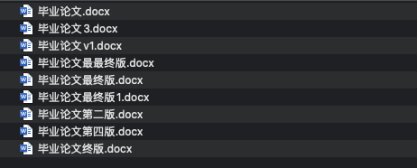

## 关于版本控制

你一定不想看到如下图的场景，不但难以确认每一版的改动，还难以找到最需要的版本。

那么这也就是我们做版本控制的原因 —— 追溯每个变更并管理每个版本，当然此外还需要有更好的协作模式。

## 主流的版本控制系统

主流的版本控制系统有 CVS、SVN 和 Git 等。

### CVS

我们先说 CVS（Concurrent Versions System），它是集中式版本控制系统的典型。它的工作是 C/S 模式的，即在服务器上建立一个仓库，仓库管理员管理这仓库里面的所有文件，任何人需要进行修改的时候需要下载到本地（copy）再进行对文件的修改（modify），改完以后再提交给 CVS，由 CVS 源码库统一进行合并（merge），这样就做到了只有一个人对仓库的文件进行写入，避免了很多冲突和管理难题。

CVS 的痛点很多，比如不支持重命名，只能删除再添加文件。又如每次提交不是原子性的，而是针对单个文件的，这给文件管理带来了极大的灵活性，但同时也对版本控制带来了挑战，想象一下某一个修改了上千个文件的版本上线之后需要回滚，那么管理员就只能一个文件一个文件地来做了。

### SVN

类似于 CVS ，SVN（subversion）也是集中式版本控制系统，它解决了一些 CVS 的痛点，如支持了重命名，对不同编码的文件的支持等，保证安全性的同时易于管理。同时也将变更变成了原子性的，以一定的灵活性的代价换来了管理的便利。但也因为它是集中控制系统，几乎所有的操作都需要发生在服务器上如对比，提交，还原等，就给服务器带来了压力，如此就不适合进行开源项目而只适合开发人数有限的项目的开发。同样的，开发人员每天都需要从服务器上获取最新的文件随后进行修改，解决冲突并提交，在某些不能保证稳定网络连接的情况下SVN是没有办法帮助企业保证其业务的连续性的。

### Git

作为本文的主角，Git 是这些主流版本控制工具中唯一的分布式版本控制系统，开发者可以将整个代码库放到本地，这样不要求客户端时刻联网而就可以在本地进行对比、提交等工作，然后再 `push` 进服务器端进行 `merge` 即可。将部分工作放在本地以平衡服务器的负载，这样的解决方案使得 Git 支持大规模多用户的开发模式便可更好地支持开源项目。

## Git 简史

同生活中的许多伟大事物一样，Git 诞生于一个极富纷争大举创新的年代。

Linux 内核开源项目有着为数众多的参与者。 绝大多数的 Linux 内核维护工作都花在了提交补丁和保存归档的繁琐事务上（1991－2002年间）。到 2002 年，整个项目组开始启用一个专有的分布式版本控制系统 BitKeeper 来管理和维护代码。

到了 2005 年，开发 BitKeeper 的商业公司同 Linux 内核开源社区的合作关系结束，他们收回了 Linux 内核社区免费使用 BitKeeper 的权力。这就迫使 Linux 开源社区（特别是 Linux 的缔造者 Linus Torvalds）基于使用 BitKeeper 时的经验教训，开发出自己的版本系统。他们对新的系统制订了若干目标：

* 速度
* 简单的设计
* 对非线性开发模式的强力支持（允许成千上万个并行开发的分支）
* 完全分布式
* 有能力高效管理类似 Linux 内核一样的超大规模项目（速度和数据量）

自诞生于 2005 年以来，Git 日臻成熟完善，在高度易用的同时，仍然保留着初期设定的目标。 它的速度飞快，极其适合管理大项目，有着令人难以置信的非线性分支管理系统。

注：本段引用自 [https://git-scm.com/book/zh/v2/起步-Git-简史](https://git-scm.com/book/zh/v2/%E8%B5%B7%E6%AD%A5-Git-%E7%AE%80%E5%8F%B2)。
