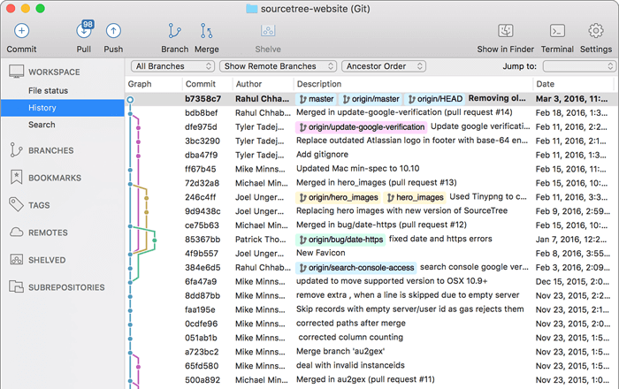
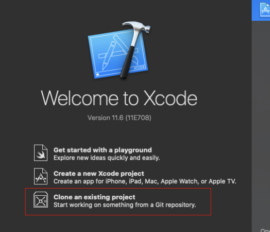
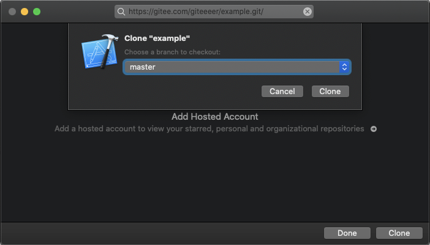
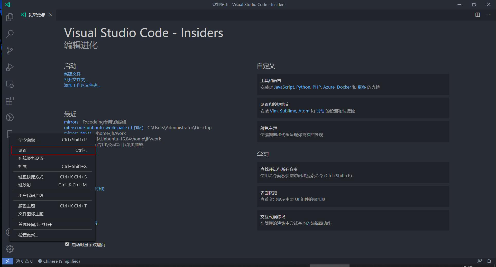
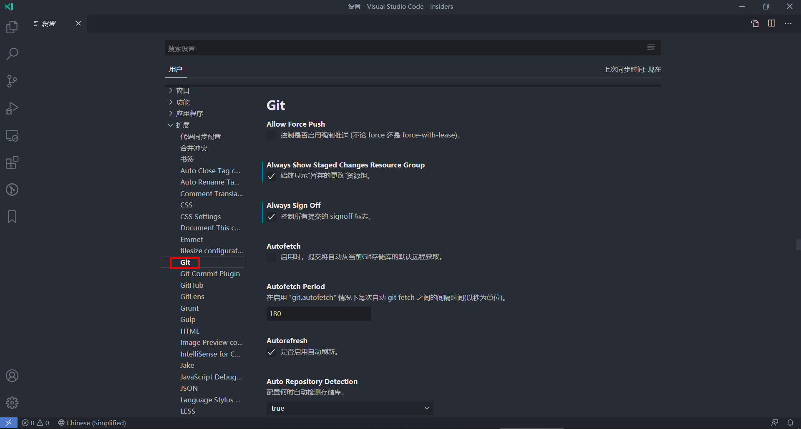
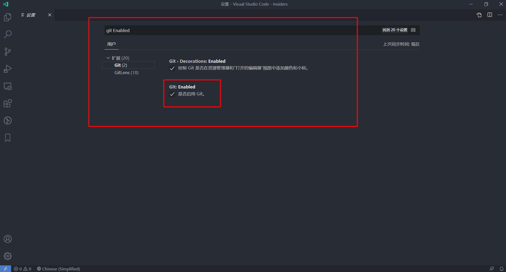
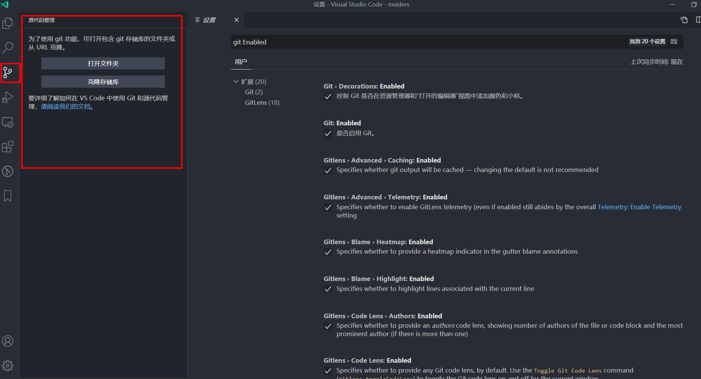
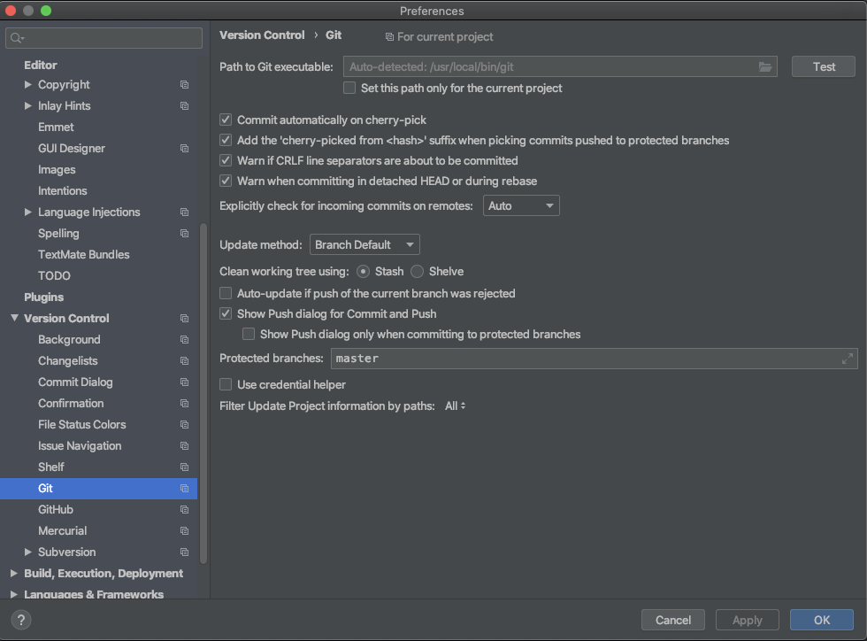

## 根据系统安装

### 在 Windows 下安装

打开 [https://git-scm.com/download/win](https://git-scm.com/download/win)，下载会自动开始，运行下载的可执行文件跟随指引安装

### 在 Linux 下安装

#### Debian/Ubuntu

用以下命令来安装最新的发布版 Git

```
apt-get install git
```
Ubuntu 系统还可使用以下命令来安装最新的稳定 Upstream 版 Git
```
add-apt-repository ppa:git-core/ppa
apt update; apt install git
```
#### RedHat 企业版 Linux，Oracle Linux 等

RHEL 和其他衍生版本可使用`dnf`命令来安装

```
sudo dnf install git-all
```
你也可以从  [https://mirrors.edge.kernel.org/pub/software/scm/git/](https://mirrors.edge.kernel.org/pub/software/scm/git/)   下载源码来编译安装最新版的 Git 。
#### 更多参见

[https://git-scm.com/download/linux](https://git-scm.com/download/linux)

### 在 Mac OS X 下安装

#### homebrew

如果你安装了 homebrew，可以通过以下命令来安装

```shell
$ brew install git
```
#### 安装包安装

从 [https://sourceforge.net/projects/git-osx-installer/](https://sourceforge.net/projects/git-osx-installer/) 下载后根据提示安装

#### 编译源码

从 [https://mirrors.edge.kernel.org/pub/software/scm/git/](https://mirrors.edge.kernel.org/pub/software/scm/git/) 下载源代码后进行编译


## Git 工具

### 命令行工具

 Git 作为开源版本控制工具有诸多的用法，可以使用原生的命令行、图形界面以及第三方提供的图形界面工具，这其中命令行工具是最基础也是最强大的。

在上文中我们就使用的是在 MacOS 中的命令行工具 Terminal。当然如果你用的是 Linux 系统，也可以用 Terminal ，如果你用的是 Windows 系统那么可以用命令窗口（Command Prompt）或者 PowerShell。

### 使用 GUI 客户端操作

#### Source Tree

Source Tree 是 Atlassian 公司出品的可运行在 Mac 和 Windows 下的 Git 图形客户端，可以从 [https://www.sourcetreeapp.com/](https://www.sourcetreeapp.com/)下载安装。



图片来源：[https://www.sourcetreeapp.com/](https://www.sourcetreeapp.com/)

#### Tortoise Git

如果你在用 Windows ，那么可以考虑从 [https://tortoisegit.org/download/](https://tortoisegit.org/download/)下载使用Tortoise Git

### Git 集成 IDE 客户端

IDE 集成 Git 给我们提供了一站式的解决方案，在不切换程序的情况下即可进行版本操作，这给开发带来极大的便利。以下我们会介绍若干主流 IDE 的 Git 集成方式。

#### Xcode

Xcode 自带 Git，可以在欢迎界面执行`clone`操作即可





#### VS Code

同样的 VS Code 也集成了 Git，可以通过设置来进行配置，之后即可在主界面使用 Git










#### JetBrains 系列

JetBrains 提供了针对多种语言的开发工具，配置方法大同小异，我们以 IntelliJ IDEA 社区版为例：

默认支持 SVN，Git 等版本控制工具，在设置中可以进行设置。



可以在主界面中进行`checkout`、`commit`、`push`等一系列操作：
