## 创建、拉取、推送、克隆

创建远程库

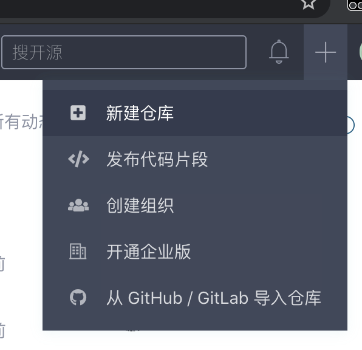

填入仓库名称（Gitee支持中文、字母、数字或者下划线(_)、中划线(-)、英文句号(.)、加号(+)，必须以字母或数字开头，不能以下划线/中划线结尾，且长度为2~191个字符）, 建议只使用字母/中划线/下划线/数字。

其他信息按需配置即可，点击创建完成。

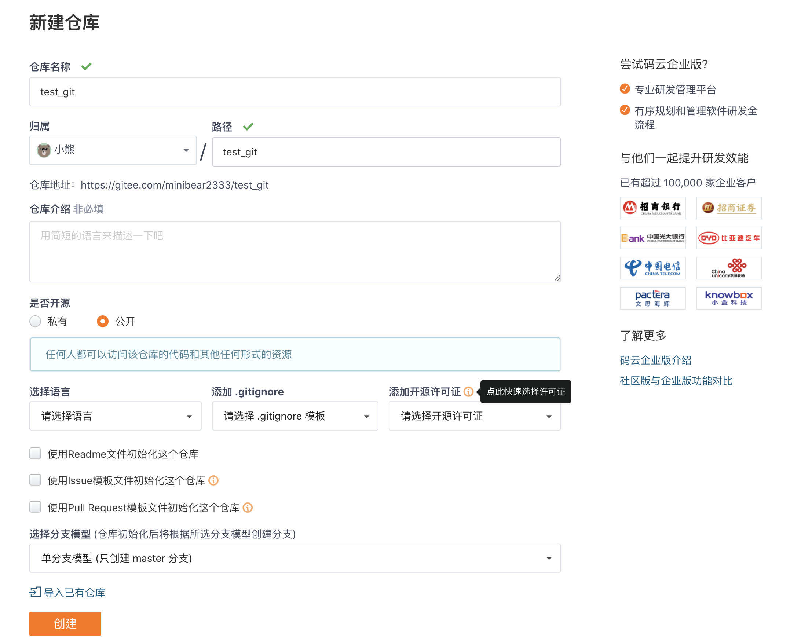

创建完成后自动跳转到项目首页，如果是空项目在此获得项目链接

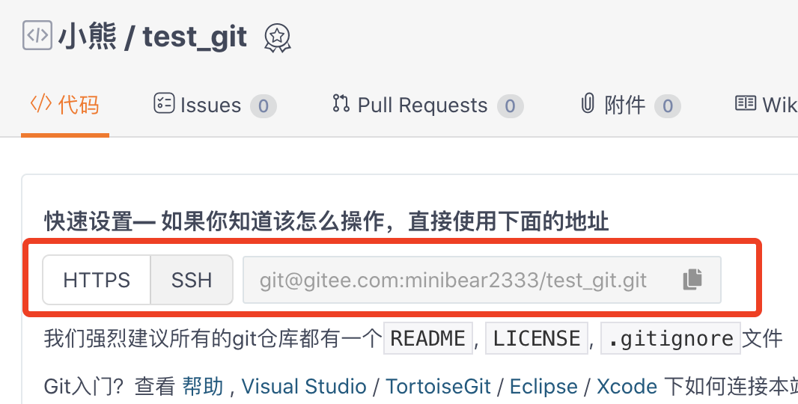

非空项目在此获取项目链接

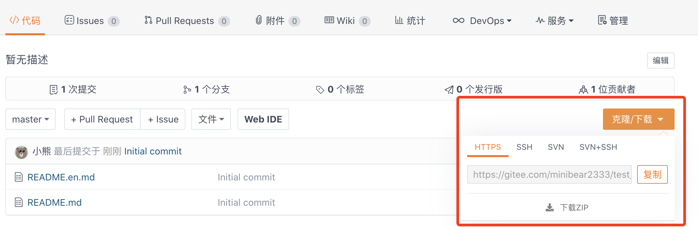

创建 git 仓库（注意项目名称、项目链接、用户名称替换成自己的）:

``` shell
mkdir test_git
cd test_git
git init
touch README.md
git add README.md
git commit -m "first commit"
git remote add origin git@gitee.com:username/test_git.git
git push -u origin master
```

已有仓库(注意替换仓库链接和用户名称)

``` shell
cd existing_git_repo
git remote add origin git@gitee.com:minibear2333/test_git.git
git push -u origin master
```

## 邀请远程库协作者

对于一个开源项目而言，人人都可以看到项目，但是只有项目成员可以直接 push 代码，以及一些更高级的操作，如果你想在 Gitee 上邀请其他人，通过直接向你的项目提交代码的方式参与协作，你可以在浏览器访问如下链接在线邀请。

``` shell
https://gitee.com/用户英文id/项目名称/team
```

也可以从项目里直接进入，位置如下

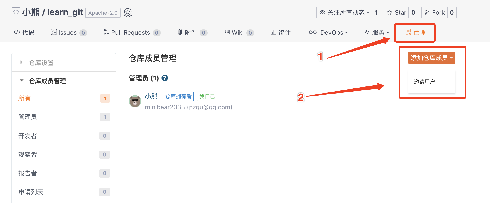

点击邀请用户以后，有三种邀请方式都非常直观，你可以按需使用。

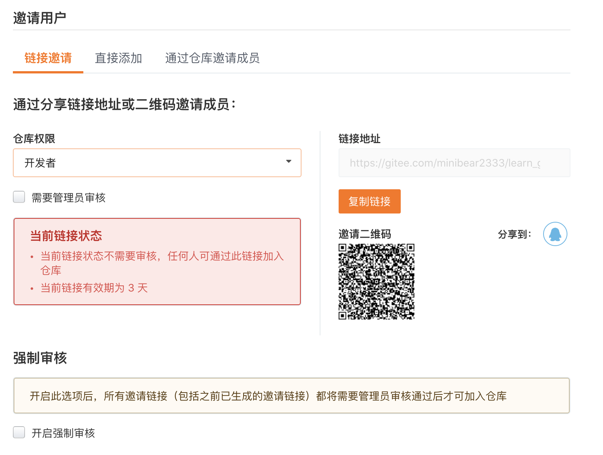

这里的仓库权限有四种

* 管理员：管理员拥有项目的全部权限，包括删除项目和清空项目等
* 开发者：开发者能推送代码，新建和删除分支，创建 Issue, Pull Request, Wiki 等
* 观察者：私有项目观察者不能操作代码，但可以下载代码，可以创建 Wiki，Issue，Pull Request 等
* 报告者：私有项目报告者仅能创建 Issue，公有项目可以 `Fork` 项目、下载代码和创建 PullRequest

当然你也可以创建组织，并通过组织成员管理和组织内的项目成员管理进行权限控制，创建组织链接[https://gitee.com/organizations/new](https://gitee.com/organizations/new)

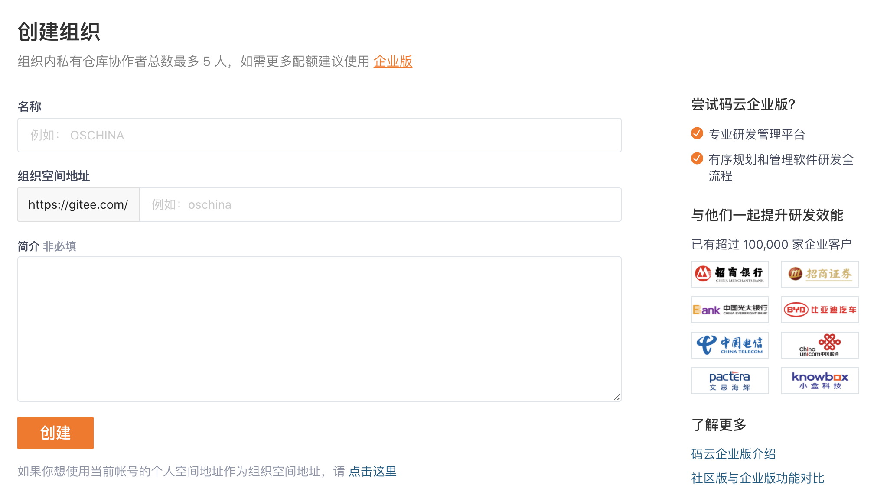

## 使用 Pull Request 贡献代码

但是开源项目不应该是人人都可以随意 Push、管理分支、tag的，为了保证代码质量和开发流程合规，需要由项目管理员/开发者进行管理，其他成员都是报告者的权限，也就是私有项目报告者仅能创建Issue，公有项目可以fork项目、下载代码和创建 `PullRequest` 。

当你遇到一个非常棒的开源项目，你可以选择发起 `PullRequest` 的方式贡献代码，如果说想在简历上添加什么闪光点，没有什么比给开源项目贡献代码更好的经历了。

在贡献代码之前，你需要点击仓库右上角先 `fork` 此仓库，这样会在你本地复制一个完全一样的仓库，你可以在这个新仓库里自由的修改内容。建议只在有意向参与改进该仓库时使用 Fork 功能。

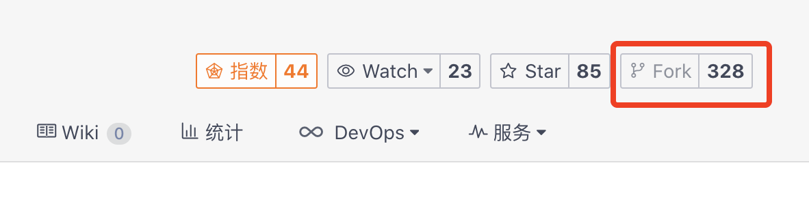

fork 成功后自动跳转，可以到新仓库名下有 fork 来源项目提示

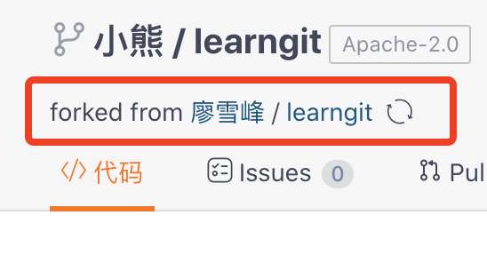

修改代码，然后push到该项目，此时就可以在页面上发起 PR

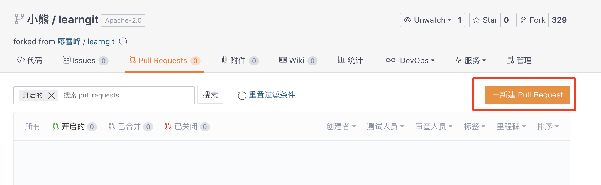

发起 PR 需要对这次提交修改了哪些功能进行描述，方便项目管理员看到这些内容，来判断是否可以合并，点击创建按钮成功发起

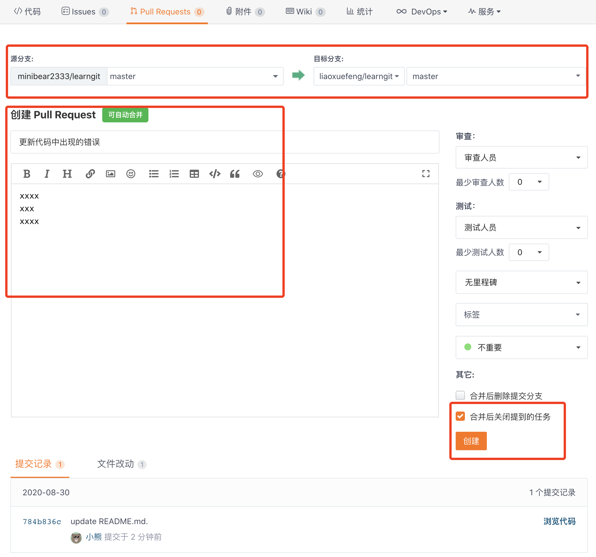

这样源项目处，就可以看到这次PR

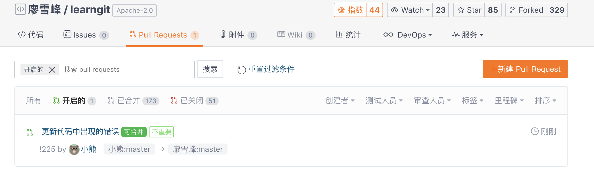

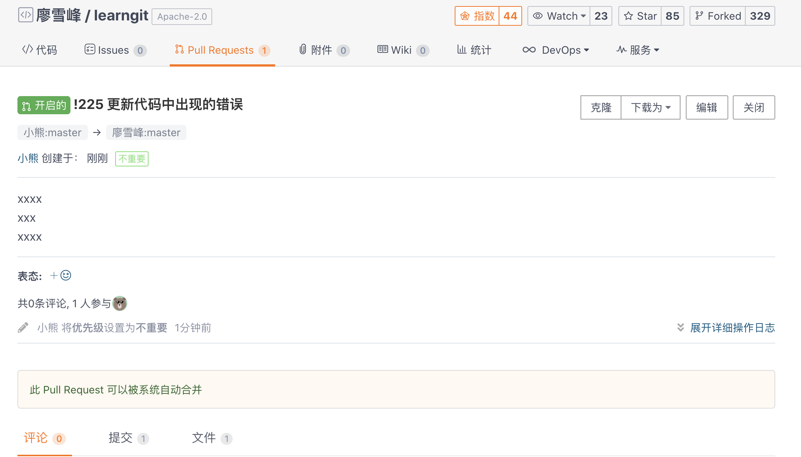

项目管理员或者其他人可以就你的 PR 提出建议，你可以参考其他人的建议使用 `git reset --soft 上一次的commitid` 取消你的 `commit` ，修改完成后强制推送到自己的仓库里 `git push --force origin 分支名` ，PR 中会自动更新。

**好的习惯**

* 在主干开发和分支开发中选择适合自己项目的解决方案并严格遵循
* 尽量保证每个 PR 都只针对一个功能或者一个 bug 做出修改
* 在提交代码之前，将远程分支上最新的代码合并进本地
* 在发起 PR 之前，保证自己的项目和源项目没有冲突，有冲突需要先解决冲突
* 发起pr的描述信息尽可能详细，不仅方便管理员查看，也方便其他人发现你修复的 bug

## 第三方托管的选择

选用第三方代码托管平台，可以省去自己搭建服务器的过程，也更方便自己的项目被其他开发者发现，一起协作或者增加影响力，世面上有很多平台可以供选择，各有优略，可以参考维基百科的[https://git.wiki.kernel.org/index.php/GitHosting](https://git.wiki.kernel.org/index.php/GitHosting)页面。


常用的代码协作平台有开源中国的 [Gitee](https://gitee.com/)、GitHub、GitLab 等。
