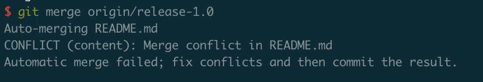

## 分支简介

分支功能是 Git 最为强大的功能之一，我们一直在使用的就是主线分支，就像一根时间轴，每次新提交都建立在上一次的基础上，正是因为这样我们才可以任意改变我们所处的位置，实现在不同时间轴上进行切换。


软件开发的过程中，每个周期都会经过开发和测试，测试完成以后对最后一次提交封版，新的功能只允许在新版本上提交，旧版本只允许增加补丁，这时候就要同时维护两个版本，只有一个主线分支就不够用了。

如下图，继续在 `master` 上提交新功能，上一个版本 release-1.0 封版本，两个分支就可以分开管理了，分支在开发中具体要怎么用，后续的开支开流工作会做详细的讲解。


分支主要解决了以下几个场景。

* 可以使用分支同时开发多个功能，而不产生冲突。
* 当出现定制开发任务，不得不同时维护两个及以上版本的代码时，分支是最好的解决办法。
* 你可以新建个人开发分支，处理完问题以后把最新的主线代码更新到本地而不产生冲突，把开发分支合并到主线以后再提交。保证主线代码的完整性和可用性。

## 分支的新建与合并

**新建分支**

使用以下命令完成创建（如果你想直接基于当前分支复制，可以省略源分支名）

``` 
git checkout -b [源分支名] 新分支名
```

因为 Git 是离线管理的，这个时候新建的分支还需要推送到远程，在平台上才可以看到

``` 
git push origin 远程分支名
```

**分支的合并**

**如果你想把 release-1.0 分支的所有代码合并到 `master` 分支要怎么操作呢?**

可以使用 `git merge` 命令

``` 
git merge origin/release-1.0
```

但是如果两个分支对同一个文件进行了修改，在合并时就会产生冲突



使用 `git status` 查看产生的冲突


此处只有一个文件产生了冲突，Git 要求人工判断哪些代码需要保留哪些代码需要删除，Git 命令行已经很好的提示了解决冲突的办法，产生的冲突如下（ `<<<<<< HEAD` 和 `========` 包含的代表当前分支， `========` 和 `>>>>>>>` 分支名 包含的代表合并分支）

``` 
<<<<<<< HEAD

#### 提交新功能

=======

#### 修复Bug

>>>>>>> origin/release-1.0
```

解决冲突后的效果

``` 
### 提交新功能

### 修复Bug
```

合并冲突后完成提交

``` 
git add README.md
git commit -m "合并 release-1.0"
git push
```

效果如图：


## 分支管理命令

**查看分支**

使用 `git branch` 命令，不加任何参数是查看本地有哪些分支， `*` 号代表当前所处的分支。

``` shell
$ git branch
  dev
  dev2
* master

```

如果加 `-a` 参数，代表查看包括远程分支的所有分支 。

``` shell
$ git branch -a
  dev
  dev2
* master
  remotes/origin/HEAD -> origin/master
  remotes/origin/dev
  remotes/origin/dev2
  remotes/origin/master
  remotes/origin/release-1.0
```

使用 `-v` 参数，代表查看每个本地分支的最后一次提交内容。

``` shell
$ git branch -v 
```

两个参数同时加上，自然就表示查看所有分支（包括远程分支）的最后一次提交内容。

``` shell
$ git branch -av
```

**删除分支**

如果你想删除一个分支，只需要加 `-D 分支名` 即可。

``` shell
$ git branch -D dev2
```

但是你不可以删除当前所在的分支。

``` shell
$ git branch -D master
error: Cannot delete branch 'master' checked out at '/home/root/gitee/learn_git'
```

如果是已经推送到远程的分支，可以用以下命令删除远程分支（请保证你有删除远程分支的权限）。

``` shell
$ git push origin -d dev2
```

注意！如果远程分支不存在，在删除的过程中会报错，既然是要删除远程分支，那可以忽略这个报错。

``` shell
$ git push origin -d dev2
error: unable to delete 'dev2': remote ref does not exist
error: failed to push some refs to 'git@gitee.com:minibear2333/learn_git.git'
```

如果是远程已经删除的分支，在本地还存在，可以使用 `git fetch -p` 命令清理本地无效的分支（仅仅会删除曾今在推送到远程且在远程删除掉本地还存在的同一个分支，不会影响本地新建但从未推送到远程的分支）

举个例子：

以 `master` 分支为源分支，新建本地分支，并自动切换到 `dev3` 分支

``` shell
$ git checkout -b dev3 master
$ git push origin dev3
```

清理远程删除掉的本地分支 `dev3` 和远程的联系，并删除掉本地分支 `dev3`

``` shell
$ git fetch -p
$ git checkout master
$ git branch -d dev3
```

**在分支之间切换**

如果是不存在的分支，可以用【分支的新建与合并】一节说过的方式基于当前分支创建并切换到新分支

``` shell
$ git checkout -b dev4 master
Switched to a new branch 'dev4'
```

如果是已存在的分支，可直接使用 `git checkout 分支名` 进行切换

``` shell
$ git checkout master
Switched to branch 'master'
Your branch is up to date with 'origin/master'.
```

但如果你已经处于待切换的分支，会提示 `Already on '分支名'` 可以忽略这个提示，比如我们再尝试切换到 `master` 分支

``` shell
$ git checkout master
Already on 'master'
Your branch is up to date with 'origin/master'.
```

**更新和推送**

更新有两种方式，一种是 `fetch` 一种是 `pull`

在本地的git使用中，会在某个地方离线存储远程有哪些分支、 `tag` 信息，以及每个分支和 `tag` 的提交记录和内容，在使用 `fetch` 命令刷新时，会进行联网更新，把远程新的提交、新的分支、新的 `tag` 等所有的信息进行更新，但并不会影响本地所有的代码记录，需要手动合并代码才会更新你的代码记录。 

``` shell
$ git fetch
```

`pull` 其实包含了两个命令： `fetch` 和 `merge` ，当 然你也可以直接拆开来用， `fetch` 代表先把远程仓库的信息刷新，再 `merge` 和当前分支合并。

``` shell
$ git pull
```

如果出现冲突，需要使用【分支的新建与合并】-【分支的合并】那一节的方法 `git merge` 一样的处理过程进行合并冲突。

## 分支开流工作

你已经掌握了所有的常用分支操作方法，怎么正式应用到实际的开发工作中呢？这一节就进行详细的讲解。

因为分支可以方便的进行切换、新建、删除、合并，所以在开发过程中，可以利用这些特性，同时维护多个分支，随时可以尝试新的想法，也随时可以回到原来的思路，让工作井井有条。

**长期分支（团队协作工作流）**

`master` 分支是我们的主力开发分支，在业界推荐开发过程中保证 `master` 分支永远是最稳定的分支，保留一个开发分支 `dev` 进行协作，把新需求和缺陷提交到上面，待到 `dev` 分支测试稳定以后再合并到主线上。

主线上针对这一次需求和缺陷，只会产生一个提交，这个过程也适用于定制开发，看起来就是这样子的。


另一种开发方式，把新功能提交到 `master` 分支上，提测时从 `master` 拉出一个 `test` 分支，下一个版本的新功能就继续在 `master` 上迭代，本次测试出现的 bug 修复到 `test` 分支中，封板以后拉出新 `release` 稳定分支，删除 `test` 分支，合并 `release` 分支修复的 bug 到 `master` 看起来是这样的过程。


**个人开发工作流**

在个人开发过程中深深会遇到临时任务、新的想法验证、解决bug/完成需求的情况，在一天之内就会进行多次创建、使用、合并、删除分支的过程。

比如你正在 `master` 分支上工作，这时候你准备解决一个 feature于是新建了分支 `feature1` ；在 `feature1` 分支上工作到 C4 又有了一个新想法，于是你在 `feature1` 分支 C4 的基础上创建了一个临时验证分支 `try_feature1` 来做实验；这个时候 `master` 突然出现一个紧急 bug ，需要你立即处理，你马上切换到 `master` 分支，并创建一个 `bug1` 分支，看起来就是这样。


解决完临时 bug1 以后你把他合并回了 `master` 分支，然后你继续切换到 `try_feature1` 分支完成了开发测试，并发现自己在 `try_feature1` 上尝试的新想法惊为天人，你决定放弃 `feature1` 分支的老想法（也就是丢弃 C7 提交），把 `try_feature1` 合并回 `master` ，出现新的提交 C8 。


注意：只要没有 push 到远程的分支，所有的操作都是离线的

## 远程分支

`push` 命令可以把当前分支推送到远程， `git push` 仓库别名分支名推送任意本地分支到远程

``` shell
$ git push origin dev4
```

远程为每一个分支维护了一个远程分支指针（类似于书签），指向远程的某一次提交，当你第一次 `clone` 项目时，Git 会自动给你的远程仓库起一个别名 
 origin ，并创建一个本地分支指针 `master` （就是分支名）和一个远程指针 `origin/master` ，指向同一个位置，如下：


只要你不推送到远程，仅在本地提交，远程就不会更新。


当然，在多人协作中，很难避免远程分支出现本地没有的提交，也就是出现分叉，在使用 `git fetch` 命令时可以更新远程跟踪分支到本地，接下来只需要在本地解决冲突并提交和推送就好了。


## 变基（git rebase）

在 【分支的新建与合并】-【分支的合并】这一节里面我们讲述了 `merge` 操作，他的特点是不保留源合并分支的提交信息，把所有有提交重写成了一个，并且要求我们自己写 commit 信息。


其实还有另一个命令 `git rebase` 可以保留源合并分支的所有提交信息，在目标合并分支上重放


``` shell
$ git rebase origin/release-1.0
# 解决冲突并add
$ git rebase --continue
Applying: 新功能1
$ git push
```

这样我们在主线看到的提交信息就还是原作者的提交追加在后面，有多少个提交都会保留，尽管实际的开发工作是并行的，但它们看上去就像是串行的一样，提交历史是一条直线没有分叉。好处是历史记录非常简洁，不需要手动重写 `commit` 信息。

如果已经执行了 `git rebase` 命令，想放弃此次 `rebase` 操作执行如下命令（本地）

``` shell
git rebase --abort
```

注意：如果是想用 `rebase` 的方式合并当前远程分支内容，需要是先 `git fetch` 然后再 `git rebase`

**变基的风险**

我们应该遵守远程分支不要强制回滚历史记录的约定 `git push --force` ，甚至应该设置远程分支为被保护分支，否则一旦回滚历史记录会导致远程的 `commit` 记录消失，如果这些 `commit` 记录被其他人合并/变基时所使用，那么在提交代码的时候就不得不重新解决冲突问题，回滚这些提交，所以即使想回滚远程提交，也应该通过新建提交的方式来回滚，这样就可以解决几乎全部的问题。

到底应该使用 `merge` 还是 `rebase` 需要根据团队的具体情况进行约定，如果更关注记录所有的历史提交方便溯源和管理就使用 `rebase` ，如果不在意所有的历史提交，被合并的分支职责单一，只负责某个功能 bug，那可以使用 `merge` 。