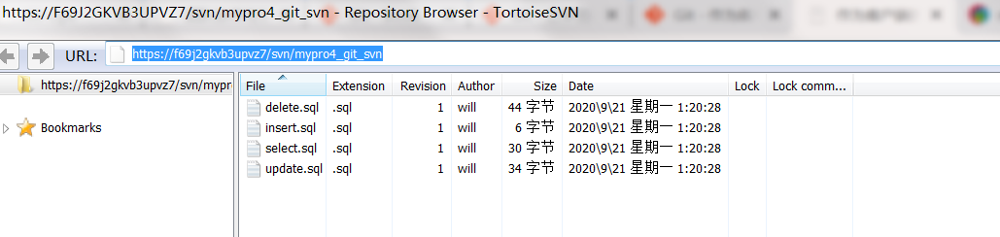
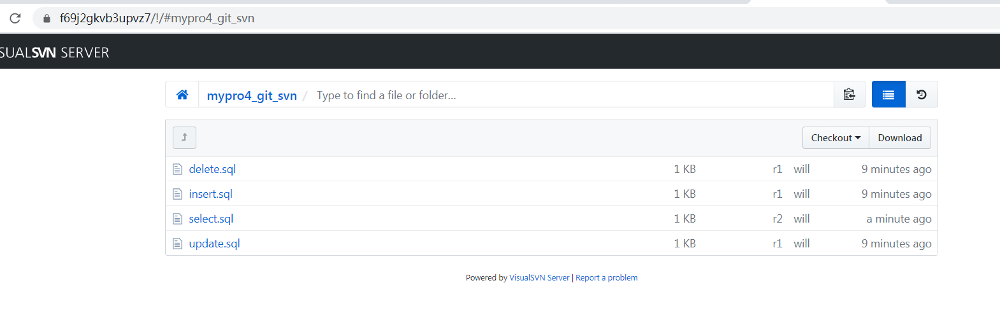
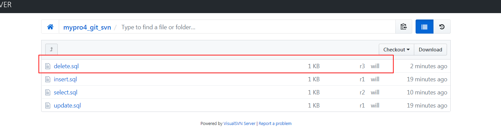
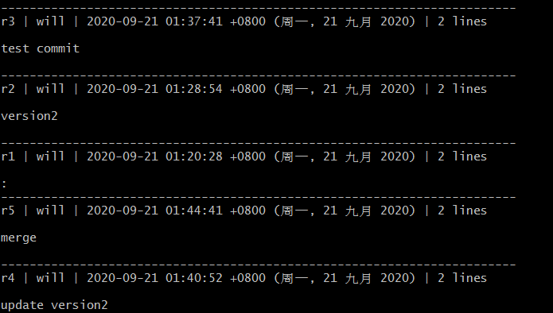

## Git 与 Subversion

在 Git 中所有 Subversion 桥接命令的基础命令是 `git svn`。 它可以跟很多命令，接下来演示一些最常用的命令。

需要特别注意的是当你使用 `git svn` 时，就是在与 Subversion 打交道，一个与 Git 完全不同的系统。 尽管**可以**在本地新建分支与合并分支，但是你最好还是通过变基你的工作来保证你的历史尽可能是直线，并且避免做类似同时与 Git 远程服务器交互的事情。

### 开始

我先创建了一个 SVN 的测试仓库（[https://f69j2gkvb3upvz7/svn/mypro4_git_svn](https://f69j2gkvb3upvz7/svn/mypro4_git_svn)），里面随便塞了几个文件。



使用 `git svn clone` 命令即可完成从 svn 仓库拉取到本地：

```shell
$ git svn clone https://f69j2gkvb3upvz7/svn/mypro4_git_svn
Initialized empty Git repository in G:/git_svn_test/mypro4_git_svn/.git/
        A       delete.sql
        A       insert.sql
        A       select.sql
        A       update.sql
r1 = 128cf673e44837ebe893856bcba67e2251cae2b4 (refs/remotes/git-svn)
        M       select.sql
r2 = a5f6fc84e95098a1c1cfb9b9c07d20aa9d8b9056 (refs/remotes/git-svn)
Checked out HEAD:
  https://f69j2gkvb3upvz7/svn/mypro4_git_svn r2
```

由于该命令会将 svn 仓库中所有版本的更新都会同步到本地仓库，如果项目更新次数过多会花费很长的时间，所以我们可以通过指定版本号以避免不必要的更新。

如：`git svn clone -r2:HEAD [svn_url] [new_name]`，r2 为最新的版本号，查看版本号可直接通过浏览器访问 svn 地址，点击右上角的查看历史即可看到版本号信息，如下图所示。



至此，我们得到了一个已经导入了分支与标签的有效的 Git 仓库：

```shell
$ git branch -a
* master
  remotes/git-svn
```

### 提交回 Subversion

现在你有了一个工作目录，你可以在项目上做一些改动，然后高效地使用 Git 作为 SVN 客户端将你的提交推送到上游。

一旦编辑了一个文件并提交它，你就有了一个存在于本地 Git 仓库的提交，这提交在 Subversion 服务器上并不存在：

```shell
$ git commit -am 'test commit'
[master 7e3b45a] test commit
 1 file changed, 1 insertion(+)
```

你可以离线做几次提交然后一次性将它们推送到 Subversion 服务器。要推送到一个 Subversion 服务器，运行 `git svn dcommit`命令：

```shell
$ git svn dcommit
Committing to https://f69j2gkvb3upvz7/svn/mypro4_git_svn ...
        M       delete.sql
Committed r3
        M       delete.sql
r3 = a208b7c1c2adc4132e1b88b4cbf09ba98100746f (refs/remotes/git-svn)
No changes between 7e3b45aae35d9ddc336fcc71d3dc56be9860dd3d and refs/remotes/git-svn
Resetting to the latest refs/remotes/git-svn
```



这会拿走你在 Subversion 服务器代码之上所做的所有提交，针对每一个做一个 Subversion 提交，然后重写你本地的 Git 提交来包含一个唯一的标识符。这很重要因为这意味着所有你的提交的 SHA-1 校验和都改变了。部分由于这个原因，同时使用一个基于 Git 的项目远程版本和一个 Subversion 服务器并不是一个好主意。

如果你查看最后一次提交，有新的 `git-svn-id` 被添加：

```shell
$ git log -1
commit a208b7c1c2adc4132e1b88b4cbf09ba98100746f (HEAD -> master, git-svn)
Author: will <will@7adf1bb6-8b8d-ba41-906b-aa243fc2b489>
Date:   Sun Sep 20 17:37:41 2020 +0000
    test commit
    git-svn-id: https://f69j2gkvb3upvz7/svn/mypro4_git_svn@3 7adf1bb6-8b8d-ba41-906b-aa243fc2b489
```

### 拉取新改动

如果你和其他开发者一起工作，当在某一时刻你们其中之一推送时，另一人尝试推送修改会导致冲突。 那次修改会被拒绝直到你合并他们的工作。 在 `git svn` 中，它看起来是这样的：

```shell
$ git commit -am 'test commit 2'
[master 55bbeea] test commit 2
 1 file changed, 2 insertions(+), 1 deletion(-)
$ git svn dcommit
Committing to https://f69j2gkvb3upvz7/svn/mypro4_git_svn ...
        M       update.sql
ERROR from SVN:
Item is out of date: File '/update.sql' is out of date
W: 55bbeea2d8b31d0bc27e4950ef6eab550e3ef21a and refs/remotes/git-svn differ, using rebase:
:100644 100644 b0d87c3f73b0ddc69875d6caa5059a2af3b7643e 37034df32709dfcc893f4828be7d023931400086 M      update.sql
```

为了解决这种情况，可以运行 `git svn rebase`，它会从服务器拉取任何你本地还没有的改动，并将你所有的工作变基到服务器的内容之上：

```shell
$ git svn rebase
        M       update.sql
r4 = 805ae86b6428fc039ec58b500a74406312b7f2fd (refs/remotes/git-svn)
First, rewinding head to replay your work on top of it...
Applying: test commit 2
Using index info to reconstruct a base tree...
M       update.sql
Falling back to patching base and 3-way merge...
Auto-merging update.sql
CONFLICT (content): Merge conflict in update.sql
Recorded preimage for 'update.sql'
error: Failed to merge in the changes.
Patch failed at 0001 test commit 2
Use 'git am --show-current-patch' to see the failed patch
Resolve all conflicts manually, mark them as resolved with
"git add/rm <conflicted_files>", then run "git rebase --continue".
You can instead skip this commit: run "git rebase --skip".
To abort and get back to the state before "git rebase", run "git rebase --abort".
rebase refs/remotes/git-svn: command returned error: 128
```

处理了冲突之后就可以顺利地 `dcommit`：

```shell
$ git svn dcommit
Committing to https://f69j2gkvb3upvz7/svn/mypro4_git_svn ...
        M       update.sql
Committed r5
        M       update.sql
r5 = a66548dab43982fbcf05b43cf24abdec46ff930e (refs/remotes/git-svn)
No changes between 5e7b5ba362f0a83ec137c7394cb3da9df0b763d3 and refs/remotes/git-svn
Resetting to the latest refs/remotes/git-svn
```

### Git 分支问题

当适应了 Git 的工作流程，你大概会想要创建主题分支，在上面做一些工作，然后将它们合并入主分支。如果你正通过 `git svn` 推送到一个 Subversion 服务器，你可能想要把你的工作变基到一个单独的分支上，而不是将分支合并到一起。 比较喜欢变基的原因是因为 Subversion 有一个线性的历史并且无法像 Git 一样处理合并，所以 `git svn` 在将快照转换成 Subversion 提交时，只会保留第一父提交。

假设你的历史像下面这样：创建了一个 `experiment` 分支，做了两次提交，然后将它们合并回 `master`。当 `dcommit` 时，你看到输出是这样的：

```shell
$ git svn dcommit
Committing to file:///tmp/test-svn/trunk ...
    M	CHANGES.txt
Committed r89
    M	CHANGES.txt
r89 = 89d492c884ea7c834353563d5d913c6adf933981 (refs/remotes/origin/trunk)
    M	COPYING.txt
    M	INSTALL.txt
Committed r90
    M	INSTALL.txt
    M	COPYING.txt
r90 = cb522197870e61467473391799148f6721bcf9a0 (refs/remotes/origin/trunk)
No changes between 71af502c214ba13123992338569f4669877f55fd and refs/remotes/origin/trunk
Resetting to the latest refs/remotes/origin/trunk
```

在一个合并过历史提交的分支上 `dcommit` 命令工作得很好，除了当你查看你的 Git 项目历史时，它并没有重写所有你在 `experiment` 分支上所做的任意提交 —— 相反，所有这些修改显示一个单独合并提交的 SVN 版本中。

当其他人克隆那些工作时，他们只会看到一个被塞入了所有改动的合并提交，就像运行了 `git merge --squash`；他们无法看到修改从哪来或何时提交的信息。

### Subversion 分支

在 Subversion 中新建分支与在 Git 中新建分支并不相同；如果你能不用它，那最好就不要用。

## Subversion 命令

`git svn` 工具集通过提供很多功能与 Subversion 中那些相似的命令来帮助简化转移到 Git 的过程。下面是一些提供了 Subversion 中常用功能的命令。

### SVN 风格历史

如果你习惯于使用 Subversion 并且想要看 SVN 输出风格的提交历史，可以运行 `git svn log` 来查看 SVN 格式的提交历史：



关于 `git svn log`，有两件重要的事你应该知道：

- 首先，它是离线工作的，并不像真正的 `svn log` 命令，会向 Subversion 服务器询问数据。
- 其次，它只会显示已经提交到 Subversion 服务器上的提交。它更像是最后获取到的 Subversion 服务器上的提交状态。

### SVN 注解

类似 `git svn log` 命令离线模拟了 `svn log` 命令，你可以认为 `git svn blame [FILE]` 离线模拟了 `svn annotate`。输出看起来像这样：

```shell
$ git svn blame update.sql
     4       will update table set id='22' where 1=1
     5       will version2222
     5       will update table set id='22' where 1=1
     5       will conflict
     5       will test commit 2
```

重复一次，它并不显示你在 Git 中的本地提交，也不显示同一时间被推送到 Subversion 的其他提交。

### SVN 服务器信息

可以通过运行 `git svn info` 得到与 `svn info` 相同种类的信息。

```shell
$ git svn info
Path: .
URL: https://f69j2gkvb3upvz7/svn/mypro4_git_svn
Repository Root: https://f69j2gkvb3upvz7/svn/mypro4_git_svn
Repository UUID: 7adf1bb6-8b8d-ba41-906b-aa243fc2b489
Revision: 5
Node Kind: directory
Schedule: normal
Last Changed Author: will
Last Changed Rev: 5
Last Changed Date: 2020-09-21 01:44:41 +0800 (周一, 21 九月 2020)
```

这就像是在你上一次和 Subversion 服务器通讯时同步了之后，离线运行的 `blame` 与 `log` 命令。

### 忽略 SVN 所忽略的

如果克隆一个在任意一处设置 `svn:ignore` 属性的 Subversion 仓库时，你也许会想要设置对应的 `.gitignore` 文件，这样就不会意外的提交那些不该提交的文件。

`git svn` 有两个命令来帮助解决这个问题。

第一个是 `git svn create-ignore`，它会为你自动地创建对应的 `.gitignore` 文件，这样你的下次提交就能包含它们。

第二个命令是 `git svn show-ignore`，它会将你需要放在 `.gitignore` 文件中的每行内容打印到标准输出，这样就可以将输出内容重定向到项目的例外文件中：

```shell
$ git svn show-ignore > .git/info/exclude
```

这样，你就不会由于 `.gitignore` 文件而把项目弄乱。当你是 Subversion 团队中唯一的 Git 用户时这是一个好的选项，并且你的队友并不想要项目内存在 `.gitignore` 文件。

