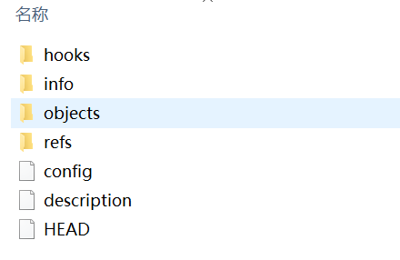

此前已经详述了 Git 的使用和协作，接下来我们一起深入的了解一下它的内部原理和实现方式。

从根本上理解，Git 是 一个内容寻址（content-addressable）文件系统，并在此之上提供了一个版本控制系统的用户界面。

由于 Git 最初是一套面向版本控制系统的工具集，而不是一个完整的、用户友好的版本控制系统， 所以它还包含了一部分用于完成底层工作的子命令。 这些命令被设计成能以 UNIX 命令行的风格连接在一起，或由脚本调用，来完成工作。 这部分命令一般被称作“底层（plumbing）”命令，而那些更友好的命令，比如 checkout ， branch 等则被称作“上层（porcelain）”命令。

其实目前的上层命令已经足够日常使用，但是底层命令能够让我们了解Git 是如何完成工作的，以及它为何如此运作的，更好的理解Git的工作机制， 多数底层命令并不面向最终用户：它们更适合作为新工具的组件和自定义脚本的组成部分。

当在一个新目录或已有目录执行 git init 时，Git 会创建一个 .git 目录。 这个目录包含了几乎所有 Git 存储和操作的东西。 如若想备份或复制一个版本库，只需把这个目录拷贝至另一处即可。 本章探讨的所有内容，均位于这个目录内。 新初始化的 .git 目录的典型结构如下：

随着 Git 版本的不同，该目录下可能还会包含其他内容。 不过对于一个全新的 git init 版本库，这将是你看到的默认结构：

`description` 文件仅供 GitWeb 程序使用，我们无需关心。

`config` 文件包含项目特有的配置选项。

`info` 目录包含一个全局性排除（global exclude）文件， 用以放置那些不希望被记录在 `.gitignore` 文件中的忽略模式（ignored patterns）。

`hooks` 目录包含客户端或服务端的钩子脚本（hook scripts）。

剩下的四个条目很重要：`HEAD` 文件、（尚待创建的）`index` 文件，和 `objects` 目录、`refs` 目录。 它们都是 Git 的核心组成部分。

`objects` 目录存储所有数据内容；

`refs` 目录存储指向数据（分支、远程仓库和标签等）的提交对象的指针；

`HEAD` 文件指向目前被检出的分支；

`index` 文件保存暂存区信息。