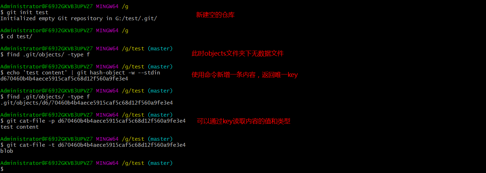
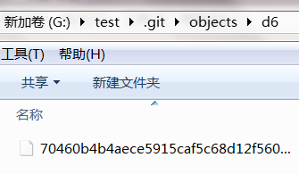
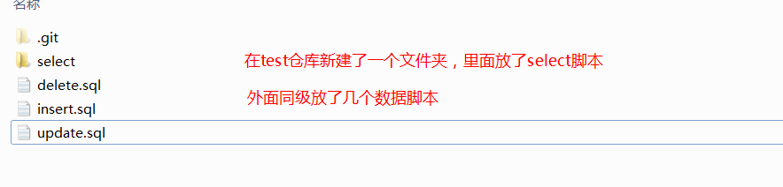
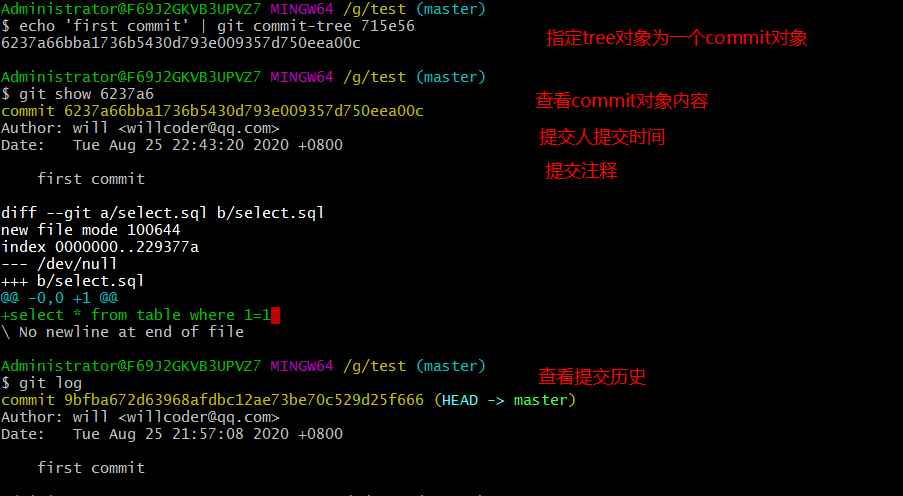
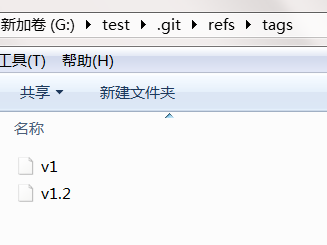

Git 包含四种基本对象类型：blob object （数据对象）、tree object （树对象）、commit object （提交对象）和 tag object （标签对象）。

## blob object（数据对象）

git 中的数据对象（blob object）就是**文件系统中的文件**，包含键：一个 hash 值和校验值的组合，值：文件内容。

可以当成我们电脑资源管理器上各种各样的文件，比较特殊的是：blob object 只存内容，不包括文件名、路径、格式等信息。

### 写入

git hash-object 会接受你传给它的东西，而它只会返回可以存储在 Git 仓库中的唯一键。这个 key 的前 6 位即可找到指定的 value。

`-w` 选项会指示该命令不要只返回键，还要将该对象写入数据库中。最后，`--stdin` 选项则指示该命令从标准输入读取内容；若不指定此选项，则须在命令尾部给出待存储文件的路径。

### 读取

可以通过 cat-file 命令从 Git 那里取回数据。这个命令简直就是一把剖析 Git 对象的瑞士军刀。

为 cat-file 指定 `-p` 选项可指示该命令自动判断内容的类型，并为我们显示大致的内容。

`git cat-file -p` 指返回存储的值。

```shell
git show
```

`git cat-file -t` 指返回存储的对象类型。

这部分感觉 Git 有点像 Redis 的味道，Git 的核心部分就是一个键值对数据库（key-value data store）。

```shell
find .git/objects/ -type f
```






## tree object（树对象）

树对象（tree object）相当于文件系统中的文件夹。但它包含了此目录下的数据对象，子目录（对应于子 trees），文件名、路径等元数据。因此，对于有子目录的目录，Git 相当于存储了嵌套的 trees。

树对象（tree object），它能解决文件名保存的问题，也允许我们将多个文件组织到一起。Git 以一种类似于 UNIX 文件系统的方式存储内容，但作了些许简化。所有内容均以树对象和数据对象的形式存储，其中树对象对应了 UNIX 中的目录项，数据对象则大致上对应了 inodes 或文件内容。一个树对象包含了一条或多条树对象记录（tree entry），每条记录含有一个指向数据对象或者子树对象的 SHA-1 指针，以及相应的模式、类型、文件名信息。例如，某项目当前对应的最新树对象可能是这样的：




提交新建的文件：

```shell
$ git add .
$ git commit -m 'first commit'
[master (root-commit) 9bfba67] first commit
 4 files changed, 5 insertions(+)
 create mode 100644 delete.sql
 create mode 100644 insert.sql
 create mode 100644 select/select.sql
 create mode 100644 update.sql
```

**使用 `git cat-file -p` 读取文件内容**，`master^{tree}` 语法表示 master 分支上最新的提交所指向的树对象。

```shell
$ git cat-file -p master^{tree}
100644 blob 7be9c19f6ca8802e1d8a1e017b0eb6a56db47320    delete.sql
100644 blob 2a313e0a83e07249fb263783edcde65af44f6331    insert.sql
040000 tree 715e56aa2f24831240cf204ecdb39fef9f61e0ea    select
100644 blob 37034df32709dfcc893f4828be7d023931400086    update.sql
```

请注意，select 子目录（所对应的那条树对象记录）并不是一个数据对象，而是一个指针，其指向的是另一个树对象：


### 新建 tree 对象

```shell
$ git write-tree
d61a5c0a3dbe06d2b5d9e25f70e830fe9f98bbf2
```

验证新建对象的类型

```shell
$ git cat-file -t d61a5c0a3dbe06d2b5d9e25f70e830fe9f98bbf2
tree
```


## commit object（提交对象）

提交对象（commit object）可以理解为对树对象的一层封装，里面包含了提交一个更新的所有元数据，如指向的 tree，父 commit，作者、提交者、提交日期、提交日志等。即带有时间、作者等信息的文件夹。

### 指定 tree 对象为 commit 对象

```shell
$ echo 'first commit' | git commit-tree 715e56
6237a66bba1736b5430d793e009357d750eea00c
```

### 查看 commit 对象内容

查看 commit 对象内容，包括提交人提交时间、提交注释等：

```shell
$ git show 6237a6
commit 6237a66bba1736b5430d793e009357d750eea00c
Author: will <willcoder@example.com>
Date:   Tue Aug 25 22:43:20 2020 +0800
    first commit
diff --git a/select.sql b/select.sql
new file mode 100644
index 0000000..229377a
--- /dev/null
+++ b/select.sql
@@ -0,0 +1 @@
+select * from table where 1=1
\ No newline at end of file
```

### 查看提交历史

```shell
$ git log
commit 9bfba672d63968afdbc12ae73be70c529d25f666 (HEAD -> master)
Author: will <willcoder@example.com>
Date:   Tue Aug 25 21:57:08 2020 +0800
    first commit
```




## tag object（标签对象）

可以给以上的任意对象打标签，但实际使用中，一般只会给提交打标签。

**列出现有 tag：**

```shell
git tag
```

**查看指定 tag 的信息：**

```shell
git show v1.2.3
```

**查看包含指定提交的 tag：**

```shell
git tag --contains <commit>
```

**简单新建：**

```shell
git tag v1.2.3
```

**给指定 commit 添加带注释的 tag：**

```shell
git tag -a v1.2.3 -m "your message" 9fceb02
```

### 示例

查看提交记录：

```shell
$ git log
commit 681b8b5b65b186cac5e194ba1a8a3a6271267645 (HEAD -> master, tag: v1)
Author: will <willcoder@example.com>
Date:   Tue Aug 25 23:05:47 2020 +0800
    commit 2
commit 9bfba672d63968afdbc12ae73be70c529d25f666
Author: will <willcoder@example.com>
Date:   Tue Aug 25 21:57:08 2020 +0800
    first commit
```

为提交添加 Tag：

```shell
$ git tag -a v1.2 -m "version 1.2" 9bfba6
```

查看 Tag 列表：

```shell
$ git tag
v1
v1.2
```

查看 Tag 内容：

```shell
$ git show v1.2
tag v1.2
Tagger: will <willcoder@example.com>
Date:   Tue Aug 25 23:11:19 2020 +0800
version 1.2
commit 9bfba672d63968afdbc12ae73be70c529d25f666 (tag: v1.2)
Author: will <willcoder@example.com>
Date:   Tue Aug 25 21:57:08 2020 +0800
    first commit
diff --git a/delete.sql b/delete.sql
new file mode 100644
index 0000000..7be9c19
--- /dev/null
+++ b/delete.sql
@@ -0,0 +1 @@
+insert
\ No newline at end of file
diff --git a/select/select.sql b/select/select.sql
new file mode 100644
index 0000000..229377a
--- /dev/null
+++ b/select/select.sql
@@ -0,0 +1 @@
+update table set id='22' where 1=1
```

Tag 存储位置：



