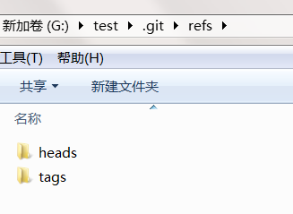
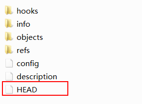
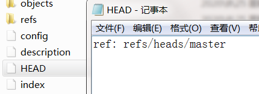
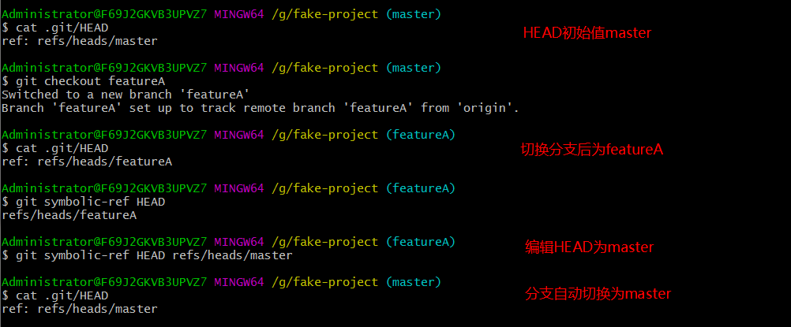
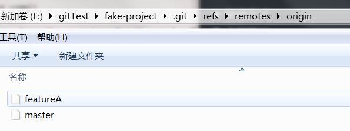

Git 引用，引用（references，缩写 refs）



引用的目的是创建一个指针替代原始的 key（SHA-1值）。

## 标签引用

比如上篇提到的查询对象内容的命令：

```shell
 git show <SHA-1>
```

如果我们给这个 commit 对象添加了 Tag：

```shell
$ git tag -a v1.2 -m "version 1.2" 9bfba6
```

即可使用 `git show <tag>` 的命令查看 commit 内容：

```shell
 $ git show v1.2
```

这种方式叫做标签引用。

此外，还有其他引用方式，Head 引用和 Remote 引用。

## HEAD 引用

当你执行 `git branch <branch>` 时，Git 如何知道最新提交的 SHA-1 值呢？答案是 HEAD 文件。





HEAD 文件是可以手动编辑的，但我们有个更安全的命令来完成此事：`git symbolic-ref`。也可以借助此命令来查看 HEAD 引用对应的值：



## 远程引用

remote reference



如果项目有添加远程版本库：

```shell
$ cat .git/refs/remotes/origin/master
24de949bb7c23ff052d5b39d01d809e86dd43fd2
```

远程引用和分支（位于 refs/heads 目录下的引用）之间最主要的区别在于，远程引用是只读的。虽然可以 `git checkout` 到某个远程引用，但是 Git 并不会将 HEAD 引用指向该远程引用。因此，不能通过 `commit` 命令来更新远程引用。Git 将这些远程引用作为记录远程服务器上各分支最后已知位置状态的书签来管理。

