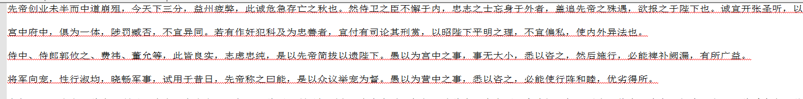

新建了一个 出师表txt



新增提交后

查看文件

```shell
$ git cat-file -p master^{tree}
100644 blob cd32d11c26f2909e3204e327bbd2685a87baf660    CSB.txt
```
修改这个文件，在最后加了几行文字
新增提交后 查看文件

```shell
$ git add .
$ git commit -m 'v2'
[master e532abd] v2
 1 file changed, 3 insertions(+)
$ git cat-file -p master^{tree}
100644 blob f3858d435146e27364574fa97936b45bec65663e    CSB.txt
```
发现两次文件是不一样的
查看文件大小

```shell
$ git cat-file -s cd32d1
1498
$ git cat-file -s f3858d
1561
```
这就是说，无论对这个文件做了多小的改动，Git 都会新建一个对象来保存新的内容。
这也造成了 Git 存储了前面大量内容是重复的，这种最初的存储对象格式称为“松散（loose）”对象格式

但是，Git 会时常将多个这些对象打包成一个称为“包文件（packfile）”的二进制文件，以节省空间和提高效率。 当版本库中有太多的松散对象，或者我们手动执行`git gc`命令，再或者我们向远程服务器执行推送时，Git 都会执行打包过程。

首先，我们查看当前对象列表，有一堆数据和提交对象

```shell
$ find .git/objects -type f
.git/objects/54/68f3283bfc7fd3ae3cf17e89210b744d106e48
.git/objects/af/f46a8086171b70b0146a1b44e6380ba242c022
.git/objects/cd/32d11c26f2909e3204e327bbd2685a87baf660
.git/objects/ce/e1c35858358f7438920ae1b7f7d86f5cc2119d
.git/objects/e5/32abd82431e55f3f03a2971b1af88002a26810
.git/objects/f3/858d435146e27364574fa97936b45bec65663e
.git/objects/f5/abd87faf2abc34e7d1ac18e7e020f7d4e1c547
```
然后我们执行`git gc`命令
```shell
$ git gc
Enumerating objects: 6, done.
Counting objects: 100% (6/6), done.
Delta compression using up to 8 threads.
Compressing objects: 100% (4/4), done.
Writing objects: 100% (6/6), done.
Total 6 (delta 1), reused 0 (delta 0)
```
再次查看对象列表，发现内容已打包
```shell
$ find .git/objects -type f
.git/objects/54/68f3283bfc7fd3ae3cf17e89210b744d106e48
.git/objects/info/packs
.git/objects/pack/pack-5035b9fb775a699fecee6ac3c3df69734a095758.idx
.git/objects/pack/pack-5035b9fb775a699fecee6ac3c3df69734a095758.pack
```
使用`git verify-pack`命令可以查看打包的内容
```shell
$ git verify-pack -v 
.git/objects/pack/pack-5035b9fb775a699fecee6ac3c3df69734a095758.idx
e532abd82431e55f3f03a2971b1af88002a26810 commit 197 139 12
aff46a8086171b70b0146a1b44e6380ba242c022 commit 149 110 151
f3858d435146e27364574fa97936b45bec65663e blob   1561 1076 261
f5abd87faf2abc34e7d1ac18e7e020f7d4e1c547 tree   35 45 1337
cee1c35858358f7438920ae1b7f7d86f5cc2119d tree   35 46 1382
cd32d11c26f2909e3204e327bbd2685a87baf660 blob   7 18 1428 1 
f3858d435146e27364574fa97936b45bec65663e
non delta: 5 objects
chain length = 1: 1 object
.git/objects/pack/pack-5035b9fb775a699fecee6ac3c3df69734a095758.pack: ok
```
可以看到对象`f3858d`为1561字节，为修改后的最新内容，另外一个对象`cd32d1`引用了`f3858d`，也就是保存了所有文件内容，且只占用7字节。