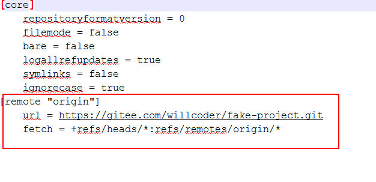
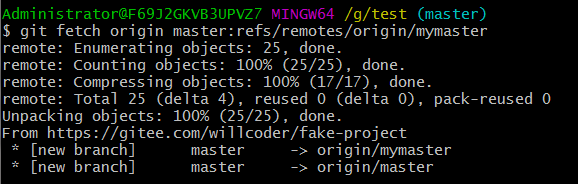
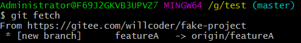
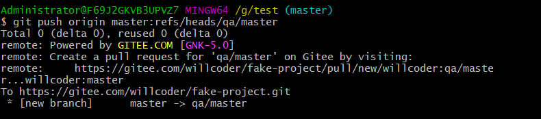

## 引用规范设置

添加远程仓库的命令会在 `.git/config` 文件中添加一个小节， 并在其中指定远程版本库的名称（origin）、URL 和一个用于获取操作的 引用规范（refspec）。

```shell
git remote add origin https://gitee.com/willcoder/fake-project.git
```



引用规范的格式由一个可选的 + 号和紧随其后的 `<src>:<dst>` 组成，其中 `<src>` 代表远程版本库中的引用；`<dst>` 是本地跟踪的远程引用的位置。+ 号告诉 Git 即使在不能快进的情况下也要（强制）更新引用。

默认情况下，引用规范由 `git remote add origin` 命令自动生成，Git 获取服务器中 `refs/heads/` 下面的所有引用，并将它写入到本地的 `refs/remotes/origin/` 中。所以，如果服务器上有一个 `master` 分支，你可以在本地通过下面任意一种方式来访问该分支上的提交记录：

```shell
$ git log origin/master
$ git log remotes/origin/master
$ git log refs/remotes/origin/master
```

上面的三个命令作用相同，因为 Git 会把它们都扩展成 `refs/remotes/origin/master`。

如果想让 Git 每次只拉取远程的 `master` 分支，而不是所有分支，可以把（引用规范的）获取那一行修改为只引用该分支：

```shell
fetch = +refs/heads/master:refs/remotes/origin/master
```

这种方式会默认修改引用规范，如果只希望被执行一次的操作，我们可以在命令行中指定引用规范。

若要将远程的 `master` 分支拉到本地的 `origin/mymaster` 分支，可以运行：

```shell
git fetch origin master:refs/remotes/origin/mymaster
```



也可以指定多个引用规范。在命令行中，你可以按照如下的方式拉取多个分支：

```shell
$ git fetch origin master:refs/remotes/origin/mymaster  \
topic:refs/remotes/origin/topic
From https://gitee.com/willcoder/fake-project.git
! [rejected]        master     -> origin/mymaster  (non fast forward)
* [new branch]      topic      -> origin/topic
```

在这个例子中，对 `master` 分支的拉取操作被拒绝，因为它不是一个可以快进的引用。我们可以通过在引用规范之前指定 `+` 号来覆盖该规则。

你也可以在配置文件中指定多个用于获取操作的引用规范。如果想在每次从 origin 远程仓库获取时都包括 `master` 和 `featureA` 分支，添加如下两行：

```shell
[remote "origin"]
url = https://gitee.com/willcoder/fake-project.git
fetch = +refs/heads/master:refs/remotes/origin/master
fetch = +refs/heads/featureA:refs/remotes/origin/featureA
```



我们不能在模式中使用部分通配符，所以像下面这样的引用规范是不合法的：

```shell
fetch = +refs/heads/qa*:refs/remotes/origin/qa*
```

但我们可以使用命名空间（或目录）来达到类似目的。

假设你有一个 QA 团队，他们推送了一系列分支，同时你只想要获取 `master` 和 QA 团队的所有分支而不关心其他任何分支，那么可以使用如下配置：

```shell
[remote "origin"]
url = https://gitee.com/willcoder/fake-project.git
fetch = +refs/heads/master:refs/remotes/origin/master
fetch = +refs/heads/qa/*:refs/remotes/origin/qa/*
```

如果项目的工作流很复杂，有 QA 团队推送分支、开发人员推送分支、集成团队推送并且在远程分支上展开协作，你就可以像这样（在本地）为这些分支创建各自的命名空间，非常方便。

## 引用规范推送

像上面这样从远程版本库获取已在命名空间中的引用当然很棒，但 QA 团队最初应该如何将他们的分支放入远程的 `qa/` 命名空间呢？我们可以通过引用规范推送来完成这个任务。

如果 QA 团队想把他们的 `master` 分支推送到远程服务器的 `qa/master` 分支上，可以运行：

```shell
$ git push origin master:refs/heads/qa/master
```

如果他们希望 Git 每次运行 `git push origin` 时都像上面这样推送，可以在他们的配置文件中添加一条 `push` 值：

```shell
[remote "origin"]
url = https://gitee.com/willcoder/fake-project.git
fetch = +refs/heads/*:refs/remotes/origin/*
push = refs/heads/master:refs/heads/qa/master
```



正如刚才所指出的，这会让 `git push origin` 默认把本地 `master` 分支推送到远程 `qa/master` 分支。

## 删除引用

删除引用你还可以借助类似下面的命令通过引用规范从远程服务器上删除引用：

```shell
$ git push origin :topic
```

因为引用规范（的格式）是 `<src>:<dst>`，所以上述命令把 `<src>` 留空，意味着把远程版本库的 topic 分支定义为空值，也就是删除它。

或者你可以使用更新的语法（自 Git v1.7.0 以后可用）：

```shell
$ git push origin --delete topic
```

