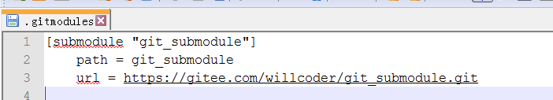
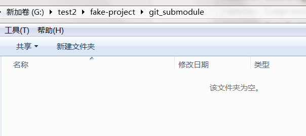

`git submodule`

## 开始使用

有种情况我们经常会遇到：某个工作中的项目需要包含并使用另一个项目。 也许是第三方库，或者你独立开发的，用于多个父项目的库。 现在问题来了：你想要把它们当做两个独立的项目，同时又想在一个项目中使用另一个。

此时就需要使用 Git 的子模块。 子模块允许你将一个 Git 仓库作为另一个 Git 仓库的子目录。 它能让你将另一个仓库克隆到自己的项目中，同时还保持提交的独立。

我们将要演示如何在一个被分成一个主项目与几个子项目的项目上开发。

我们首先将一个已存在的 Git 仓库添加为正在工作的仓库的子模块。 你可以通过在`git submodule add`命令后面加上想要跟踪的项目的相对或绝对 URL 来添加新的子模块。

首先新建了一个远程仓库当做子模块，然后在主项目上使用命令添加子模块

```shell
Administrator@F69J2GKVB3UPVZ7 MINGW64 /g/test/fake-project (master)
$ git submodule add https://gitee.com/willcoder/git_submodule.git
Cloning into 'G:/test/fake-project/git_submodule'...
remote: Enumerating objects: 3, done.
remote: Counting objects: 100% (3/3), done.
remote: Total 3 (delta 0), reused 0 (delta 0), pack-reused 0
Unpacking objects: 100% (3/3), done.
warning: LF will be replaced by CRLF in .gitmodules.
The file will have its original line endings in your working directory.
```
默认情况下，子模块会将子项目放到一个与仓库同名的目录中`git_submodule`。 如果你想要放到其他地方，那么可以在命令结尾添加一个不同的路径。
如果这时运行`git status`，你会注意到几件事。

```shell
$ git status
On branch master
Your branch and 'origin/master' have diverged,
and have 4 and 2 different commits each, respectively.
  (use "git pull" to merge the remote branch into yours)
Changes to be committed:
  (use "git reset HEAD <file>..." to unstage)
        new file:   .gitmodules
        new file:   git_submodule
```
首先应当注意到新的`.gitmodules`文件。 该配置文件保存了项目 URL 与已经拉取的本地目录之间的映射：


```shell
[submodule "git_submodule"]
	path = git_submodule
	url = https://gitee.com/willcoder/git_submodule.git
```
如果有多个子模块，该文件中就会有多条记录。 要重点注意的是，该文件也像`.gitignore`文件一样受到（通过）版本控制。 它会和该项目的其他部分一同被拉取推送。 这就是克隆该项目的人知道去哪获得子模块的原因。
在`git status`输出中列出的另一个是项目文件夹记录。 如果你运行`git diff`，会看到类似下面的信息：

```shell
$ git diff --cached git_submodule
diff --git a/git_submodule b/git_submodule
new file mode 160000
index 0000000..0c7ce50
--- /dev/null
+++ b/git_submodule
@@ -0,0 +1 @@
+Subproject commit 0c7ce502e3c47b30e02e08c1ff015660ff3bed45
```
虽然`git_submodule`是工作目录中的一个子目录，但 Git 还是会将它视作一个子模块。当你不在那个目录中时，Git 并不会跟踪它的内容， 而是将它看作子模块仓库中的某个具体的提交。
如果你想看到更漂亮的差异输出，可以给`git diff`传递`--submodule`选项。

```shell
$ git diff --cached --submodule
diff --git a/.gitmodules b/.gitmodules
new file mode 100644
index 0000000..7345b56
--- /dev/null
+++ b/.gitmodules
@@ -0,0 +1,3 @@
+[submodule "git_submodule"]
+       path = git_submodule
+       url = https://gitee.com/willcoder/git_submodule.git
Submodule git_submodule 0000000...0c7ce50 (new submodule)
```
当你提交时，会看到类似下面的信息：
```shell
$ git commit -am 'add git_submodules'
[master 8738267] add git_submodules
 2 files changed, 4 insertions(+)
 create mode 100644 .gitmodules
 create mode 160000 git_submodule
```
注意`git_submodule`记录的`160000`模式。 这是 Git 中的一种特殊模式，它本质上意味着你是将一次提交记作一项目录记录的，而非将它记录成一个子目录或者一个文件。
最后，推送这些更改：

```shell
$ git push origin master
```
## 克隆含有子模块的项目

接下来我们将会克隆一个含有子模块的项目。 当你在克隆这样的项目时，默认会包含该子模块目录，但其中还没有任何文件：

```shell
$ git clone https://gitee.com/willcoder/fake-project.git
Cloning into 'fake-project'...
remote: Enumerating objects: 44, done.
remote: Counting objects: 100% (44/44), done.
remote: Compressing objects: 100% (31/31), done.
remote: Total 44 (delta 10), reused 0 (delta 0), pack-reused 0
Unpacking objects: 100% (44/44), done.
$ cd fake-project/git_submodule/
$ ll
total 0
```


其中有`git_submodule`目录，不过是空的。此时必须运行两个命令：`git submodule init`用来初始化本地配置文件，而`git submodule update`则从该项目中抓取所有数据并检出父项目中列出的合适的提交。

```shell
$ git submodule init
Submodule 'git_submodule' (https://gitee.com/willcoder/git_submodule.git) registered for path 'git_submodule'
$ git submodule update
Cloning into 'G:/test2/fake-project/git_submodule'...
Submodule path 'git_submodule': checked out '0c7ce502e3c47b30e02e08c1ff015660ff3bed45'
```
现在`git_submodule`子目录是处在和之前提交时相同的状态了。
不过还有更简单一点的方式。 如果给`git clone`命令传递`--recurse-submodules`选项，它就会自动初始化并更新仓库中的每一个子模块， 包括可能存在的嵌套子模块。

```shell
$ git clone --recurse-submodules https://gitee.com/willcoder/fake-project.git
Cloning into 'fake-project'...
remote: Enumerating objects: 44, done.
remote: Counting objects: 100% (44/44), done.
remote: Compressing objects: 100% (31/31), done.
remote: Total 44 (delta 10), reused 0 (delta 0), pack-reused 0
Unpacking objects: 100% (44/44), done.
Submodule 'git_submodule' (https://gitee.com/willcoder/git_submodule.git) registered for path 'git_submodule'
Cloning into 'G:/test2/fake-project/git_submodule'...
remote: Enumerating objects: 3, done.
remote: Counting objects: 100% (3/3), done.
remote: Total 3 (delta 0), reused 0 (delta 0), pack-reused 0
Submodule path 'git_submodule': checked out '0c7ce502e3c47b30e02e08c1ff015660ff3bed45'
```
如果你已经克隆了项目但忘记了`--recurse-submodules`，那么可以运行`git submodule update --init`将`git submodule init`和`git submodule update`合并成一步。如果还要初始化、抓取并检出任何嵌套的子模块， 请使用简明的`git submodule update --init --recursive`。
## 在包含子模块的项目上工作

现在我们有一份包含子模块的项目副本，我们将会同时在主项目和子模块项目上与队员协作。

### **从子模块的远端拉取上游修改**

在项目中使用子模块的最简模型，就是只使用子项目并不时地获取更新，而并不在你的检出中进行任何更改。 我们来看一个简单的例子。

如果想要在子模块中查看新工作，可以进入到目录中运行`git fetch`与`git merge`，合并上游分支来更新本地代码。

```shell
$ git fetch
remote: Enumerating objects: 5, done.
remote: Counting objects: 100% (5/5), done.
remote: Total 3 (delta 0), reused 0 (delta 0), pack-reused 0
Unpacking objects: 100% (3/3), done.
From https://gitee.com/willcoder/git_submodule
   0c7ce50..a5cbd40  master     -> origin/master
$ git merge origin/master
Updating 0c7ce50..a5cbd40
Fast-forward
 my_submodule.txt | 3 ++-
 1 file changed, 2 insertions(+), 1 deletion(-)
```
如果你现在返回到主项目并运行`git diff --submodule`，就会看到子模块被更新的同时获得了一个包含新添加提交的列表。 如果你不想每次运行`git diff`时都输入`--submodle`，那么可以将`diff.submodule`设置为 “log” 来将其作为默认行为。
```shell
$ git config --global diff.submodule log
$ git diff
Submodule git_submodule 0c7ce50..a5cbd40:
  > update my_submodule.txt.
```
如果在此时提交，那么你会将子模块锁定为其他人更新时的新代码。
如果你不想在子目录中手动抓取与合并，那么还有种更容易的方式。 运行`git submodule update --remote`，Git 将会进入子模块然后抓取并更新。

```shell
$ git submodule update --remote git_submodule
remote: Enumerating objects: 5, done.
remote: Counting objects: 100% (5/5), done.
remote: Total 3 (delta 0), reused 0 (delta 0), pack-reused 0
Unpacking objects: 100% (3/3), done.
From https://gitee.com/willcoder/git_submodule
   a5cbd40..a7597da  master     -> origin/master
Submodule path 'git_submodule': checked out 'a7597dad4a94bec59bd44d36e53939add9735ada'
```
此命令默认会假定你想要更新并检出子模块仓库的`master`分支。 不过你也可以设置为想要的其他分支。 例如，你想要子模块跟踪仓库的 “stable” 分支，那么既可以在`.gitmodules`文件中设置 （这样其他人也可以跟踪它），也可以只在本地的`.git/config`文件中设置。 让我们在`.gitmodules`文件中设置它：
```shell
$ git config -f .gitmodules submodule.git_submodule.branch stable
$ git submodule update --remote
remote: Enumerating objects: 5, done.
remote: Counting objects: 100% (5/5), done.
remote: Compressing objects: 100% (2/2), done.
remote: Total 3 (delta 0), reused 0 (delta 0), pack-reused 0
Unpacking objects: 100% (3/3), done.
From https://gitee.com/willcoder/git_submodule
 * [new branch]      stable     -> origin/stable
Submodule path 'git_submodule': checked out 'b2f53efebee60cf5b2092f911bf170e338c3acd1'
```
如果不用`-f .gitmodules`选项，那么它只会为你做修改。但是在仓库中保留跟踪信息更有意义一些，因为其他人也可以得到同样的效果。
这时我们运行`git status`，Git 会显示子模块中有“新提交”。

```shell
$ git status
On branch master
Your branch is up to date with 'origin/master'.
Changes not staged for commit:
  (use "git add <file>..." to update what will be committed)
  (use "git checkout -- <file>..." to discard changes in working directory)
        modified:   .gitmodules
        modified:   git_submodule (new commits)
no changes added to commit (use "git add" and/or "git commit -a")
```
如果你设置了配置选项`status.submodulesummary`，Git 也会显示你的子模块的更改摘要：
```shell
$ git config status.submodulesummary 1
$ git status
On branch master
Your branch is up to date with 'origin/master'.
Changes not staged for commit:
  (use "git add <file>..." to update what will be committed)
  (use "git checkout -- <file>..." to discard changes in working directory)
        modified:   .gitmodules
        modified:   git_submodule (new commits)
Submodules changed but not updated:
* git_submodule 0c7ce50...b2f53ef (3):
  > update my_submodule.txt.
no changes added to commit (use "git add" and/or "git commit -a")
```
这时如果运行`git diff`，可以看到我们修改了 .gitmodules 文件，同时还有几个已拉取的提交需要提交到我们自己的子模块项目中。
```shell
$ git diff
warning: LF will be replaced by CRLF in .gitmodules.
The file will have its original line endings in your working directory.
diff --git a/.gitmodules b/.gitmodules
index 7345b56..a36a136 100644
--- a/.gitmodules
+++ b/.gitmodules
@@ -1,3 +1,6 @@
 [submodule "git_submodule"]
        path = git_submodule
        url = https://gitee.com/willcoder/git_submodule.git
+       branch = stable
```
这非常有趣，因为我们可以直接看到将要提交到子模块中的提交日志。 提交之后，你也可以运行`git log -p`查看这个信息。
```shell
$ git log -p --submodule
commit 873826777c305398b44496d0fb2c3408fece5f50 (HEAD -> master, origin/master, origin/HEAD)
Author: will <willcoder@example.com>
Date:   Mon Sep 14 00:05:37 2020 +0800
    add git_submodules
diff --git a/.gitmodules b/.gitmodules
new file mode 100644
index 0000000..7345b56
--- /dev/null
+++ b/.gitmodules
@@ -0,0 +1,3 @@
+[submodule "git_submodule"]
+       path = git_submodule
+       url = https://gitee.com/willcoder/git_submodule.git
Submodule git_submodule 0000000...0c7ce50 (new submodule)
```
当运行`git submodule update --remote`时，Git 默认会尝试更新**所有**子模块， 所以如果有很多子模块的话，你可以传递想要更新的子模块的名字。
**从项目远端拉取上游更改**

默认情况下，`git pull`命令会递归地抓取子模块的更改。 然而，它不会**更新**子模块。所以需要运行`git submodule update --init --recursive`。

如果你想自动化此过程，那么可以为`git pull`命令添加`--recurse-submodules`选项（从 Git 2.14 开始）。 这会让 Git 在拉取后运行`git submodule update`，将子模块置为正确的状态。 此外，如果你想让 Git 总是以`--recurse-submodules`拉取，可以将配置选项`submodule.recurse`设置为`true`（从 Git 2.15 开始可用于`git pull`）。此选项会让 Git 为所有支持`--recurse-submodules`的命令使用该选项（除`clone`以外）。

在为父级项目拉取更新时，还会出现一种特殊的情况：在你拉取的提交中， 可能`.gitmodules`文件中记录的子模块的 URL 发生了改变。 比如，若子模块项目改变了它的托管平台，就会发生这种情况。 此时，若父级项目引用的子模块提交不在仓库中本地配置的子模块远端上，那么执行`git pull --recurse-submodules`或`git submodule update`就会失败。 为了补救，`git submodule sync`命令需要：

```shell
# 将新的 URL 复制到本地配置中
$ git submodule sync --recursive
# 从新 URL 更新子模块
$ git submodule update --init --recursive
```
### **在子模块上工作**
现在我们将通过一个例子来演示如何在子模块与主项目中同时做修改，以及如何同时提交与发布那些修改。

为了将子模块设置得更容易进入并修改，你需要做两件事。 首先，进入每个子模块并检出其相应的工作分支。 接着，若你做了更改就需要告诉 Git 它该做什么，然后运行`git submodule update --remote`来从上游拉取新工作。 你可以选择将它们合并到你的本地工作中，也可以尝试将你的工作变基到新的更改上。

首先，让我们进入子模块目录然后检出一个分支。

```shell
$ cd git_submodule/
$ git checkout -b stable
Switched to a new branch 'stable'
```
然后尝试用 “merge” 选项来更新子模块。 为了手动指定它，我们只需给`update`添加`--merge`选项即可。 这时我们将会看到服务器上的这个子模块有一个改动并且它被合并了进来。
```shell
$ cd ..
$ git submodule update --remote --merge
remote: Enumerating objects: 11, done.
remote: Counting objects: 100% (11/11), done.
remote: Compressing objects: 100% (4/4), done.
remote: Total 9 (delta 0), reused 0 (delta 0), pack-reused 0
Unpacking objects: 100% (9/9), done.
From https://gitee.com/willcoder/git_submodule
   0c7ce50..a7597da  master     -> origin/master
 * [new branch]      stable     -> origin/stable
Updating 0c7ce50..a7597da
Fast-forward
 my_submodule.txt | 4 +++-
 1 file changed, 3 insertions(+), 1 deletion(-)
Submodule path 'git_submodule': merged in 'a7597dad4a94bec59bd44d36e53939add9735ada'
```
如果我们进入子模块目录，可以发现新的改动已经合并入本地`stable`分支。 现在让我们看看当我们对库做一些本地的改动而同时其他人推送另外一个修改到上游时会发生什么。
```shell
$ cd git_submodule/
$ vi my_submodule.txt
$ git commit -am 'my push test'
[stable 926118a] my push test
 1 file changed, 5 insertions(+), 1 deletion(-)
```
如果我们现在更新子模块，就会看到当我们在本地做了更改时上游也有一个改动，我们需要将它并入本地。
```shell
$ cd ..
$ git submodule update --remote --rebase
Current branch stable is up to date.
Submodule path 'git_submodule': rebased into 'a7597dad4a94bec59bd44d36e53939add9735ada'
```
如果你忘记`--rebase`或`--merge`，Git 会将子模块更新为服务器上的状态。并且会将项目重置为一个游离的 HEAD 状态。
```shell
$ git submodule update --remote
Submodule path 'git_submodule': checked out 'a7597dad4a94bec59bd44d36e53939add9735ada'
```
即便这真的发生了也不要紧，你只需回到目录中再次检出你的分支（即还包含着你的工作的分支）然后手动地合并或变基`origin/stable`（或任何一个你想要的远程分支）就行了。
如果你没有提交子模块的改动，那么运行一个子模块更新也不会出现问题，此时 Git 会只抓取更改而并不会覆盖子模块目录中未保存的工作。

如果你做了一些与上游改动冲突的改动，当运行更新时 Git 会让你知道。

```shell
$ git submodule update --remote --merge
Auto-merging my_submodule.txt
CONFLICT (content): Merge conflict in my_submodule.txt
Recorded preimage for 'my_submodule.txt'
Automatic merge failed; fix conflicts and then commit the result.
Unable to merge 'dd63fb4c96cc5fcd1af3595a995cb5e0b9ab6495' in submodule path 'git_submodule'
```
你可以进入子模块目录中然后就像平时那样修复冲突。
### **发布子模块改动**

现在我们的子模块目录中有一些改动。 其中有一些是我们通过更新从上游引入的，而另一些是本地生成的，由于我们还没有推送它们，所以对任何其他人都不可用。

```shell
$ git diff
diff --git a/.gitmodules b/.gitmodules
index 7345b56..a36a136 100644
--- a/.gitmodules
+++ b/.gitmodules
@@ -1,3 +1,6 @@
 [submodule "git_submodule"]
        path = git_submodule
        url = https://gitee.com/willcoder/git_submodule.git
+       branch = stable
Submodule git_submodule 0c7ce50..0b924ac:
  > conflict ok
  > test conflict
  > update my_submodule.txt.
  > update my_submodule.txt.
```
如果我们只推送主项目而不推送子模块，检出我们项目的人可能会出现错误，为了确保这不会发生，可以让 Git 在推送到主项目前检查所有子模块是否已推送。
`git push`命令接受可以设置为 “check” 或 “on-demand” 的`--recurse-submodules`参数。 如果任何提交的子模块改动没有推送那么 “check” 选项会直接使`push`操作失败。

```shell
$ git push --recurse-submodules=check
The following submodule paths contain changes that can
not be found on any remote:
  git_submodule
Please try
	git push --recurse-submodules=on-demand
or cd to the path and use
	git push
to push them to a remote.
```
它给我们了一些建议，指导接下来该如何做。 最简单的选项是进入每一个子模块中然后手动推送到远程仓库，确保它们能被外部访问到，之后再次尝试这次推送。 如果你想要对所有推送都执行检查，那么可以通过设置`git config push.recurseSubmodules check`让它成为默认行为。
另一个选项是使用 “on-demand” 值，它会尝试为你这样做。

```shell
$ git push --recurse-submodules=on-demand
```
Git 进入到子模块中然后在推送主项目前推送了它。 如果那个子模块因为某些原因推送失败，主项目也会推送失败。 你也可以通过设置`git config push.recurseSubmodules on-demand`让它成为默认行为。

### **合并子模块改动**

如果你和其他人同时改动了一个子模块引用，那么可能会遇到一些问题。

如果一个提交是另一个的直接祖先（一个快进式合并），那么 Git 会简单地选择之后的提交来合并，这样没什么问题。

不过，Git 甚至不会尝试去进行一次简单的合并。 如果子模块提交已经分叉且需要合并，那么你会收到冲突的提示。

```shell
CONFLICT (content): Merge conflict in my_submodule.txt
Recorded preimage for 'my_submodule.txt'
Automatic merge failed; fix conflicts and then commit the result.
```
所以本质上 Git 在这里指出了子模块历史中的两个分支记录点已经分叉并且需要合并。 它将其解释为 “merge following commits not found” （未找到接下来需要合并的提交），虽然这有点令人困惑，不过之后我们会解释为什么是这样。
为了解决这个问题，你需要弄清楚子模块应该处于哪种状态。 奇怪的是，Git 并不会给你多少能帮你摆脱困境的信息，甚至连两边提交历史中的 SHA-1 值都没有。 幸运的是，这很容易解决。 如果你运行`git diff`，就会得到试图合并的两个分支中记录的提交的 SHA-1 值。

1. 首先解决冲突
2. 然后返回到主项目目录中
3. 再次检查 SHA-1 值
4. 解决冲突的子模块记录
5. 提交我们的合并

有趣的是，Git 还能处理另一种情况。 如果子模块目录中存在着这样一个合并提交，它的历史中包含了的**两边**的提交，那么 Git 会建议你将它作为一个可行的解决方案。 它看到有人在子模块项目的某一点上合并了包含这两次提交的分支，所以你可能想要那个。

如果它找到了一个可以接受的合并提交，你会看到类似下面的信息：

```shell
$ git merge origin/master
warning: Failed to merge submodule git_submodule(not fast-forward)
Found a possible merge resolution for the submodule:
 9fd905e5d7f45a0d4cbc43d1ee550f16a30e825a: > merged our changes
If this is correct simply add it to the index for example
by using:
  git update-index --cacheinfo 160000 9fd905e5d7f45a0d4cbc43d1ee550f16a30e825a "git_submodule"
which will accept this suggestion.
Auto-merging git_submodule
CONFLICT (submodule): Merge conflict in git_submodule
Automatic merge failed; fix conflicts and then commit the result.
```
Git 建议的命令是更新索引，就像你运行了`git add`那样，这样会清除冲突然后提交。 不过你可能不应该这样做。你可以轻松地进入子模块目录，查看差异是什么，快进到这次提交，恰当地测试，然后提交它。
```shell
$ cd git_submodule/
$ git merge 9fd905e
Updating eb41d76..9fd905e
Fast-forward
$ cd ..
$ git add git_submodule
$ git commit -am 'Fast forwarded to a common submodule child'
```
这些命令完成了同一件事，但是通过这种方式你至少可以验证工作是否有效，以及当你在完成时可以确保子模块目录中有你的代码。
## **其他**

### **子模块遍历**

有一个`foreach`子模块命令，它能在每一个子模块中运行任意命令。 如果项目中包含了大量子模块，这会非常有用。

```shell
$ git submodule foreach 'git stash'
Entering 'git_submodule'
Saved working directory and index state WIP on (no branch): 0b924ac conflict ok
```
### **有用的别名**

你可能想为其中一些命令设置别名，因为它们可能会非常长而你又不能设置选项作为它们的默认选项。

```shell
$ git config alias.sdiff '!'"git diff && git submodule foreach 'git diff'"
$ git config alias.spush 'push --recurse-submodules=on-demand'
$ git config alias.supdate 'submodule update --remote --merge'
```
这样当你想要更新子模块时可以简单地运行`git supdate`，或`git spush`检查子模块依赖后推送。