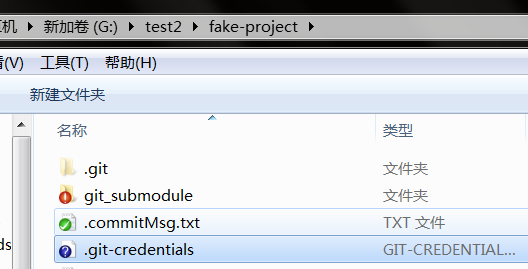

`git credential`

## 凭证存储设置

如果你使用的是 SSH 方式连接远端，并且设置了一个没有口令的密钥，这样就可以在不输入用户名和密码的情况下安全地传输数据。 然而，这对 HTTP 协议来说是不可能的 —— 每一个连接都是需要用户名和密码的，但我们使用时，并没有每次都被要求输入凭证，原因就是Git拥有凭证系统来处理这个事情。

* 默认所有都不缓存。 每一次连接都会询问你的用户名和密码。
* “cache” 模式会将凭证存放在内存中一段时间。 密码永远不会被存储在磁盘中，并且在15分钟后从内存中清除。
* “store” 模式会将凭证用明文的形式存放在磁盘中，并且永不过期。 这意味着除非你修改了你在 Git 服务器上的密码，否则你永远不需要再次输入你的凭证信息。 这种方式的缺点是你的密码是用明文的方式存放在你的 home 目录下。
* 如果你使用的是 Mac，Git 还有一种 “osxkeychain” 模式，它会将凭证缓存到你系统用户的钥匙串中。 这种方式将凭证存放在磁盘中，并且永不过期，但是是被加密的，这种加密方式与存放 HTTPS 凭证以及 Safari 的自动填写是相同的。
* 如果你使用的是 Windows，你可以安装一个叫做 “Git Credential Manager for Windows” 的辅助工具。 这和上面说的 “osxkeychain” 十分类似，但是是使用 Windows Credential Store 来控制敏感信息。 可以在[https://github.com/Microsoft/Git-Credential-Manager-for-Windows](https://github.com/Microsoft/Git-Credential-Manager-for-Windows)下载。
* 你可以设置 Git 的配置来选择上述的一种方式

```shell
$ git config --global credential.helper cache
```
查看凭证缓存配置：
```shell
git config --list | grep credential
```
Mac，默认会输出：
```shell
include.path=.gitcredential
credential.helper=osxkeychain
```
对应的也就是Mac的“钥匙串”系统。
Windows安装GitGUI后，默认会输出：

```shell
credential.helper=manager
```

Git 甚至允许你配置多个辅助工具。 当查找特定服务器的凭证时，Git 会按顺序查询，并且在找到第一个回答时停止查询。 当保存凭证时，Git 会将用户名和密码发送给**所有**配置列表中的辅助工具，它们会按自己的方式处理用户名和密码。 如果你在闪存上有一个凭证文件，但又希望在该闪存被拔出的情况下使用内存缓存来保存用户名密码，`.gitconfig`配置文件如下：

```shell
[credential]
    helper = store --file G:/test2/fake-project/.git-credentials
    helper = cache --timeout 30000
```


## 底层实现

Git 凭证辅助工具系统的命令是`git credential`，这个命令接收一个参数，并通过标准输入获取更多的参数。

举一个例子更容易理解。 我们假设已经配置好一个凭证辅助工具，这个辅助工具保存了`mygithost`的凭证信息。 下面是一个使用 “fill” 命令的会话，当 Git 尝试寻找一个服务器的凭证时就会被调用。

```shell
$ git credential fill (1)
protocol=https (2)
host=mygithost
(3)
protocol=https (4)
host=mygithost
username=bob
password=s3cre7
$ git credential fill (5)
protocol=https
host=unknownhost
Username for 'https://unknownhost': bob
Password for 'https://bob@unknownhost':
protocol=https
host=unknownhost
username=bob
password=s3cre7
```
1. 这是开始交互的命令。
2. Git-credential 接下来会等待标准输入。 我们提供我们所知道的信息：协议和主机名。
3. 一个空行代表输入已经完成，凭证系统应该输出它所知道的信息。
4. 接下来由 Git-credential 接管，并且将找到的信息打印到标准输出。
5. 如果没有找到对应的凭证，Git 会询问用户的用户名和密码，我们将这些信息输入到在标准输出的地方（这个例子中是同一个控制台）。

简单来说：就是每次需要用户名密码的时候，都会调用 Git-credential 命令，它会先向辅助程序获取用户密码，如果成功，就用这个获得的用户密码去访问远程仓库。如果获取不到，就会让用户输入一次，并尝试保存下来。

因此我们第一次使用的时候，会被提示输入用户名密码，就是因为git的内部调用了这个命令。