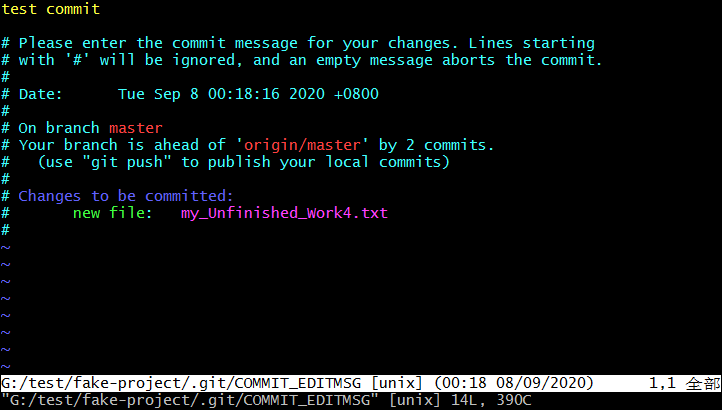
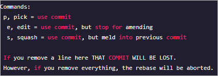
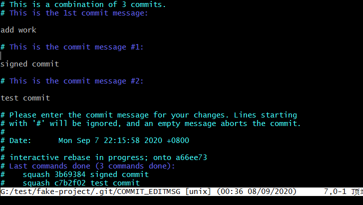
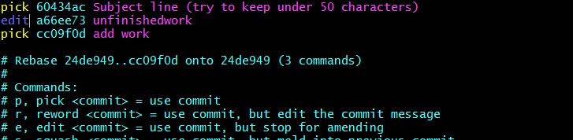

## 修改最后一次提交

修改最后一次提交可能是所有修改历史提交的操作中最常见的一个需求。一般是简单修改提交信息，或者通过添加、移除或修改文件来更改提交实际的内容。

首先做一次提交：

```shell
$ git commit -m 'test commit'
[master 3587f3f] test commit
 1 file changed, 1 insertion(+)
 create mode 100644 my_Unfinished_Work4.txt
```

如果，你只是想修改最近一次提交的提交信息，那么很简单：

```shell
$ git commit --amend
```



上面这条命令会将最后一次的提交信息载入到编辑器中供你修改。当保存并关闭编辑器后，编辑器会将更新后的提交信息写入新提交中，它会成为新的最后一次提交。

另一方面，如果你想要修改最后一次提交的实际内容，那么流程很相似：首先作出你想要补上的修改，暂存它们，然后用 `git commit --amend` 以新的改进后的提交来**替换**掉旧有的最后一次提交，使用这个技巧的时候需要小心，因为修正会改变提交的 SHA-1。它类似于一个小的变基 —— 如果已经推送了最后一次提交就不要修正它。

## 修改多个提交说明

要修改更早的历史提交，Git 没有提供工具，但可以使用 `rebase` 来衍合一系列的提交到它们原来所在的 HEAD 上而不是移到新的上。你可以通过给 `git rebase` 增加 `-i` 选项来以交互方式地运行 `rebase`。

例如，如果想要修改最近三次提交信息，或者那组提交中的任意一个提交信息，将想要修改的最近一次提交的父提交作为参数传递给 `git rebase -i` 命令，即 `HEAD~2^` 或 `HEAD~3`。 记住 `~3` 可能比较容易，因为你正尝试修改最后三次提交；但是注意实际上指定了以前的四次提交，即想要修改提交的父提交。

```shell
$ git rebase -i HEAD~3
```

再次记住这是一个变基命令 —— 在 `HEAD~3..HEAD` 范围内的每一个修改了提交信息的提交及其**所有后裔**都会被重写。不要涉及任何已经推送到中央服务器的提交 —— 这样做会产生一次变更的两个版本，因而使他人困惑。

运行这个命令会在文本编辑器上给你一个提交的列表，看起来像下面这样：

```shell
pick a732e98 add work
pick 3b69384 signed commit
pick c7b2f02 test commit
# Rebase a66ee73..c7b2f02 onto a66ee73 (3 commands)
#
# Commands:
# p, pick <commit> = use commit
# r, reword <commit> = use commit, but edit the commit message
# e, edit <commit> = use commit, but stop for amending
# s, squash <commit> = use commit, but meld into previous commit
# f, fixup <commit> = like "squash", but discard this commit's log message
# x, exec <command> = run command (the rest of the line) using shell
# d, drop <commit> = remove commit
# l, label <label> = label current HEAD with a name
# t, reset <label> = reset HEAD to a label
# m, merge [-C <commit> | -c <commit>] <label> [# <oneline>]
# .       create a merge commit using the original merge commit's
# .       message (or the oneline, if no original merge commit was
# .       specified). Use -c <commit> to reword the commit message.
#
# These lines can be re-ordered; they are executed from top to bottom.
<ake-project/.git/rebase-merge/git-rebase-todo [unix] (00:23 08/09/2020)1,1 顶端
<t/fake-project/.git/rebase-merge/git-rebase-todo" [unix] 29L, 1137C
```

需要重点注意的是相对于正常使用的 `log` 命令，这些提交显示的顺序是相反的。运行一次 `log` 命令，会看到类似这样的东西：

```shell
$ git log --pretty=format:"%h %s" HEAD~3..HEAD
c7b2f02 test commit
3b69384 signed commit
a732e98 add work
```

注意其中的反序显示。交互式变基给你一个它将会运行的脚本。它将会从你在命令行中指定的提交（`HEAD~3`）开始，从上到下的依次重演每一个提交引入的修改。它将最旧的而不是最新的列在上面，因为那会是第一个将要重演的。

你需要修改脚本来让它停留在你想修改的变更上。要达到这个目的，你只要将你想修改的每一次提交前面的 ‘pick’ 改为 ‘edit’。例如，只想修改第三次提交信息，可以像下面这样修改文件：

```shell
edit a732e98 add work
pick c7b2f02 test commit
pick 3b69384 signed commit
```

当保存并退出编辑器时，Git 将你带回到列表中的最后一次提交，把你送回命令行并提示以下信息：

```shell
$ git rebase -i HEAD~3
Stopped at a732e98... add work
You can amend the commit now, with
       git commit --amend
Once you're satisfied with your changes, run
       git rebase --continue
```

这些指令准确地告诉你该做什么。输入：

```shell
$ git commit --amend
```

修改提交信息，然后退出编辑器。然后运行：

```shell
$ git rebase --continue
```

这个命令会自动应用其他两次提交，你就完成任务了。如果你将更多行的 `pick` 改为 `edit`，你就能对你想修改的提交重复这些步骤。Git 每次都会停下，让你修正提交，完成后继续运行。

## 重新排序提交

也可以使用交互式变基来重新排序或完全移除提交。 如果想要移除 “signed commit” 提交然后修改另外两个提交引入的顺序，可以将变基脚本从这样：

```shell
pick a732e98 add work
pick c7b2f02 test commit
pick 3b69384 signed commit
```

改为这个：

```shell
pick c7b2f02 test commit
pick a732e98 add work
```

当你保存并退出编辑器，Git 将分支倒回至这些提交的父提交，应用 c7b2f02 ，然后 a732e98 ，接着停止。你有效地修改了这些提交的顺序并且彻底删除了“signed commit”这次提交。

## 压制（Squashing）提交

交互式的衍合工具还可以将一系列提交压制为单一提交。脚本在 rebase 的信息里放了一些有用的指示：



如果不用 "pick" 或者 "edit"，而是指定 "squash"，Git 会同时应用那个变更和它之前的变更并将提交说明归并。因此，如果你想将这三个提交合并为单一提交，你可以将脚本修改成这样：

```shell
pick a732e98 add work
squash c7b2f02 test commit
squash 3b69384 signed commit
```

当你保存并退出编辑器，Git 会应用全部三次变更然后将你送回编辑器来归并三次提交说明。



当你保存之后，你就拥有了一个包含前三次提交的全部变更的单一提交。

## 拆分提交

拆分提交就是撤销一次提交，然后多次部分地暂存或提交直到结束。例如，假设你想将第二次提交拆分。将 "unfinishedwork" 拆分成两次提交：第一次为 "unfinishedworkA"，第二次为 "unfinishedworkB"。你可以在 `rebase -i` 脚本中修改你想拆分的提交前的指令为 "edit"：



然后，这个脚本就将你带入命令行，你重置那次提交，提取被重置的变更，从中创建多次提交。当你保存并退出编辑器，Git 倒回到列表中第一次提交的父提交，应用第一次提交（60434ac），应用第二次提交（a66ee73），然后将你带到控制台。那里你可以用 `git reset HEAD^` 对那次提交进行一次混合的重置，这将撤销那次提交并且将修改的文件撤回。此时你可以暂存并提交文件，直到你拥有多次提交，结束后，运行 `git rebase --continue`。

```shell
$ git rebase -i HEAD~3
Stopped at a66ee73...  unfinishedwork
You can amend the commit now, with
  git commit --amend
Once you are satisfied with your changes, run
  git rebase --continue
Administrator@F69J2GKVB3UPVZ7 MINGW64 /g/test/fake-project (master|REBASE-i 2/3)
$ git reset HEAD^
Administrator@F69J2GKVB3UPVZ7 MINGW64 /g/test/fake-project (master|REBASE-i 2/3)
$ git add .
Administrator@F69J2GKVB3UPVZ7 MINGW64 /g/test/fake-project (master|REBASE-i 2/3)
$ git commit -m 'unfinishedworkA'
[detached HEAD 85853a2] unfinishedworkA
 1 file changed, 0 insertions(+), 0 deletions(-)
 create mode 100644 my_Unfinished_Work.txt
Administrator@F69J2GKVB3UPVZ7 MINGW64 /g/test/fake-project (master|REBASE-i 2/3)
$ git add .
Administrator@F69J2GKVB3UPVZ7 MINGW64 /g/test/fake-project (master|REBASE-i 2/3)
$ git commit -m 'unfinishedworkB'
[detached HEAD 5a56d30] unfinishedworkB
 1 file changed, 1 insertion(+)
Administrator@F69J2GKVB3UPVZ7 MINGW64 /g/test/fake-project (master|REBASE-i 2/3)
$ git rebase --continue
Successfully rebased and updated refs/heads/master.
```

Git 在脚本中应用了最后一次提交（a5f4a0d），你的历史看起来就像这样了：

```shell
$ git log --pretty=format:"%h %s"
be69930 add work
5a56d30 unfinishedworkB
85853a2 unfinishedworkA
60434ac Subject line (try to keep under 50 characters)
```

再次提醒，这会修改你列表中的提交的 SHA 值，所以请确保这个列表里不包含你已经推送到共享仓库的提交。

## 核弹级选项 filter-branch

如果你想用脚本的方式修改大量的提交，还有一个重写历史的选项可以使用 —— 例如，全局性地修改电子邮件地址或者将一个文件从所有提交中删除。这个命令是 filter-branch，**这个会大面积地修改你的历史**，所以你很有可能不该去用它，除非你的项目尚未公开，没有其他人在你准备修改的提交的基础上工作。

### 从所有提交中删除一个文件

这个经常发生。有些人不经思考使用 `git add .`，意外地提交了一个巨大的二进制文件，你想将它从所有地方删除。也许你不小心提交了一个包含密码的文件，而你想让你的项目开源。filter-branch大概会是你用来清理整个历史的工具。要从整个历史中删除一个名叫 password.txt 的文件，你可以在 filter-branch 上使用 `--tree-filter` 选项。

```shell
$ git filter-branch --tree-filter 'rm -f passwords.txt' HEAD
Rewrite 6b9b3cf04e7c5686a9cb838c3f36a8cb6a0fc2bd (21/21)
Ref 'refs/heads/master' was rewritten
```

`--tree-filter` 选项会在每次检出项目时先执行指定的命令然后重新提交结果。

### 将一个子目录设置为新的根目录

假设你完成了从另外一个代码控制系统的导入工作，得到了一些没有意义的子目录（trunk, tags 等等）。如果你想让 trunk 子目录成为每一次提交的新的项目根目录，`filter-branch` 也可以帮你做到。

```shell
$ git filter-branch --subdirectory-filter trunk HEAD
Rewrite 856f0bf61e41a27326cdae8f09fe708d679f596f (12/12)
Ref 'refs/heads/master' was rewritten
```

现在你的项目根目录就是 trunk 子目录了。Git 会自动地删除不对这个子目录产生影响的提交。

### 全局性地更换电子邮件地址

另一个常见的案例是你在开始时忘了运行 `git config` 来设置你的姓名和电子邮件地址，也许你想开源一个项目，把你所有的工作电子邮件地址修改为个人地址。无论哪种情况你都可以用 `filter-branch` 来更换多次提交里的电子邮件地址。你必须小心一些，只改变属于你的电子邮件地址，所以你使用 `--commit-filter`。

```shell
$ git filter-branch --commit-filter '
        if [ "$GIT_AUTHOR_EMAIL" = "rudy@localhost" ];
        then
                GIT_AUTHOR_NAME="Rudy Lo";
                GIT_AUTHOR_EMAIL="rudy@example.com";
                git commit-tree "$@";
        else
                git commit-tree "$@";
        fi' HEAD
```

这个会遍历并重写所有提交使之拥有你的新地址。因为提交里包含了它们的父提交的 SHA-1 值，这个命令会修改你的历史中的所有提交，而不仅仅是包含了匹配的电子邮件地址的那些。

