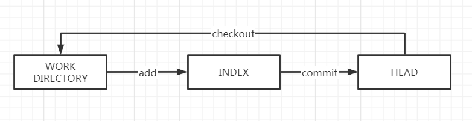
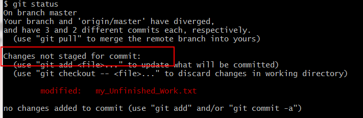
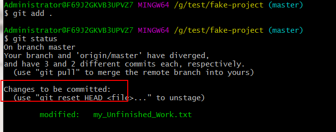
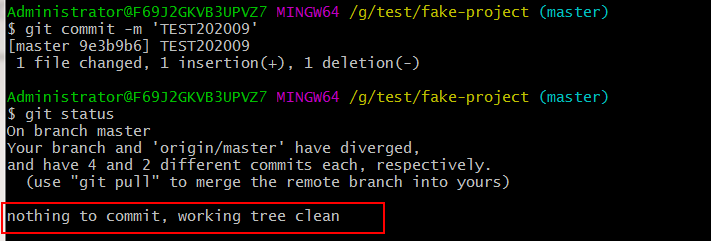

重置理解起来并不困难，我们先确定三个定义 HEAD、INDEX、WORKDIRECTORY。

## HEAD、INDEX、WORKDIRECTORY

HEAD、INDEX、WORKDIRECTORY 是 Git 中的三个重要概念，它们的含义如下：

- HEAD：HEAD 是当前分支引用的指针，它总是指向该分支上的最后一次 Commit。
- INDEX：索引是你的**预期的下一次提交**。 也就是每次执行 `git add` 存储的地方，我们将这个概念引用为 Git 的“暂存区”。
- WORKDIRECTORY：工作目录或者叫 WORKTREE，就是我们工作的位置。

Git 的工作流程就是在这三个区域之间进行，如下图所示。



`git status` 实际上就是比较这三个区域的改动。

例如：我们修改了一个文件，然后执行 `git status`。



我们会看到文件显示在 “Changes not staged for commit” 下面并被标记为红色，因为该条目在索引与工作目录之间存在不同。 接着我们运行 `git add` 来将它暂存到索引中。



此时，由于索引和 HEAD 不同，若运行 `git status` 的话就会看到 “Changes to be committed” 下的该文件变为绿色 ——也就是说，现在预期的下一次提交与上一次提交不同。其实这时候已经有提示可以" (use `git reset HEAD <file>...` to unstage)" 。我们先不要 reset，我们运行 `git commit` 来完成提交。



现在运行 `git status` 会没有输出，因为三个区域又相同了。

## 重置的作用

在以下情景中观察 `reset` 命令会更有意义。

为了演示这些例子，假设我们修改了项目三次并提交三次。文件的三次版本分别为 v1（5a56d3）、v2（be6993）、v3（9e3b9b）。

```shell
commit 9e3b9b667130be604fcd0fb9104361068fb84715 (HEAD -> master)
commit be69930a6a7e85c0a3fecff73112e850deace1b9
commit 5a56d30ed040f31c2f711e60f322934df9985753
```

当第三次提交完成后，三个区域的版本都是 v3。此时想要将版本 reset 到 v2。

### 第 1 步：移动 HEAD

`reset` 做的第一件事是移动 HEAD 的指向。这意味着如果 HEAD 设置为 `master` 分支（例如，你正在 `master` 分支上）， 运行 `git reset be6993` 将会使 `master` 指向 v2。

无论你调用了何种形式的带有一个提交的 `reset`，它首先都会尝试这样做。使用 `reset --soft`，它将仅仅停在那儿。

它指向 v2 本质上是撤销了第三次的 `git commit` 命令。当你在运行 `git commit` 时，Git 会创建一个新的提交，并移动 HEAD 所指向的分支来使其指向该提交。当你将它 `reset` 回 `HEAD~`（HEAD 的父结点）时，其实就是把该分支移动回原来的位置，而不会改变索引和工作目录。现在你可以更新索引并再次运行 `git commit` 来完成 `git commit --amend` 所要做的事情了。

### 第 2 步：更新索引（--mixed）

注意，如果你现在运行 `git status` 的话，就会看到新的 HEAD 和以绿色标出的它和索引之间的区别。

接下来，`reset` 会用 HEAD 指向的当前快照的内容来更新索引。

如果指定 `--mixed` 选项，`reset` 将会在这时停止。这也是默认行为，所以如果没有指定任何选项（在本例中只是 `git reset HEAD~`），这就是命令将会停止的地方。

现在再看一眼上图，理解一下发生的事情：它依然会撤销一上次`提交`，但还会**取消暂存**所有的东西。于是，我们回滚到了所有 `git add` 和 `git commit` 的命令执行之前。此时 Index 和 Head 都是 v2 版本。

### 第 3 步：更新工作目录（--hard）

`reset` 要做的的第三件事情就是让工作目录看起来像索引。如果使用 `--hard` 选项，它将会把工作区的代码也重置为 v2。

到此为止，我们撤销了最后的提交、`git add` 和 `git commit` 命令**以及**工作目录中的所有工作。

必须注意，`--hard` 标记是 `reset` 命令唯一的危险用法，它也是 Git 会真正地销毁数据的仅有的几个操作之一。其他任何形式的 `reset` 调用都可以轻松撤消，但是 `--hard` 选项不能，因为它强制覆盖了工作目录中的文件。在这种特殊情况下，我们的 Git 数据库中的一个提交内还留有该文件的 **v3** 版本， 我们可以通过 `reflog` 来找回它。但是若该文件还未提交，Git 仍会覆盖它从而导致无法恢复。

### **回顾**

`reset` 命令会以特定的顺序重写这三棵树，在你指定以下选项时停止：

1. 移动 HEAD 分支的指向（若指定了 `--soft`，则到此停止）
2. 使 INDEX 看起来像 HEAD（若未指定 `--hard`，则到此停止）
3. 使工作目录看起来像 INDEX

## 通过路径来重置

前面讲述了 `reset` 基本形式的行为，不过你还可以给它提供一个作用路径。若指定了一个路径，`reset` 将会跳过第 1 步，并且将它的作用范围限定为指定的文件或文件集合。因为 HEAD 只是一个指针，你无法让它同时指向两个提交中各自的一部分。不过索引和工作目录**可以部分更新**，所以重置会继续进行第 2、3 步。

现在，假如我们运行 `git reset file.txt`（这其实是 `git reset --mixed HEAD file.txt` 的简写形式），因为既没有指定一个提交的 SHA-1 或分支，也没有指定 `--soft` 或 `--hard`，所以它会：

1. 移动 HEAD 分支的指向（已跳过）
2. 让索引看起来像 HEAD（到此处停止）

所以它本质上只是将 `file.txt` 从 HEAD 复制到索引中。

它还有**取消暂存文件**的实际效果。 如果我们查看该命令的示意图，然后再想想 `git add` 所做的事，就会发现它们正好相反。

这就是为什么 `git status` 命令的输出会建议运行此命令来取消暂存一个文件。

我们可以不让 Git 从 HEAD 拉取数据，而是通过具体指定一个提交来拉取该文件的对应版本。 我们只需运行类似于 `git reset 5a56d3 file.txt` 的命令即可。

它其实做了同样的事情，也就是把工作目录中的文件恢复到 **v1** 版本，运行 `git add` 添加它， 然后再将它恢复到 **v3** 版本（只是不用真的过一遍这些步骤）。如果我们现在运行 `git commit`，它就会记录一条“将该文件恢复到 **v1** 版本”的更改， 尽管我们并未在工作目录中真正地再次拥有它。

还有一点同 `git add` 一样，就是 `reset` 命令也可以接受一个 `--patch` 选项来一块一块地取消暂存的内容。这样你就可以根据选择来取消暂存或恢复内容了。

## 压缩

我们来看看如何利用这种新的功能来做一些有趣的事情 —— 压缩提交。

假设你的一系列提交信息都是为了一个功能，提交多次显得杂乱，此时可以使用 reset 将其压缩为一个提交。

那么可以运行 `git reset --soft HEAD~2` 来将 HEAD 分支移动到一个旧一点的提交上（即你想要保留的最近的提交），然后只需再次运行 `git commit` 即可。

## 检出

最后，你大概还想知道 `checkout` 和 `reset` 之间的区别。和 `reset` 一样，`checkout` 也操纵这三个区域，不过它有一点不同，这取决于你是否传给该命令一个文件路径。

### **不带路径**

运行 `git checkout [branch]` 与运行 `git reset --hard [branch]` 非常相似，它会更新所有三棵树使其看起来像 `[branch]`，不过有两点重要的区别。

首先不同于 `reset --hard`，`checkout` 对工作目录是安全的，它会通过检查来确保不会将已更改的文件弄丢。而 `reset --hard` 则会不做检查就全面地替换所有东西。

第二个重要的区别是 `checkout` 如何更新 HEAD。`reset` 会移动 HEAD 分支的指向，而 `checkout` 只会移动 HEAD 自身来指向另一个分支。

例如，我们有 `master` 和 `develop` 分支，它们分别指向不同的提交；我们现在在 `develop`上（所以 HEAD 指向它）。 如果我们运行 `git reset master`，那么 `develop` 自身现在会和 `master` 指向同一个提交。 而如果我们运行 `git checkout master` 的话，`develop` 不会移动，HEAD 自身会移动。 现在 HEAD 将会指向 `master`。

所以，虽然在这两种情况下我们都移动 HEAD 使其指向了提交 A，但做法是不同的。**`reset` 会移动 HEAD 分支的指向，而`checkout`则移动 HEAD 自身。**

### **带路径**

运行 `checkout` 的另一种方式就是指定一个文件路径，这会像 `reset` 一样不会移动 HEAD。 它就像 `git reset [branch] file` 那样用该次提交中的那个文件来更新索引，但是它也会覆盖工作目录中对应的文件。它就像是 `git reset --hard [branch] file`（如果 `reset` 允许你这样运行的话）， 这样对工作目录并不安全，它也不会移动 HEAD。

此外，同 `git reset` 和 `git add` 一样，`checkout` 也接受一个 `--patch` 选项，允许你根据选择一块一块地恢复文件内容。

