`git rerere`全称是 重用记录的解决方案（reuse recorded resolution）。这个功能是隐藏的，默认不开启。

它允许你让 Git 记住解决一个块冲突的方法， 这样在下一次看到相同冲突时，Git 可以为你自动地解决它。

有些场景下， rerere 会很方便，比如当我们将不同的功能主题分支合并到测试分支，如果测试失败，我们可以将分支回退到合并之前，去除导致测试失败的主题分支后重做合并而不用重新解决所有的冲突。

## 示例

接下来简单的例子:

1.首先开启 rerere 功能

`git config --global rerere.enabled true`

这是全局开启的设置选项，我们也可以在特定仓库中创建 `.git/rr-cache` 目录来开启功能。

2.我在 master 分支中创建了一个文件 rerere.txt

内容`rerere master`

3.基于master创建了两个分支 2019 2020

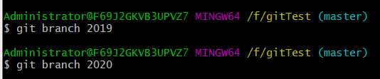

2019将内容修改为`rerere 2019`

2020将内容修改为`rerere 2020`

将两个分支合并

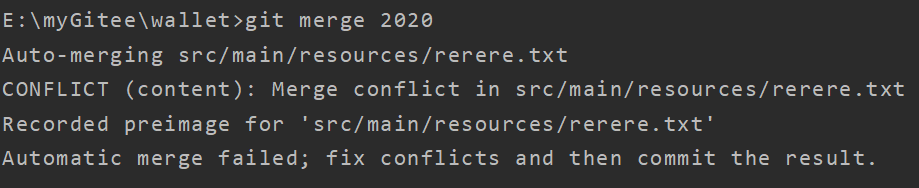

和未开启 rerere 功能的合并冲突相比

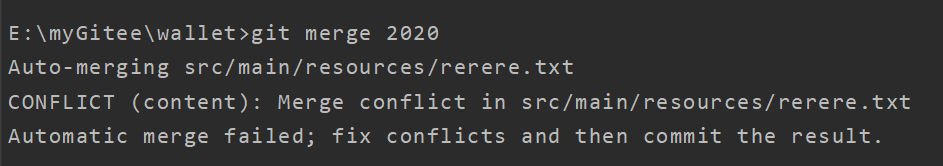

多了一行

`Recorded preimage for 'src/main/resources/rerere.txt'`

3.和往常一样，在这个时候你可以运行 git status 来查看所有冲突的内容

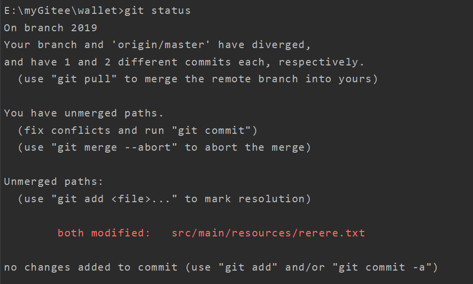

也可以用`git rerere status`来查看冲突文件

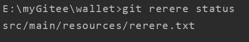

`git rerere diff`将会显示解决方案的当前状态——开始解决前与解决后的样子

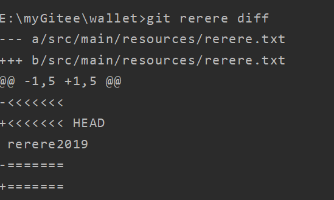

4.接受2020的变更，处理冲突后提交，然后在这个文件中制造相同的冲突

将2020分支的文件内容修改为`rerere 2021`，提交变更到主分支

在2019继续合并2020分支，此时正常应该继续提示冲突

但是

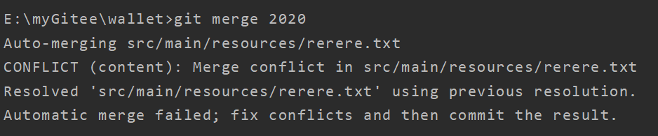

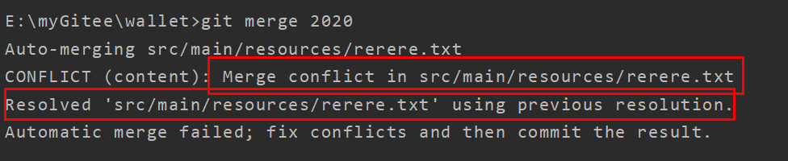

`Resolved 'src/main/resources/rerere.txt' using previous resolution.`

可以看到冲突已经自动解决了，使用了原来的方案

5.`git diff`查看解决方式

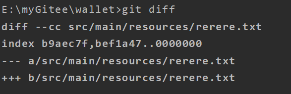

6.我们可以使用`checkout`命令恢复合并前状态

`git checkout --conflict=merge src/main/resources/rerere.txt`

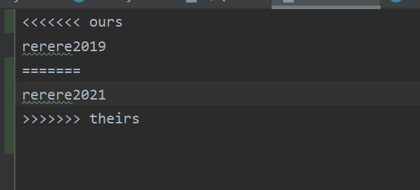

打开 rerere.txt，即可看到合并前内容

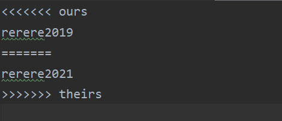

使用`git rerere`将冲突再次解决

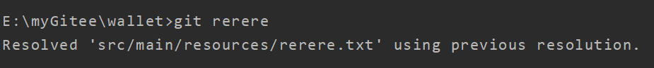

## **总结**

`rerere`功能开启后遇到冲突，我们只需解决一遍，当下次遇到相同的冲突，git会帮我们自动处理，即便有些场景不需要它自动合并冲突，我们也可以选择`checkout`将其回退然后手动处理。
