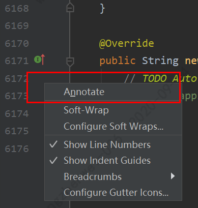

除了主要作为版本控制工具外，Git 也提供了几个命令来辅助你调试你的项目源码中的问题。

## 文件标注

文件标注能显示任何文件中每行最后一次修改的提交记录。 所以，如果你在代码中看到一个有 bug 的方法，你可以使用`git blame`标注这个文件，查看哪一次提交引入了这行。

以下示例用`git blame`确定了 Linux 内核源码顶层的`Makefile`中每一行分别来自哪个提交和提交者， 此外用`-L`选项还可以将标注的输出限制为该文件中的第 69 行到第 82 行。

```shell
$ git blame -L 69,82 Makefile
b8b0618cf6fab (Cheng Renquan  2009-05-26 16:03:07 +0800 69) ifeq ("$(origin V)", "command line")
b8b0618cf6fab (Cheng Renquan  2009-05-26 16:03:07 +0800 70)   KBUILD_VERBOSE = $(V)
^1da177e4c3f4 (Linus Torvalds 2005-04-16 15:20:36 -0700 71) endif
^1da177e4c3f4 (Linus Torvalds 2005-04-16 15:20:36 -0700 72) ifndef KBUILD_VERBOSE
^1da177e4c3f4 (Linus Torvalds 2005-04-16 15:20:36 -0700 73)   KBUILD_VERBOSE = 0
^1da177e4c3f4 (Linus Torvalds 2005-04-16 15:20:36 -0700 74) endif
^1da177e4c3f4 (Linus Torvalds 2005-04-16 15:20:36 -0700 75)
066b7ed955808 (Michal Marek   2014-07-04 14:29:30 +0200 76) ifeq ($(KBUILD_VERBOSE),1)
066b7ed955808 (Michal Marek   2014-07-04 14:29:30 +0200 77)   quiet =
066b7ed955808 (Michal Marek   2014-07-04 14:29:30 +0200 78)   Q =
066b7ed955808 (Michal Marek   2014-07-04 14:29:30 +0200 79) else
066b7ed955808 (Michal Marek   2014-07-04 14:29:30 +0200 80)   quiet=quiet_
066b7ed955808 (Michal Marek   2014-07-04 14:29:30 +0200 81)   Q = @
066b7ed955808 (Michal Marek   2014-07-04 14:29:30 +0200 82) endif
```
请注意，第一个字段是最后一次修改该行的提交的部分 SHA-1 值。 接下来两个字段的值是从提交中提取出来的——作者的名字以及提交的时间——所以你就可以很轻易地知道是谁在什么时候修改了那一行。 接下来就是行号和文件内容。 注意一下`^1da177e4c3f4`这个提交的几行，其中的前缀`^`指出了该文件自第一次提交后从未修改的那些行。
另一件比较酷的事情是 Git 不会显式地记录文件的重命名。 它会记录快照，然后在事后尝试计算出重命名的动作。 这其中有一个很有意思的特性就是你可以让 Git 找出所有的代码移动。 如果你在`git blame`后面加上一个`-C`，Git 会分析你正在标注的文件， 并且尝试找出文件中从别的地方复制过来的代码片段的原始出处。 比如，你将`GITServerHandler.m`这个文件拆分为数个文件，其中一个文件是`GITPackUpload.m`。 对`GITPackUpload.m`执行带`-C`参数的 blame 命令，你就可以看到代码块的原始出处：

```shell
$ git blame -C -L 141,153 GITPackUpload.m
f344f58d GITServerHandler.m (Scott 2009-01-04 141)
f344f58d GITServerHandler.m (Scott 2009-01-04 142) - (void) gatherObjectShasFromC
f344f58d GITServerHandler.m (Scott 2009-01-04 143) {
70befddd GITServerHandler.m (Scott 2009-03-22 144)         //NSLog(@"GATHER COMMI
ad11ac80 GITPackUpload.m    (Scott 2009-03-24 145)
ad11ac80 GITPackUpload.m    (Scott 2009-03-24 146)         NSString *parentSha;
ad11ac80 GITPackUpload.m    (Scott 2009-03-24 147)         GITCommit *commit = [g
ad11ac80 GITPackUpload.m    (Scott 2009-03-24 148)
ad11ac80 GITPackUpload.m    (Scott 2009-03-24 149)         //NSLog(@"GATHER COMMI
ad11ac80 GITPackUpload.m    (Scott 2009-03-24 150)
56ef2caf GITServerHandler.m (Scott 2009-01-05 151)         if(commit) {
56ef2caf GITServerHandler.m (Scott 2009-01-05 152)                 [refDict setOb
56ef2caf GITServerHandler.m (Scott 2009-01-05 153)
```
这个功能很有用。 通常来说，你会认为复制代码过来的那个提交是最原始的提交，因为那是你第一次在这个文件中修改了这几行。 但 Git 会告诉你，你第一次写这几行代码的那个提交才是原始提交，即使这是在另外一个文件里写的。
## 二分查找

当你知道问题是在哪里引入的情况下文件标注可以帮助你查找问题。 如果你不知道哪里出了问题，并且自从上次可以正常运行到现在已经有数十个或者上百个提交， 这个时候你可以使用`git bisect`来帮助查找。`bisect`命令会对你的提交历史进行二分查找来帮助你尽快找到是哪一个提交引入了问题。

首先执行`git bisect start`来启动，接着执行`git bisect bad`来告诉系统当前你所在的提交是有问题的。 然后你必须使用`git bisect good <good_commit>`，告诉 bisect 已知的最后一次正常状态是哪次提交：

```shell
$ git bisect start
$ git bisect bad
$ git bisect good v1.0
Bisecting: 6 revisions left to test after this
[ecb6e1bc347ccecc5f9350d878ce677feb13d3b2] error handling on repo
```
Git 发现在你标记为正常的提交（v1.0）和当前的错误版本之间有大约12次提交，于是 Git 检出中间的那个提交。 现在你可以执行测试，看看在这个提交下问题是不是还是存在。 如果还存在，说明问题是在这个提交之前引入的；如果问题不存在，说明问题是在这个提交之后引入的。 假设测试结果是没有问题的，你可以通过`git bisect good`来告诉 Git，然后继续寻找。
```shell
$ git bisect good
Bisecting: 3 revisions left to test after this
[b047b02ea83310a70fd603dc8cd7a6cd13d15c04] secure this thing
```
现在你在另一个提交上了，这个提交是刚刚那个测试通过的提交和有问题的提交的中点。 你再一次执行测试，发现这个提交下是有问题的，因此你可以通过`git bisect bad`告诉 Git：
```shell
$ git bisect bad
Bisecting: 1 revisions left to test after this
[f71ce38690acf49c1f3c9bea38e09d82a5ce6014] drop exceptions table
```
这个提交是正常的，现在 Git 拥有的信息已经可以确定引入问题的位置在哪里。 它会告诉你第一个错误提交的 SHA-1 值并显示一些提交说明，以及哪些文件在那次提交里被修改过，这样你可以找出引入 bug 的根源：
```shell
$ git bisect good
b047b02ea83310a70fd603dc8cd7a6cd13d15c04 is first bad commit
commit b047b02ea83310a70fd603dc8cd7a6cd13d15c04
Author: PJ Hyett <pjhyett@example.com>
Date:   Tue Jan 27 14:48:32 2009 -0800
secure this thing
:040000 040000 40ee3e7821b895e52c1695092db9bdc4c61d1730
f24d3c6ebcfc639b1a3814550e62d60b8e68a8e4 M  config
```
当你完成这些操作之后，你应该执行`git bisect reset`重置你的 HEAD 指针到最开始的位置， 否则你会停留在一个奇怪的状态：
```shell
$ git bisect reset
```
这是一个可以帮助你在几分钟内从数百个提交中找到 bug 的强大工具。 事实上，如果你有一个脚本在项目是正常的情况下返回 0，在不正常的情况下返回非 0，你可以使`git bisect`自动化这些操作。 首先，你设定好项目正常以及不正常所在提交的二分查找范围。 你可以通过`bisect start`命令的参数来设定这两个提交，第一个参数是项目不正常的提交，第二个参数是项目正常的提交：
```shell
$ git bisect start HEAD v1.0
$ git bisect run test-error.sh
```
Git 会自动在每个被检出的提交里执行`test-error.sh`，直到找到项目第一个不正常的提交。 你也可以执行`make`或者`make tests`或者其他东西来进行自动化测试。
## 应用

实际上 Git 和 IDEA 集成后，有更方便的方式查看提交记录，直接右键选择



然后就可以看到这行代码最新提交人了。双击这行提交记录，还可以看到这位开发者在这次提交中提交的其他文件和记录，方便找问题源头和甩锅。

