可能不同的公司有自己的 Code Review 方式，我们以前还经常开评审会，首先约会议并通知评审的范围和开发成员，然后快下班甚至下了班的时候去做这些事情，当时也都戏称为公开处刑，给待审查的成员较大的压力，生怕有低级错误出现，这种方式也浪费了团队不少的时间。

## 利用 Merge Request 做代码评审

GitLab 提供了一种很棒的方式，就是利用 Merge Request 做代码评审。

比如我们修改了一个问题提交推送到了自己的分支，然后需要新增一个合并请求 merge request 将改动合并到开发测试 develop 分支。

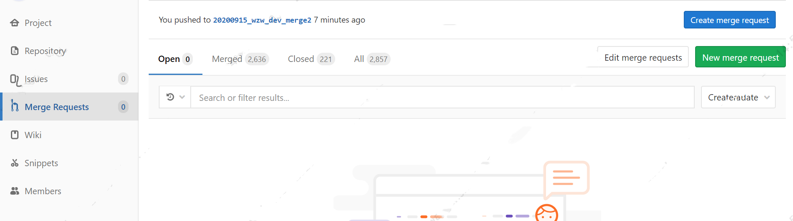

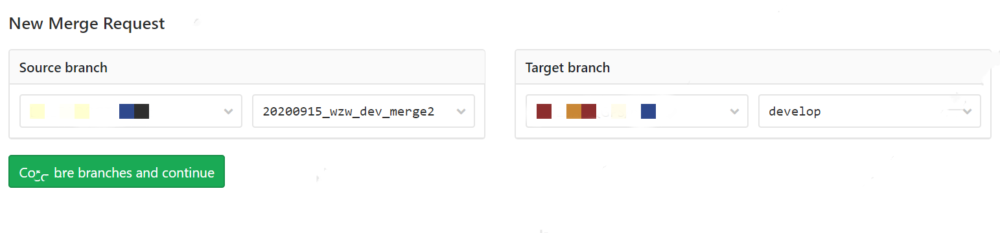

填写描述和想要指定的审查者：

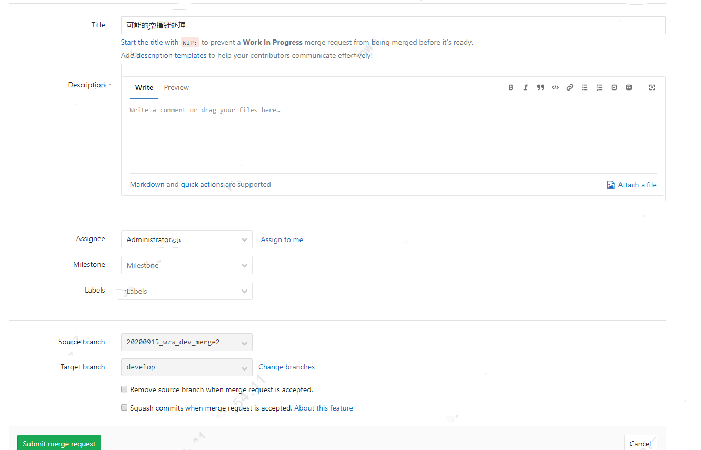

审查者看到需要审查的合并提交：

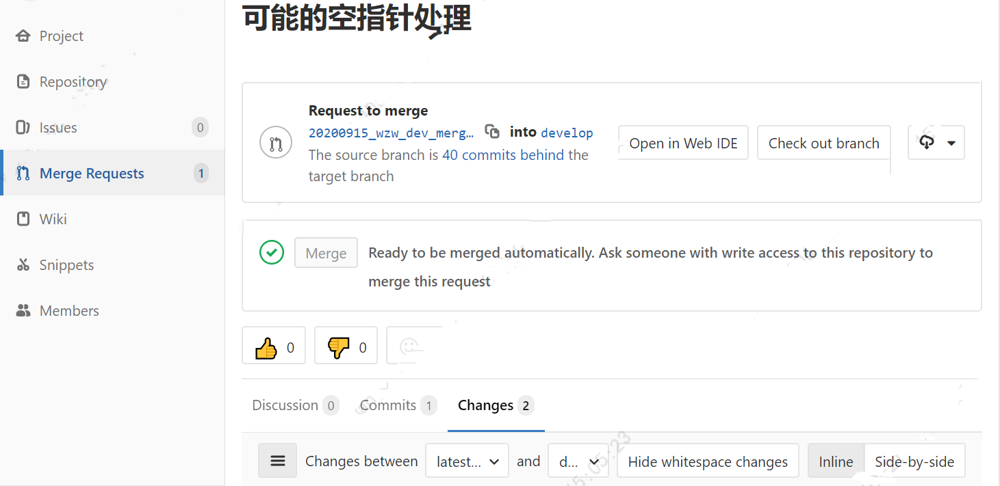

审查者可以对合并进行评论，甚至是对每行代码进行注释标注：

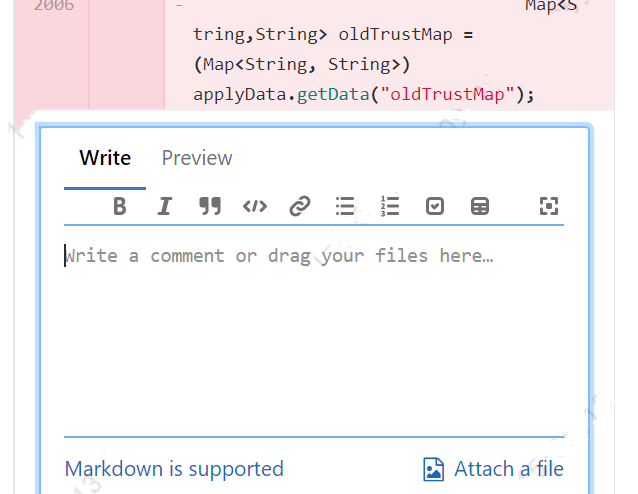

这里有个官方的线上例子可以点点看（[https://gitlab.com/gitlab-com/www-gitlab-com/](https://gitlab.com/gitlab-com/www-gitlab-com/-/merge_requests/62887)）。

## 使用 Pull Request 进行代码审查

类似的，使用 GitHub 和 Gitee 的 Pull Request 进行代码审查。

### 仓库管理员设置代码审查

代码审查以仓库为单位，根据需求设置相应的代码审核/测试人员。

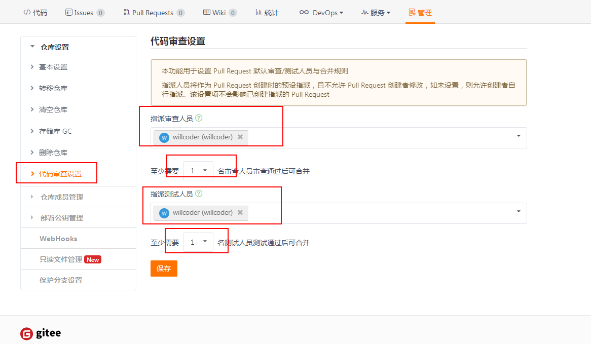

### 开发者提交 Pull Request

开发者 Fork 目标仓库，在对应分支上修改后，推送到自己 Fork 的仓库里，从自己仓库中点击“+ Pull Request”。

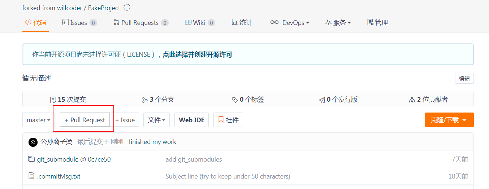

系统会默认对应源分支和要修改的目标分支，填入 Pull Request 的说明，点击“创建”，就可以提交一个 Pull Request。

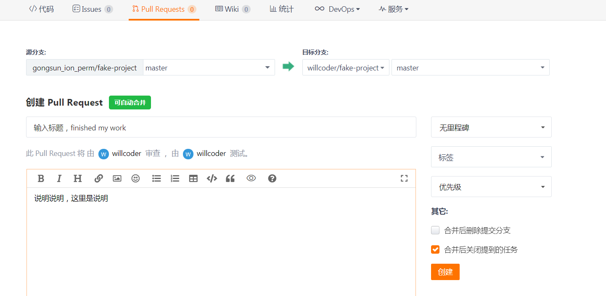

### 审查者进行代码审核/测试

审查者可以在 Pull Request 中看到信息和代码修改详情。

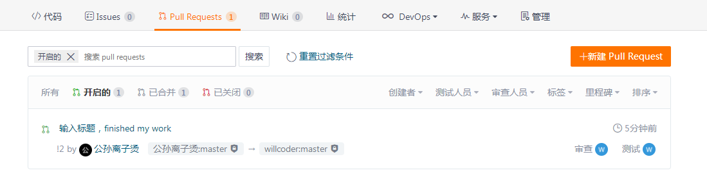

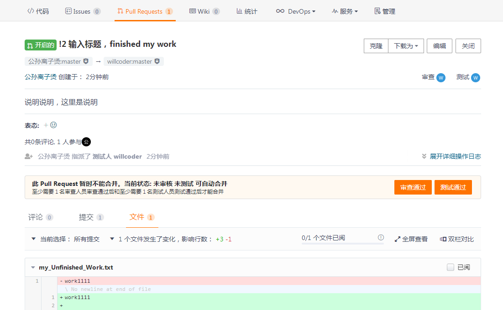

审查者可以在“评论”中留下自己对这个 Pull Request 中改动的意见和建议，同时支持“文件改动”中对代码行注释。

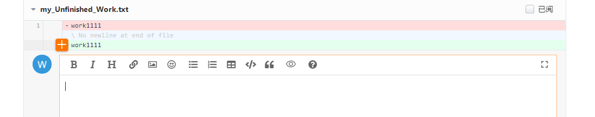

企业版的更是支持代码扫描，可以在此页面看缺陷和规范报告。

审查者的建议会通过站内信等方式通知提交 Pull Request 的开发者，开发者可以根据情况在“评论”中与审查者进行讨论。

### 仓库管理员合并 Pull Request

Pull Request 代码审查完成且满足仓库管理员设置的代码审查规则后，可由管理员把这个 Pull Request 合并到目标分支。合并完成后，开发者对目标分支的改动就生效了。

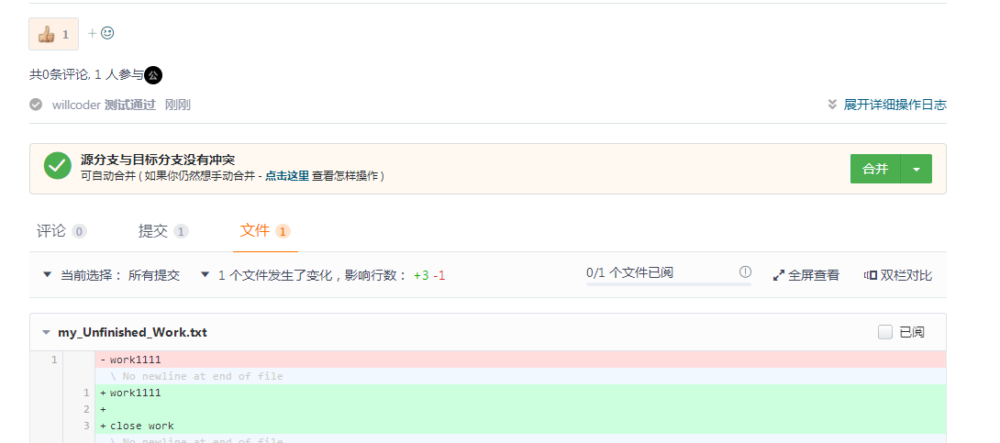

