## 工具介绍

首先介绍下这些工具是干什么的：

- Jenkins CI/CD：基于Java开发的持续集成工具；
- Nexus：依赖仓库，Maven 仓库管理器；
- Ansible：自动化运维工具，基于 Python 开发的自动化运维工具；
- Gitee/GitHub/GitLab：代码管理工具/平台。

## 整合 Demo

### 1. Jenkins 中 Maven 配置

Jenkins --> Global Tool Configuration

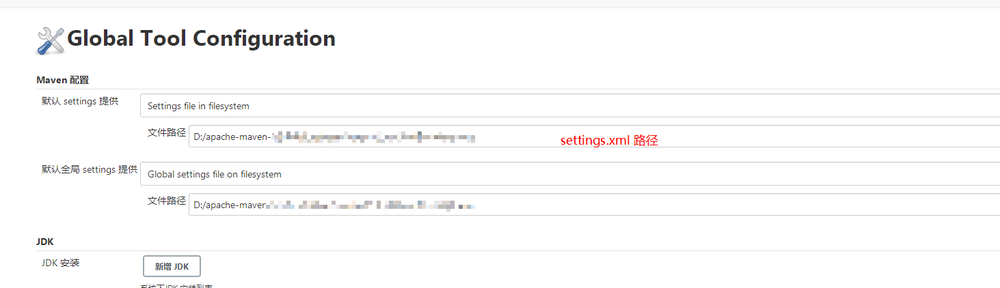

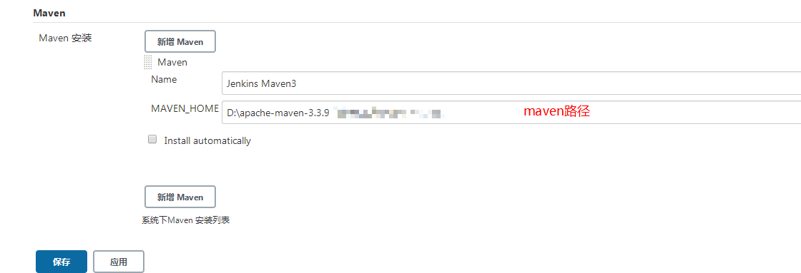

### 2. 新建 Maven 仓库

在代码仓库新建一个 Maven 的 Hello World 项目。

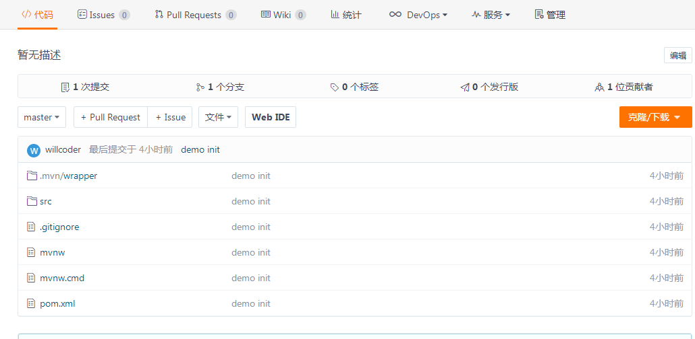

### 3. 在 Jenkins 中新建 Item

1. **新建**

   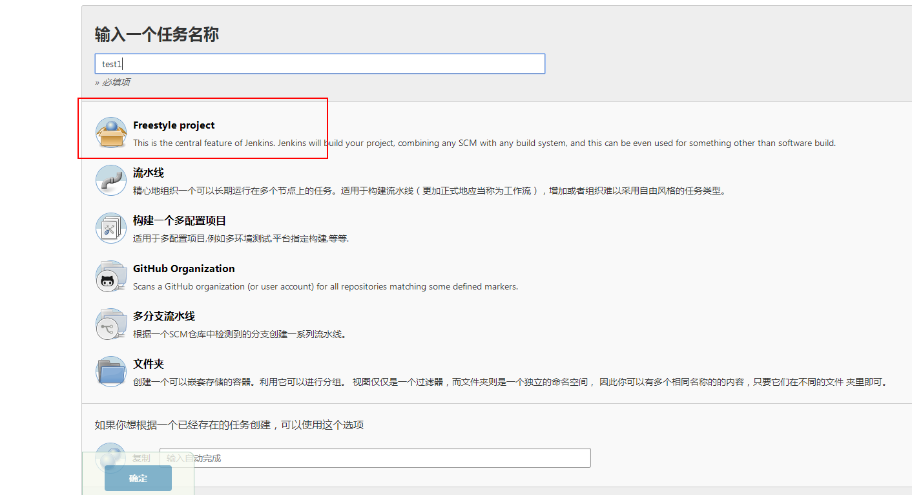

2. **添加描述**

   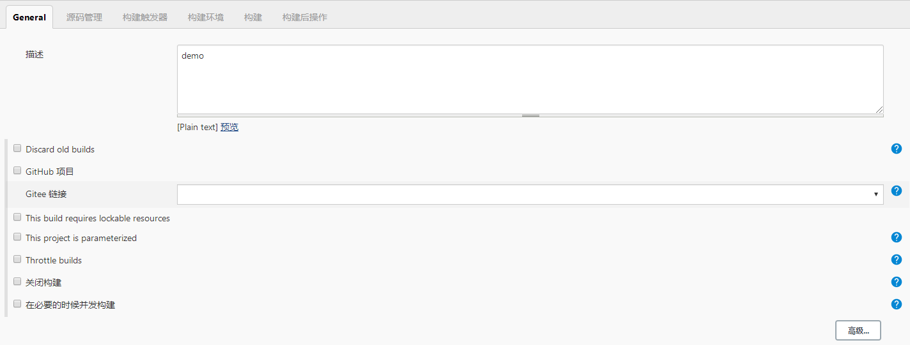

3. **源码管理配置仓库地址和凭证信息**

   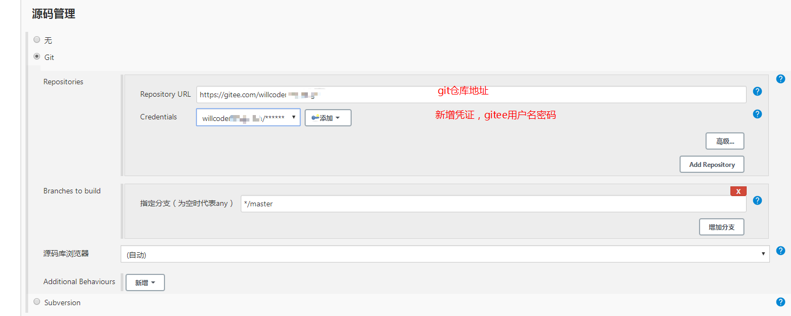

4. **新增构建设置**

   使用 maven 构建：

   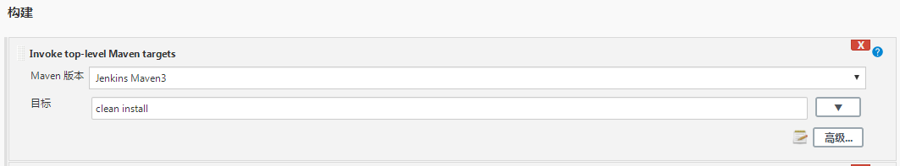

   或者使用 ansible 执行剧本构建。

   如果 ansible 有单独服务器，则需要安装 SSH 插件，远程 SSH 执行脚本：

   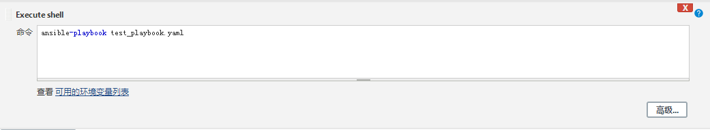

5. **构建后操作**

   写了个重启脚本，拿到当前执行项目的 pid，kill，然后 `nohup` 重启程序的 jar。

   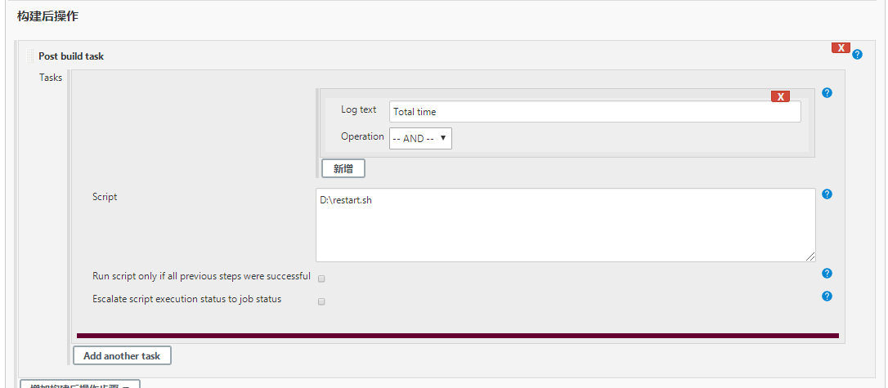

6. **构建触发器**

#### Gitee 平台配置

Gitee 文档：[https://gitee.com/help/articles/4183](https://gitee.com/help/articles/4183)

安装 Gitee 插件：

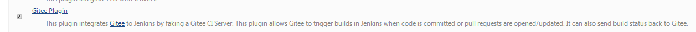

选择需要触发构建的策略：

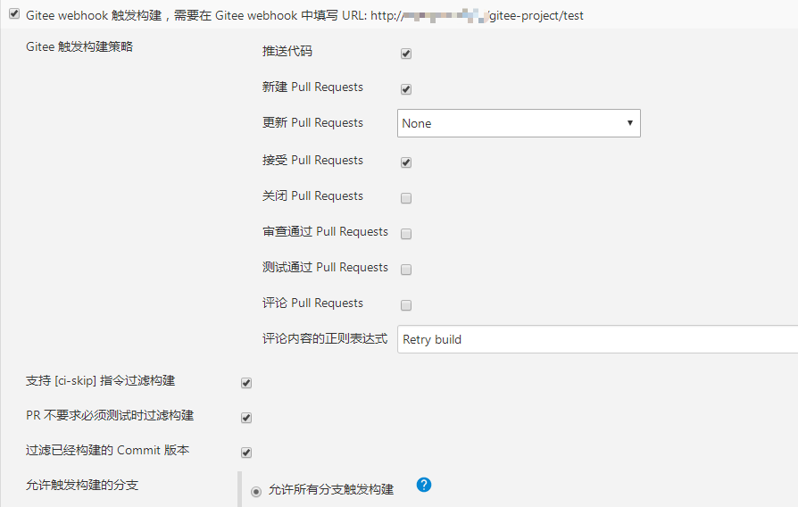

添加 WebHooks：

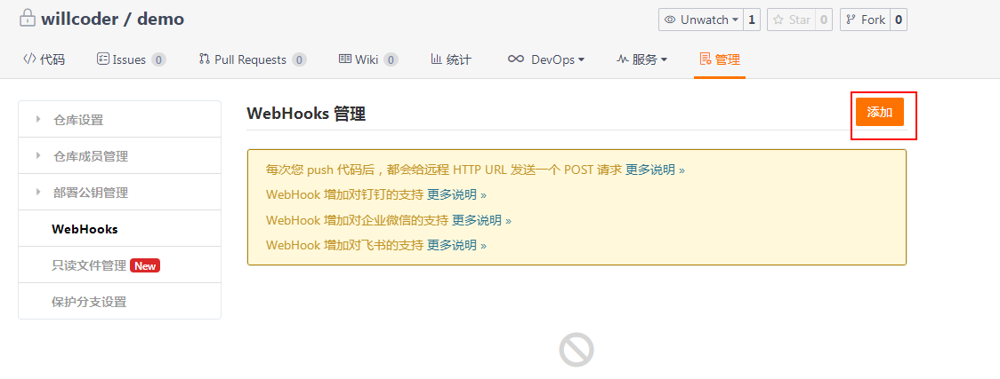

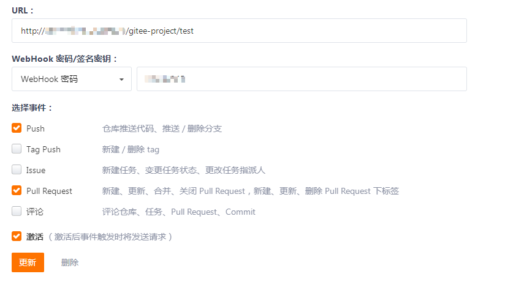

#### GitHub 平台配置

类似的安装 pull request 插件：

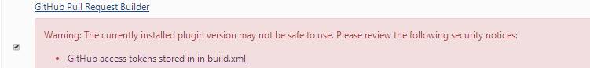

然后配置：

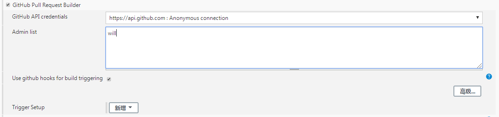

登录 GitHub，Settings>>Webhooks 中，此时会生成一个新的 webhook，也是选择自己需要触发构建的策略后保存。

### 4. 测试构建是否正常

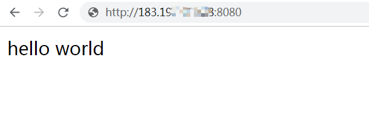

此时就完成了。

## 总结

根据配置的触发策略，开发者完成一个任务，提交 Pull Request 或者管理者代码审查后合并 PR，会触发 Jenkins 构建并自动发布重启项目，减少了团队手动运维的时间成本。

以上只是 GitOps 的一个简单例子，实际上不限于以上这些工具，Jenkins 有一个 [JenkinsX](https://jenkins-x.io/docs/) 的版本专门为 GitOps 而生，也可以将 Jenkins 换成 [Argo CD](https://argoproj.github.io/argo-cd/) 等。

