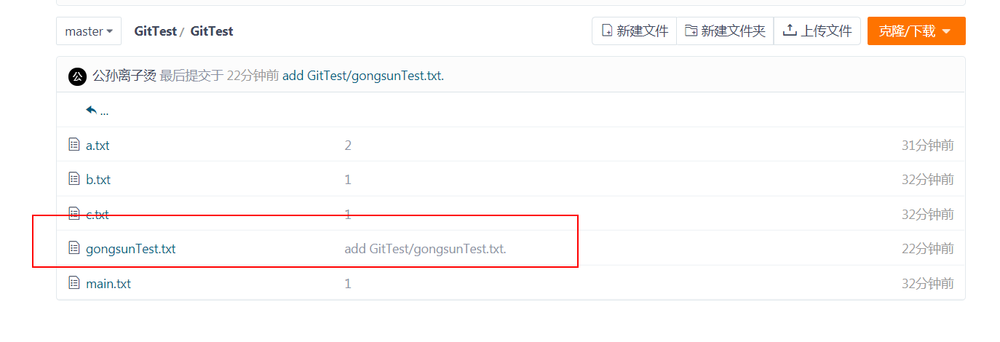

## 集中式管理

这种方式一般是在服务端配置好，客户端只需要同步提交，使用起来比较方便，容易上手。

集中式管理是需要联网的，代码或者资料是以服务端为准，所有的操作都需要先同步服务端的数据，如果服务端宕机，所有人都将无法提交代码。

## 分布式管理

使用Git做开发时，`git clone`克隆一个本地版本，然后在本地进行操作提交，本地可以完成一个完整的版本控制。只需要在发布前，使用`git push`推送到远程即可。

## 集中式工作流程

一般来讲，Git管理的项目，有一个默认分支master，这个分支只负责版本发布，一般不给开发者直接提交或删除权限，有的项目也将这个分支叫发布分支--release

实际开发的分支都是develop分支或者基于develop分支的其他版本需求分支上完成。

比如说现有A，B，C三个程序开发者，然后他们每个人都有自己的需求a1，a2，b，c

他们各自从develop分支基础上建立自己的分支，因为考虑到需求是否会被延期，A建立了两个分支分别用来开发需求a1，a2。三位的需求开发完成后，各自将自己的分支合并到develop上，在发布前由测试或者专人将develop合并到release分支上进行最后的代码扫描分析等等，最后以release分支为发布基准。

如果B和C两位虽然是不同的需求，但是他们修改了同一行的代码，如果B先向develop发起合并而且成功了，那么C发起合并请求时会遭到服务器拒绝，只有合并文件修改后才可以继续推送。

这是一种应用广泛的工作流程。

## 集成管理者工作流

Git 允许多个远程仓库存在，使得这样一种工作流成为可能：每个开发者拥有自己仓库的写权限和其他所有人仓库的读权限。 这种情形下通常会有个代表“官方”项目的权威的仓库。 要为这个项目做贡献，你需要从该项目克隆出一个自己的公开仓库，然后将自己的修改推送上去。 接着你可以请求官方仓库的维护者拉取更新合并到主项目。 维护者可以将你的仓库作为远程仓库添加进来，在本地测试你的变更，将其合并入他们的分支并推送回官方仓库。

这是 GitHub 和 Gitee 等集线器式（hub-based）工具最常用的工作流程。

人们可以容易地将某个项目派生成为自己的公开仓库，向这个仓库推送自己的修改，并为每个人所见。 这么做最主要的优点之一是你可以持续地工作，而主仓库的维护者可以随时拉取你的修改。 贡献者不必等待维护者处理完提交的更新——每一方都可以按照自己的节奏工作。

为了方便阅读，我用A账号在Gitee上建了一个仓库`https://gitee.com/willcoder/GitTest.git`

使用B账号作为贡献者来做个简单例子。

1. 项目维护者推送到主仓库。

里面随便塞了几个文件。

1. 贡献者克隆此仓库，做出修改。

因为B账号没有权限push这个项目，所以对仓库进行fork

克隆代码后，新增了一个文件

3.贡献者发送pull request

填写内容和说明

4.维护者在自己本地的仓库中，将贡献者的仓库加为远程仓库并合并修改。

审查测试后即可合并请求

## 司令官与副官工作流

这其实是多仓库工作流程的变种。 可以按照字面意思理解，或者结合一家公司的组织架构来看，由总经理，各个部门的分管总以及分管总下的普通员工这三个级别，总经理统筹大局，负责对外的主分支维护合并等工作，分管总负责这个大型项目的特定范围，处理下面普通开发者提交的该范围的请求。

一般拥有数百位协作开发者的超大型项目才会用到这样的工作方式，例如著名的 Linux 内核项目。 被称为 副主管（lieutenant） 的各个集成管理者分别负责集成项目中的特定部分。 所有这些副主管头上还有一位称为 主管（dictator） 的总集成管理者负责统筹。 主管维护的仓库作为参考仓库，为所有协作者提供他们需要拉取的项目代码。

这种工作流并不常用，只有当项目极为庞杂，或者需要多级别管理时，才会体现出优势。