## 私有化团队

一般都会采用类似 SVN 的集中式工作流程。说白了，就是几个程序员共同在master分支上做开发。对于快速迭代，成员少的小项目来说，不失为一种好用的方式。

每个人都将远程仓库clone到本地，开发各自的功能

然后经过`git add`-->`git commit -m 'msg'`-->`git push`到远程仓库。


eg:新建项目[https://gitee.com/willcoder/fake-project.git](https://gitee.com/willcoder/fake-project.git)

现有甲乙两人，他们都克隆了项目，并且分别改了新增和修改的脚本文件并提交，此时没有任何问题

```
git clone https://gitee.com/willcoder/fake-project.git
```
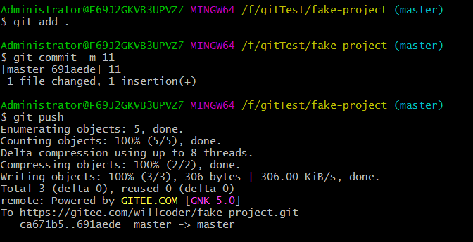

如果二人同时修改了delete脚本，那么第二个人提交时会出现冲突

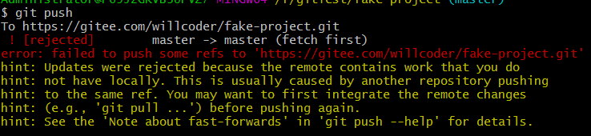

此时需要使用 git fetch拉取远程变更，然后处理冲突后再提交

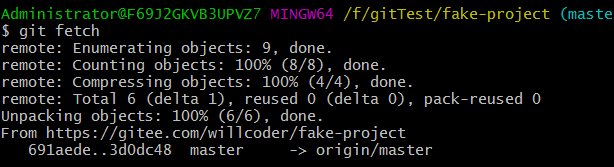

修改delete脚本，提交推送到远程仓库

`git add`-->`git commit`-->`git push`

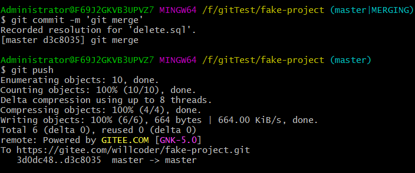

## 私有管理团队

一般的公司项目都是采用这种方式，开发拉取自己的分支，在上面开发功能需求，可能几个开发公用一个分支。而且关键分支一般都会设置权限。

比如 master 分支用于发布或测试，只有管理员能够合并，开发不能推送自己的变更，只能在远程建立一个基于 master 分支的功能分支，然后拉取该功能分支到本地进行开发，开发完成后提交合并请求，管理员验证测试后通过合并请求将该功能合并到 master 分支上。

eg:有一个项目，master分支是受保护的，只有管理员才可推送

现有两个开发，他们没有 master 分支的推送权限，所以需要新建一个分支做开发，开发完成后将该分支推送到远程

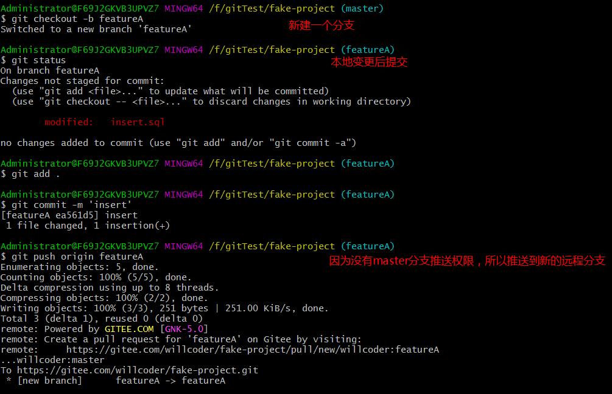


同理，其他开发者也是建立自己的功能分支开发，然后推送到远程

推送完成后，可以通过邮件或其他方式通知管理员，管理选择将分支合并到 master

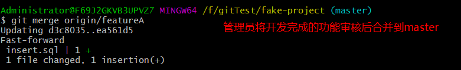

然后`git push`

## 派生的公开项目

这种整体上和私有管理团队类似，开发者没有权限更新项目的分支，需要使用别的方式将工作推送给维护者。

一般都是通过代码托管的派生功能，向一些开源项目贡献。

eg:找到一个公开项目点击Fork

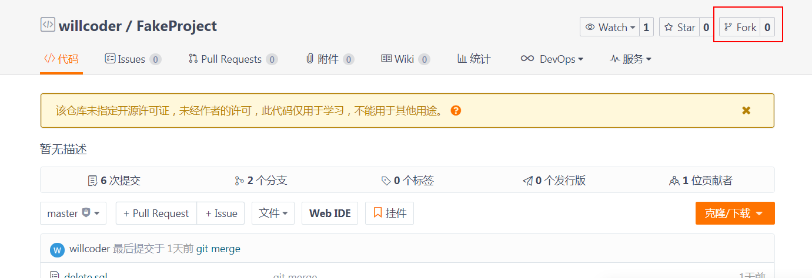

修改开发项目用的都是自己的派生仓库，开发完成后推送到自己的派生仓库中，这时候我们需要通知原项目的维护者，有些工作需要合并到主分支。这个行为叫做一个拉取请求（pull request）

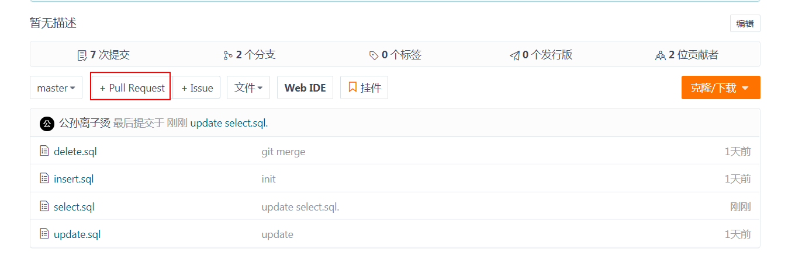

pull request中可以看到 自己的派生分支推送的目标分支， 代码提交记录和改动的文件内容的信息

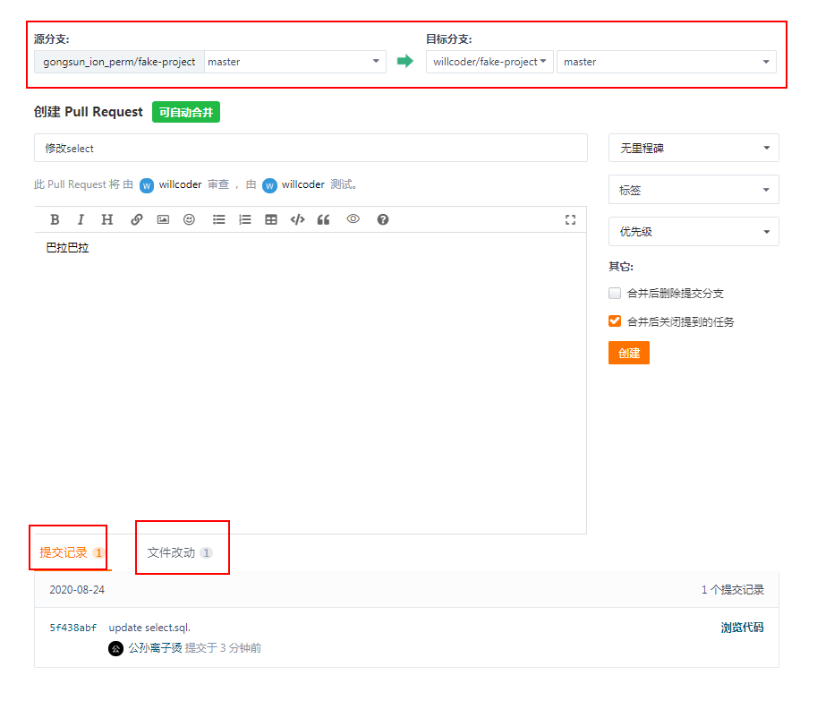

项目维护者看到拉取请求后可以审查通过后合并

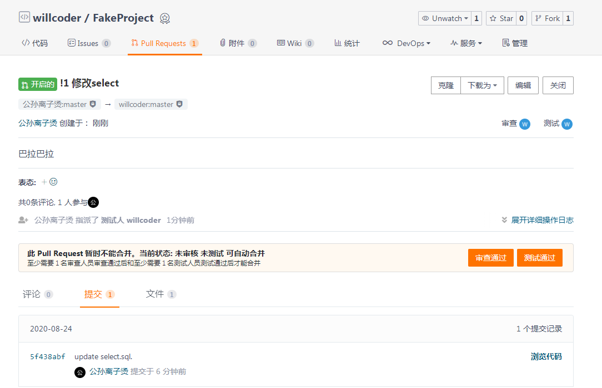

一般情况下，优秀的开源项目会有很多pull request，管理员怎么拉取有些看心情..

## 通过邮件的公开项目

许多项目会通过一个开发者的邮件列表接受补丁。

整体上和之前的例子类似，主要区别是通过邮件的公开项目不是将自己本地的提交推送到远程的一个派生仓库中，而是将本地提交转化为邮件来通知项目维护者。

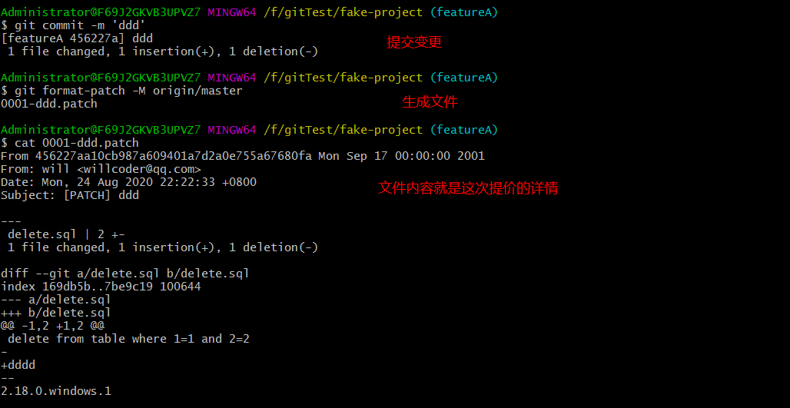

可以直接将这个文件放到邮箱客户端中发送，也可以在`git config`中配置SMTP服务器信息来发送

```
  smtpencryption = tls
  smtpserver = smtp.gmail.com
  smtpuser = user@gmail.com
  smtpserverport = 587
```
配置完成后使用`git send-email *.patch`命令来发送补丁