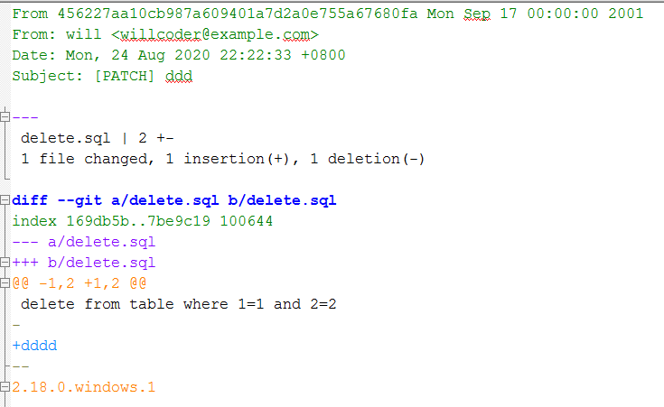

## 应用来自邮件的补丁

应用补丁有两种方式 git apply``git am

1.使用`apply`命令


`git apply`不会为你创建提交——在运行之后，需要手动暂存并提交补丁所引入的更改。

在实际应用补丁前，你还可以使用`git apply`来检查补丁是否可以顺利应用——即对补丁运行`git apply --check`命令：


如果没有产生输出，则该补丁可以顺利应用。 如果检查失败了，该命令还会以一个非零的状态退出，所以需要时你也可以在脚本中使用它。

**2.使用**`am`命令

要应用一个由`format-patch`命令生成的补丁，你应该使用`git am`命令 （`am`表示它“应用（Apply）一系列来自邮箱（Mailbox）的补丁”）。 从技术的角度看，`git am`是为了读取 mbox 文件而构建的， mbox 是一种用来在单个文本文件中存储一个或多个电子邮件消息的简单纯文本格式。 其大致格式如下所示：



这其实就是`git format-patch`命令输出的开始几行， 而同时它也是有效的 mbox 电子邮件格式。 如果有人使用`git send-email`命令将补丁以电子邮件的形式发送给你， 你便可以将它下载为 mbox 格式的文件，之后将`git am`命令指向该文件，它会应用其中包含的所有补丁。

```shell
git am +补丁
```
`git am`命令创建了一个新的提交。 其中的作者信息来自于电子邮件头部的 From 和 Date 字段，提交消息则取自 Subject 和邮件正文中补丁之前的内容。
## 检出远程分支

### **持续性合作**

如果贡献者建立了自己的版本库，并向其推送了一些修改，之后将版本库的URL和包含更改的远程分支发送给你，那么我们可以将其添加为一个远程分支，并且在本地进行合并。

```shell
$ git remote add will https://gitee.com/willcoder/fake-project.git
$ git fetch
$ git checkout -b will_test_202008
Switched to a new branch 'will_test_202008'
```
这种方式对于长期合作十分有用。当对方再次做了更改，因为之前已经设置好远程分支了， 我们就可以直接进行`fetch`和`checkout`操作。

### **非持续性合作**

对于非持续性的合作，如果你依然想要以这种方式拉取数据的话，你可以对远程版本库的 URL 调用`git pull`命令。 这会执行一个一次性的抓取，而不会将该 URL 存为远程引用

```shell
$ git pull https://gitee.com/willcoder/fake-project.git
remote: Enumerating objects: 25, done.
remote: Counting objects: 100% (25/25), done.
remote: Compressing objects: 100% (17/17), done.
remote: Total 25 (delta 4), reused 0 (delta 0), pack-reused 0
Unpacking objects: 100% (25/25), done.
From https://gitee.com/willcoder/fake-project
 * branch            HEAD       -> FETCH_HEAD
```
## 确定引入了哪些东西

```shell
$ git diff master
```
这个命令会输出一个`diff`，但它可能并不是我们想要的。
比如说你在 master 分支中向某个文件添加了一行内容，那么直接比对最新快照的结果看上去就像是你在主题分支中将这一行删除了。所以我们需要让 Git 对主题分支上最新的提交与该分支与 master 分支的首个公共祖先进行比较。

可以手工的方式找出公共祖先，并对其显式运行 diff 命令：

```shell
$ git merge-base will_test_202008 master
24de949bb7c23ff052d5b39d01d809e86dd43fd2
$ git diff 24de94
```
或者，更简洁的形式：
```shell
$ git diff $(git merge-base will_test_202008 master)
```
然而，这种做法比较麻烦，所以 Git 提供了一种比较便捷的方式：三点语法。 对于`git diff`命令来说，你可以通过把 ... 置于另一个分支名后来对该分支的最新提交与两个分支的共同祖先进行比较：
```shell
$ git diff master...will_test_202008
```
该命令仅会显示自当前主题分支与`master`分支的共同祖先起，该分支中的工作。 这个语法很有用，应该牢记。
## 将贡献的工作整合进来

### **合并工作流**

有些开发者喜欢直接将贡献的主题分支合并到 master 上，但这样做是有风险的。正常来讲，大的项目应该是将贡献者的分支先合并到 develop 分支上，经过测试和运行稳定后，再将其合并入 master 分支。

### **变基与拣选工作流**

为了保持线性的提交历史，有些维护者更喜欢在 master 分支上对贡献过来的工作进行变基和拣选，而不是直接将其合并。 Git 中的拣选类似于对特定的某次提交的变基。 它会提取该提交的补丁，之后尝试将其重新应用到当前分支上。 这种方式在只想引入主题分支中的某个提交，或者主题分支中只有一个提交，而不想运行变基时很有用。

```shell
git cherry-pick <SHA>
```
### **Rerere**
维护一个项目，有时需要做大量的合并或变基，所以冲突也会时有发生。Git提供`rerere`功能帮助维护者处理冲突。

`rerere`是隐藏功能，可以通过配置打开

```shell
 git config --global rerere.enabled true
```
它的作用是缓存第一次处理冲突的方案，在下次碰到类似的冲突时使用缓存方案自动处理。
## 为发布打标签

当我们决定发布时，可以为发布打一个标签或者版本号

```shell
git tag -s v1.2 -m 'version 1.2 FixBugs'
```
查看标签命令
```shell
git show v1.2
```
## 生成一个构建号

使用`git describe`命令。作为回应，Git 将会生成一个字符串， 它由最近的标签名、自该标签之后的提交数目和你所描述的提交的部分 SHA-1 值构成

```shell
$ git describe master
```
默认情况下，`git describe`命令需要有注解的标签（即使用`-a`或`-s`选项创建的标签）；
如果没有则会报错

```shell
fatal: No annotated tags can describe 
'24de949bb7c23ff052d5b39d01d809e86dd43fd2'.
However, there were unannotated tags: try --tags.
```
如果想使用轻量标签（无注解的标签），请在命令后添加`--tags`选项。 你也可以使用这个字符串来调用`git checkout`或`git show`命令， 但是这依赖于其末尾的简短`SHA-1`值，因此不一定一直有效。
## 准备一次发布

我们需要为那些不使用 Git 的包创建一个快照归档。使用`git archive`命令完成此工作

```shell
$ git archive master --prefix='project/' | gzip > `git describe master`.tar.gz
$ ls *.tar.gz
```
类似的打一个zip格式包，需要向`git archive`命令传递`--format=zip`选项：
```shell
$ git archive master --prefix='project/' --format=zip > `git describe master`.zip
```
## 制作提交简报

使用`git shortlog`命令可以快速生成一份包含从上次发布之后项目新增内容的修改日志（changelog）类文档。 它会对你给定范围内的所有提交进行总结。

```shell
$ git shortlog --no-merges master
wzw-001 (2):
      updateSQL
      deleteSQL
will (4):
      init
      testSQL
      insertSQL
      git apply
```