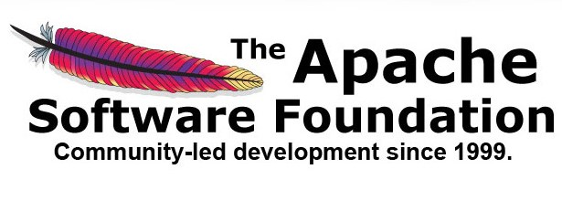
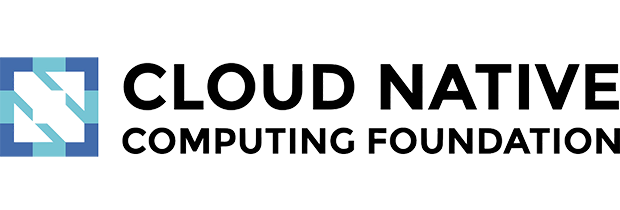
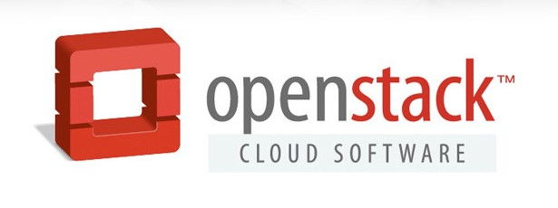
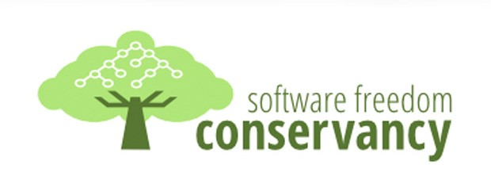
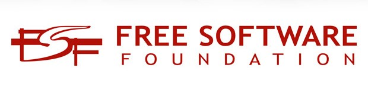

# 第 4 小节：关于开源基金会

## 开源基金会的概念

开源基金会是专门为支持开源软件项目而办的非营利性组织，它通过为软件项目社区提供服务与支持实现价值，为 IT 开发者提供了一个发现、使用、交流开源技术的平台。

## 开源基金会的目的

建立开源基金会的主要目的是：

1. 为参与者提供了一个软件知识产权管理的法律框架，在这个框架中，商业公司可以和自由/开源软件项目的贡献者和谐的在一起工作。
2. 提供一些技术服务，如软件仓库、问题跟踪、代码签署证书、以及技术指导等。
3. 提供日常的运营和治理支持，如财务和现金服务、会员管理以及项目的沟通和公关相关。

## 常见的开源基金会

开源项目组织（Open Source Initiative）的委员会主席 Allison Randal 说：“许多公司认为，自己可以通过一家可以信赖的独立的非营利机构，与其他公司一起搞开源项目，这对它们来说特别重要。”她补充说：“彼此竞争的公司通常在合作上面临巨大障碍。能够进入一家中立、不竞争的基金会，大有用处。”软件基金会为开源项目提供了许多服务，包括拥有硬件、与供应商签合同，甚至聘用员工。它们还起到了防火墙的功效，可以保护贡献者，避免合同责任或者法律起诉（比如疏忽）。它们还为项目参与者提供了许可、版权、专利及其他知识产权管理等方面的一个法律框架。

Apache 软件基金会和自由软件基金会之类的基金会甚至为监管的项目开发了自己的自由软件许可证（分别是 Apache 许可证和 GPL 许可证），这些许可证还可用于更为一般的用途。大多数基金会还提供了技术服务，比如软件库和代码签名证书，另外还提供了比较普通的商业服务，比如提供银行账户、管理项目成员以及发表声明和新闻稿。但并非所有软件基金会都相同：一些基金会致力于单单一个开源项目，一些充当多个项目的大本营，还有一些不太关注项目，更加关注推广宣传整个开源软件。以下是八家比较重要的开源基金会：

> 以下内容来源：
>
> 译文： [你需要了解的八家最重要的开源软件基金会](https://www.linuxidc.com/Linux/2015-09/123217.htm) 
>
> 原文： [8 key open source software foundations (and what makes them key)](https://www.cio.com/article/245136/8-key-open-source-software-foundations.html) 

### 1. Apache 软件基金会

[Apache 软件基金会](https://www.apache.org/)（Apache Software Foundation，简称 ASF）是专门为支持开源软件项目而办的一个非盈利性组织。旨在为开源项目提供基础设施，捐赠的法律实体，Apache 商标保护，法律保护框架，开源项目治理及指导的服务。

ASF 使命是 **为公众免费提供开源软件。**

ASF 是一个由志愿者组成的，面向全球的虚拟化组织，开发者可以以个人身份参与到基金会的运作过程中，通过贡献来赢得社群的信任。目前 ASF 基金会会员 800+，Committer 8000+， 监管 350 多个开源项目，其中包括 Apache HTTP Server（全球应用最广泛的网站服务器软件）、Apache Hadoop 大数据分析平台以及 Apache Tomcat（Java 应用服务器）。这些开源项目都是采用 Apache 许可证发行的。

[ASF 孵化器](https://incubator.apache.org/)还为期望加入该基金会的项目（和代码库）提供了一条孵化成长的道路。

### 2. Linux 基金会

[Linux 基金会](https://www.linuxfoundation.org/)（Linux Foundation）成立于 2000 年，目的是赞助 Linux 创建者 Linus Torvalds 的工作，并得到世界各地领先技术公司和开发人员的支持。一直以来，Linux 基金会都是一个致力于促进 Linux 发展的非营利性联盟。

Linux 基金会具有重要作用，因为 Linux 内核是 Linux 的基础，而 Linux 又是大多数开源软件的基础。近些年来，Linux 基金会已扩大了涉足领域，支持其他软件项目，比如与软件定义网络、物联网、移动、嵌入式软件、云计算和容器等有关的项目。嵌入式领域的知名项目 Yocto Project 和 Zephyr 都是 Linux 基金会下的项目。

Linux 基金会还监管大型的协作项目，包括 Xen 项目、Kinetic 开放存储项目和核心基础设施项目（Core infrastructure Initiative），项目贡献者来自大型商业机构，包括谷歌、IBM、英特尔、思科和惠普。

### 3. 开放原子开源基金会

[开放原子开源基金会](https://www.openatom.org/)（OpenAtom Foundation）是致力于推动全球开源事业发展的非营利机构，于 2020 年 6 月在北京成立，由阿里巴巴、百度、华为、浪潮、360、腾讯、招商银行等多家龙头科技企业联合发起。开放原子开源基金会本着以开发者为本的开源项目孵化平台、科技公益性服务机构的定位，遵循共建、共治、共享原则，系统性打造开源开放框架，搭建国际开源社区，提升行业协作效率，赋能千行百业。目前开放原子开源基金会业务范围主要包括募集资金、专项资助、宣传推广、教育培训、学术交流、国际合作、开源生态建设、咨询服务等业务。开放原子开源基金会专注于开源项目的推广传播、法务协助、资金支持、技术支撑及开放治理等公益性事业，促进、保护、推广开源软件的发展与应用；致力于推进开源项目、开源生态的繁荣和可持续发展，提升我国对全球开源事业的贡献。

开放原子开源基金会与 Apache 基金会、Linux 基金会一样，监管大型的协作项目，包括 XuperChain、OpenHarmony、PIKA、TKEStack 等重量级开源项目。

### 4. Eclipse 基金会

[Eclipse 基金会](https://www.eclipse.org/)（Eclipse Foundation）成立于 2004 年，旨在支持一个软件开发开源社区，以便构建、部署和管理软件。最知名的项目是 Eclipse 开发环境，但基金会还支持另外大约 200 个处于不同成熟阶段的项目，包括商业智能和报表工具以及物联网等项目。
        
Eclipse 基金会委员会的代表来自各大科技公司，包括谷歌、IBM、甲骨文和 SAP、爱立信。

### 5. 云原生计算基金会（CNCF）

[云原生计算基金会](https://www.cncf.io/)（Cloud Native Computing Foundation，简称 CNCF）是一个开源软件基金会，致力于使云原生计算具有普遍性和可持续性。云原生计算使用开源软件技术栈将应用程序部署为微服务，将每个部分打包到自己的容器中，并动态编排这些容器以优化资源利用率。CNCF 最知名的项目是 Kubernetes，是世界上最受欢迎的容器编排平台之一。

### 6. Cloud Foundry 基金会

[Cloud Foundry 基金会](https://www.cloudfoundry.org/)（Cloud Foundry Foundation）是一个独立的非营利性开源组织，旨在支持 Cloud Foundry 的开发、推广和采用，将其作为向各种规模的公司提供最佳开发体验的行业标准。基金会的项目主要是云基础设施项目，包括 Cloud Foundry Application Runtime、Cloud Foundry Container Runtime、BOSH、Open Service Broker API、Eirini、CF Containerization、Abacus、CF-local、CredHub、ServiceFabrik、Stratos 等。

Cloud Foundry 基金会由一群领先的厂商组成，包括 EMC、惠普、IBM、英特尔和 SAP，每一家公司是诸多领域的竞争对手，每家都拥有庞大而宝贵的知识产权资源。尽管如此，Cloud Foundry 基金会还是让它们可以彼此合作，不必担心危及彼此的竞争地位。

### 7. OpenStack 基金会

[OpenStack 基金会](https://www.openstack.org/)（OpenStack Foundation）是一个致力于推动 OpenStack 项目发展的开源组织。OpenStack 作为全球最大的开源云计算项目之一，被广泛应用于各类企业和组织中。

OpenStack 基金会的目的是，提供一系列共享资源，扩大 OpenStack 公有云和私有云的普及范围，服务于广大开发人员、用户和整个生态系统，支持看好这个平台的技术厂商，并且帮助开发人员开发云软件。

### 8. 软件自由管理委员会

[软件自由管理委员会](https://sfconservancy.org/)（Software Freedom Conservancy）虽然无论规模还是知名度都不如 Apache 软件基金会，但这是另一家为开源项目提供大本营和服务的基金会。它目前管理着 33 个项目，包括几个一下子就能辨认出来的项目，比如 BusyBox、Git、Samba 和 Wine。

软件自由管理委员会还运作一个 GPL 合规项目，该项目旨在执行 GPL。它目前在帮助出钱出力，支持指控 VMware 涉嫌违反 GPL 的诉讼。

### 9. 自由软件基金会

[自由软件基金会](https://www.fsf.org/)（Free Software Foundation，简称 FSF）是一家重要的开源软件基金会，它于1985年10月由理查德·斯托曼（Richard Matthew Stallman）建立。其主要工作是执行 GNU 计划，开发更多的自由软件。

FSF 与其他开源组织有着明显区别，它比其他任何项目更关注软件自由。其目标是实现下列内容：

“为计算机用户获得自由，为此推广自由软件和说明文档的开发和使用，尤其是 GNU 操作系统，并且竭力消除计算机用户自由面临的威胁，比如数字限制管理（DRM）和软件专利。”然而，自由软件基金会参与一个重要的软件项目：该基金会是 GNU 项目的发起者，而 GNU 项目旨在提供一个完整的免费操作系统。它还发行了 GNU GPL，这是最受欢迎的自由软件许可证。

### 10. 开放源码组织

[开放源码组织](https://opensource.org/)（Open Source Initiative）的涉足领域与自由软件基金会一样，原因在于它的初衷是支持整个软件运动，而不是支持任何某一个项目。但是相比自由软件基金会关注的重心是软件“自由”，开放源码组织谈论的却是开源软件，旨在实现下列目标：

用开放源码组织的创始成员 Michael Tiemann 的话来说：“摈弃与‘自由软件’有关的说教和对抗的态度，改而在‘务实、注重商业理由的基础’上推广宣传开源理念。”开放源码组织积极普及和倡导开源，它是“开源“的定义者强调（Open Source Definition），并负责审批某个许可证是否符合其对“开源”的定义。

### 11. 中国开源云联盟

[中国开源云联盟](https://www.coscl.org.cn/)（COSCL）成立于2012年8月，在工业和信息化部信息化和软件服务业司指导下，挂靠在中国电子技术标准化研究院，现有我国180余家开源生态圈产、学、研、用成员单位。中国开源云联盟（COSCL）作为国家重点研发计划《云计算和大数据开源社区生态系统》项目的指定开源组织，致力于联合国内开源产业界相关方，在中国共同推动开源生态系统搭建、技术社区建设、开源项目培育、开源团体标准研制、开源技术推广应用、以及开源人才培养等工作，是国内主流活跃的开源技术组织之一。

## 参考资料

- [Open source organizations](https://opensource.com/resources/organizations)
- [常见的开源组织和基金会](https://getiot.tech/opensource/opensource-organizations-and-foundations)
- [中国开源社区 landscape](https://gitee.com/oschina/china-opensource-community-landscape)

## 本部分内容贡献者

[我是XXX](https://gitee.com/zzjzxq)、[落烬](https://gitee.com/yasuocyl)、[阿基米东](https://gitee.com/luhuadong)、[雪山凌狐](https://gitee.com/xueshanlinghu)、[欧建深](https://gitee.com/oujianshen)、[tonels](https://gitee.com/tonels)、[ORH](https://gitee.com/orh)、[taotieren](https://gitee.com/taotieren)、[fangfengshi](https://gitee.com/fangfengshi)、[woohello](https://gitee.com/woohello)、[西狩](https://gitee.com/lihuimingxs) 、[XYCode](https://gitee.com/XYCode-XYC)，[WillemJiang](https://gitee.com/willemjiang) 

> 发现内容中的错误？还是想要补充更多符合主题的内容？《开源指北》欢迎你进行贡献，点击[贡献指南](./../贡献指南.md)了解贡献的具体步骤。